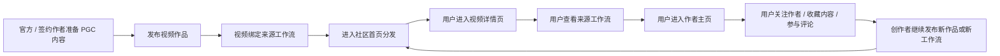
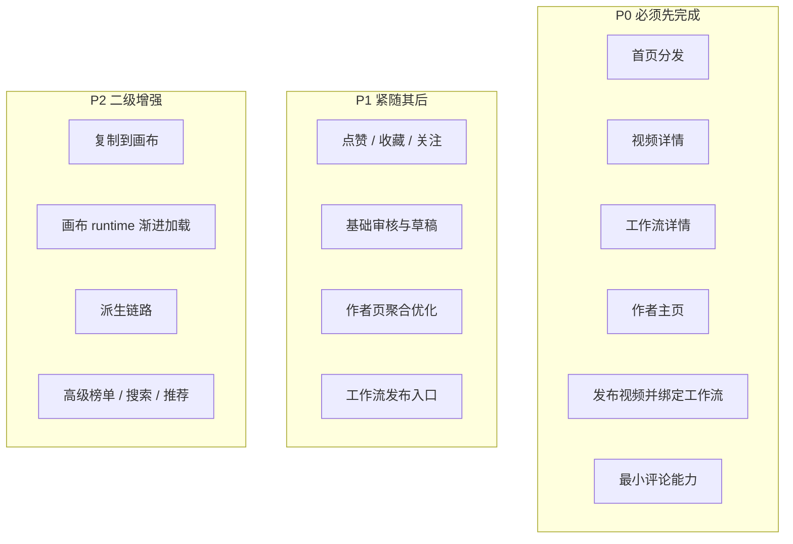

# DramaTV PGC 阶段社区主线闭环与优先级

更新日期：2026-04-06

## 1. 文档目标

这份文档专门回答一个当前最关键的问题：

- 社区主线到底是什么
- 哪些能力是第一阶段必须打通的
- 哪些能力虽然重要，但现在只能算二级能力
- 前后端接下来应该围绕什么闭环推进，而不是继续分散发力

这份文档不是替代全量业务流程文档，而是给当前阶段一个更强的“优先级锚点”。

## 2. 当前最重要的判断

DramaTV 当前要做的是一个 `PGC 冷启动阶段的 AI 视频生成社区`。

第一阶段的产品主线不是：

- 复杂画布编辑
- 工作流大规模复制派生
- 高级推荐算法
- 全站搜索体系
- 通知中心
- 复杂交易与后台权限体系

第一阶段的产品主线是：

- 让用户快速发现优质视频作品
- 让用户顺着作品进入工作流和作者
- 让社区能稳定发布 PGC 内容
- 让作品、工作流、作者、讨论形成最小闭环

一句话说，当前主线是：

`先把社区骨架跑通，再把画布联动做成强增强项，而不是反过来。`

## 3. 主线与二级能力边界

### 3.1 当前主线能力

第一阶段必须优先打通的主线只有 5 类：

1. 社区首页
2. 视频详情页
3. 工作流详情页
4. 作者主页
5. 发布页

### 3.2 当前二级能力

这些能力现在应该保留接口位、产品位或演示位，但不应该继续吃掉主线排期：

- 工作流复制到画布
- 画布 runtime 渐进加载
- 工作流派生关系图谱
- 高级榜单与复杂推荐策略
- 全量搜索与检索优化
- 复杂通知系统
- 大型活动运营体系

### 3.3 对“复制到画布”的定位修正

“复制到画布”不是无关功能，它是后续非常重要的增强项。

但在当前阶段，它的正确定位是：

- `工作流详情页上的强 CTA`
- `验证社区与画布联动可行性的桥接能力`
- `不抢占社区主线 owner 的二级能力`

也就是说：

- 它要存在
- 它不能主导当前整体推进顺序

## 4. PGC 阶段最小闭环

### 4.1 最小闭环定义

第一阶段只要先把下面这条闭环跑通，项目就不会跑偏：

这条闭环成立，社区就具备了最基本的“内容供给 -> 内容消费 -> 关系沉淀 -> 再供给”能力。

### 4.2 第一阶段的核心成功标准

第一阶段不是要把所有能力做满，而是要确认下面 4 件事成立：

1. 社区首页能稳定分发 `视频 + 工作流 + 作者入口`。
2. 视频详情页和工作流详情页之间的关系是清楚的，不再是断开的两块内容。
3. 作者主页能承接用户对“人”的兴趣，而不只是内容卡片集合。
4. 发布链路能稳定产出新的 PGC 内容，而不是只能展示静态样板。

## 5. 五个核心页面的主次职责

## 5.1 社区首页

首页必须优先解决：

- 快速发现作品
- 快速发现工作流
- 快速进入作者和专题
- 给创作者一个明确发布入口

首页当前不必优先解决：

- 高级筛选
- 复杂排序切换
- 全量搜索
- 个性化千人千面推荐

首页的内容优先级建议：

1. 推荐视频流
2. 热门工作流区
3. 作者或专题入口
4. 社区讨论热点
5. 创作入口

## 5.2 视频详情页

视频详情页必须优先解决：

- 看视频
- 看作者
- 看标签和简介
- 看来源工作流
- 看评论

视频详情页当前不必优先解决：

- 超复杂推荐流
- 多维分析面板
- 复杂二创树关系

它的定位是：

- 社区消费主页面
- 从“结果”回到“方法”的第一跳

## 5.3 工作流详情页

工作流详情页必须优先解决：

- 看工作流说明
- 看适用场景
- 看关联作品
- 看作者
- 保留进入画布的入口

工作流详情页当前不必优先解决：

- 完整画布编辑体验
- 深度节点编辑
- 大规模派生关系图

它的定位是：

- 社区里的“方法详情页”
- 社区和画布之间的桥

## 5.4 作者主页

作者主页必须优先解决：

- 展示作者身份和风格
- 分开展示作品与工作流
- 承接关注与收藏关系

作者主页当前不必优先解决：

- 复杂社交图谱
- 私信
- 多层级作品集系统

它的定位是：

- 社区里的“创作者资产主页”

## 5.5 发布页

发布页必须优先解决：

- 上传视频
- 填写标题和简介
- 添加标签和分区
- 绑定来源工作流
- 提交发布或进入审核

发布页当前建议分主次推进：

- 主线优先打通：`发布视频作品`
- 结构预留：`发布工作流`

也就是说，第一阶段发布中心可以是双入口结构，但真正先打通的是“视频发布并绑定工作流”。

## 6. 能力优先级分层

这张图的意义是：

- `P0` 不完成，社区主线不成立
- `P1` 能提升稳定性和可运营性
- `P2` 很有价值，但不能持续抢占主线排期

## 7. 前后端该围绕什么推进

## 7.1 前端主线

前端当前不应继续围绕“画布页还能再多做一点什么”推进，而应围绕：

1. 五个核心页面的页面骨架与导航关系
2. 统一的 `Video / Workflow / Creator / Comment / Draft` 视图模型
3. 首页、详情页、作者页、发布页的主路径可读可用

前端第一批真正该完成的，是：

- 首页内容区块稳定
- 视频详情页和工作流详情页双向跳转稳定
- 作者主页结构稳定
- 发布页表单结构稳定
- 交互状态明确标注“占位 / 已接接口 / 已可用”

## 7.2 后端主线

后端当前不应先深挖：

- 复杂派生 runtime
- 高级推荐引擎
- 大而全后台

后端应先围绕下面几组接口推进：

1. 首页聚合读取
2. 视频详情读取
3. 工作流详情读取
4. 作者主页读取
5. 视频发布草稿与提交
6. 评论最小闭环

## 7.3 Worker 主线

Worker 现在只需要承担主线里确实离不开的重任务：

- 视频预处理
- 封面抽帧
- 预览生成
- 基础审核辅助

“工作流复制到画布”的 Worker 补偿逻辑可以保留设计，但不应优先于发布链路。

## 8. 当前最推荐的实现顺序

结合当前目标，推荐顺序调整为：

1. 收紧首页、视频详情页、工作流详情页的信息架构
2. 补作者主页与发布页的页面契约
3. 收紧核心实体关系和 API 主线范围
4. 明确发布链路中的审核、媒体处理、草稿状态
5. 再把画布联动能力作为增强项重新接回

如果换成更直白的话，就是：

- 先把社区做成社区
- 再把社区和画布接得更强

## 9. 当前阶段的研发判断

如果接下来团队只能集中打一条主线，那就应该是：

`PGC 内容发布 -> 首页分发 -> 视频详情消费 -> 工作流详情回溯 -> 作者主页沉淀`

这条线一旦稳定，后面的很多能力都会更自然地长出来：

- PUGC 灰度开放
- 工作流复制与派生
- 推荐、榜单、活动
- 更完整的创作者成长体系

反过来，如果这条线没立住，就会出现一个很典型的问题：

- 单点功能看起来很多
- 但社区没有真正形成内容闭环

## 10. 这份文档之后最该接什么

这份文档之后，最适合继续接的不是新的二级功能，而是两件事：

1. 把 `Next.js 页面数据契约.md` 再收一遍，明确五个核心页面谁是 P0、谁是 P1。
2. 把 `第一阶段 API 清单.md` 再收一遍，只保留主线先要联调的接口组。
