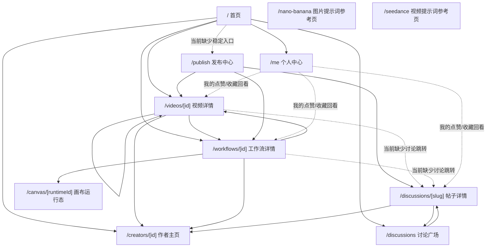

# DramaTV 当前社区界面清单与页面跳转关系分析

更新日期：2026-04-14

## 1. 文档目标

这份文档只分析当前代码里已经真实存在的前端界面，以及这些界面之间的真实跳转关系。

重点回答 3 个问题：

- 现在一共有哪几个页面或界面
- 页面与页面之间已经形成了哪些跳转链路
- 还缺哪些页面，或者现有页面里还缺哪些关键子界面

说明：

- 本文以 `apps/web/src/app` 下真实路由和 `features/*` 下真实页面组件为准
- 文档里会区分“已有页面”“已有但不完整的界面”“建议新增页面”
- `nano-banana`、`seedance`、`dev/smoke` 这类页面会单独标为“辅助/参考/内部页”，不混进社区主线页面判断

## 2. 当前真实界面盘点

## 2.1 核心社区界面

| 路由 | 界面名称 | 当前定位 | 当前状态 |
| --- | --- | --- | --- |
| `/` | 社区首页 | 社区主入口，分发视频内容、附带创作过程入口、讨论入口 | 已可用 |
| `/publish` | 发布中心 | 发布视频、附带可选工作流、发布独立帖子 | 已可用 |
| `/videos/[id]` | 视频详情页 | 看结果、看作者、看来源工作流、评论互动 | 已可用 |
| `/workflows/[id]` | 工作流详情页 | 看方法、看绑定作品、打开画布、复制工作流 | 已可用 |
| `/creators/[id]` | 作者主页 | 看作者、关注作者、浏览作者内容 | 已可用但不完整 |
| `/discussions` | 讨论广场 | 看频道、筛选帖子、进入帖子详情 | 已可用 |
| `/discussions/[slug]` | 帖子详情页 | 看独立讨论帖、点赞收藏、回复、跳作者 | 已可用 |
| `/me` | 个人中心页 | 看个人信息、最近点赞、最近收藏 | 已可用 |
| `/canvas/[runtimeId]` | 画布运行态页 | 承接“查看画布流程/复制到我的空间”后的运行态 | 已可用，属于 `P2` 增强页 |

## 2.2 辅助 / 参考 / 内部界面

| 路由 | 界面名称 | 当前定位 | 是否主线 |
| --- | --- | --- | --- |
| `/dev/smoke` | 本地 smoke 工具页 | 本地联调、重置基线数据、验健康 | 否 |
| `/nano-banana` | 图片提示词参考页 | 静态参考内容，偏专题资料页 | 否 |
| `/seedance` | 视频提示词参考页 | 静态参考内容，偏专题资料页 | 否 |

## 2.3 一个关键现状判断

如果只看“主线社区产品”，当前已经有 9 个真实界面。

但这 9 个界面里，真正构成主闭环的还是下面这 8 个：

- `/`
- `/publish`
- `/videos/[id]`
- `/workflows/[id]`
- `/creators/[id]`
- `/discussions`
- `/discussions/[slug]`
- `/me`

`/canvas/[runtimeId]` 已经存在，但它更像“工作流详情页之后的增强型承接页”，不是当前社区主线的第一入口。

## 3. 当前页面之间的真实跳转关系

## 3.1 全局关系图



这张图能看出一个很重要的现状：

- “视频结果页”和“工作流方法页”的来回跳转已经形成
- “帖子讨论页”已经独立成立
- “首页头像 -> 个人中心”这条入口已经成立
- 但“创作入口”和“讨论入口”还没有真正嵌进所有主线页面

## 3.2 按页面拆解跳转关系

### 3.2.1 首页 `/`

当前首页已有跳转：

- 首页视频卡 -> 视频详情页
- 首页视频卡作者 -> 作者主页
- 首页视频卡“查看创作过程” -> 工作流详情页
- 首页右侧工作流列表 -> 工作流详情页
- 首页右侧讨论频道 chip -> 讨论广场筛选态
- 首页右侧讨论卡 -> 帖子详情页
- 首页顶部头像入口 -> 个人中心页

当前首页缺的关键跳转：

- 没有稳定、显眼的“去发布”入口
- 没有稳定、显眼的“去提示词专题页”入口
- 没有把 `featuredCreators` 做成独立作者入口区

结论：

- 首页已经能做“内容分发”
- 但还没完全做成“社区主入口”

### 3.2.2 发布中心 `/publish`

当前发布页内部有两个主模式：

- `Video Publish`
- `Post Publish`

其中 `Video Publish` 里还会在同页展开一个可选的 `Workflow` 编辑区。

当前发布页已有跳转：

- 发布视频成功 -> 打开已发布视频详情页
- 发布工作流成功 -> 打开已发布工作流详情页
- 发布帖子成功 -> 打开已发布帖子详情页

当前发布页的优点：

- 视频、工作流、帖子这三条链路已经都能走到真实目标页
- 帖子已经改成独立内容，不再和视频/工作流绑定在同一条用户链路里

当前发布页的不足：

- 缺少“我的已发布内容 / 我的草稿管理”后续承接页
- 不是从首页或全局导航稳定进入，而更像“知道地址的人才会用”

### 3.2.3 视频详情页 `/videos/[id]`

当前视频详情页已有跳转：

- 作者信息 -> 作者主页
- 来源工作流 CTA -> 工作流详情页
- 相关作品卡 -> 其他视频详情页

当前视频详情页已有互动：

- 点赞
- 收藏
- 关注作者
- 评论与评论点赞

当前视频详情页缺的关键跳转：

- 没有回首页入口
- 没有回讨论广场入口
- 没有“围绕这条作品发起独立讨论”的入口

结论：

- 它已经是“结果页”
- 但还没有完全把“结果 -> 讨论”这条社区链路接上

### 3.2.4 工作流详情页 `/workflows/[id]`

当前工作流详情页已有跳转：

- 作者名 -> 作者主页
- 绑定作品卡 -> 视频详情页
- 查看画布流程 -> 画布运行态或外部画布地址
- 复制到我的空间 -> 复制后跳到画布运行态

当前工作流详情页已有互动：

- 点赞
- 收藏
- 评论与评论点赞

当前工作流详情页缺的关键跳转：

- 没有“去讨论广场”或“围绕这条方法发帖讨论”的入口
- 没有统一的“返回社区分发页”入口

结论：

- “方法页 -> 画布页”已经成立
- “方法页 -> 独立讨论页”还没成立

### 3.2.5 作者主页 `/creators/[id]`

当前作者页已有跳转：

- 关注作者
- 作品列表 -> 视频详情页

当前作者页当前更准确的定位是：

- 它是对外展示的“创作者主页”
- 当前产品口径下只展示作品
- 工作流只通过作品卡里的“查看创作过程”附带展示，不单独成区

结论：

- 作者页不是个人中心，不应该承接“我的点赞 / 我的收藏 / 资料编辑”这类个人回访功能

### 3.2.6 讨论广场 `/discussions`

当前讨论广场已有跳转：

- 全部频道 -> 讨论广场默认态
- 频道卡 -> 讨论广场筛选态
- 帖子卡 -> 帖子详情页

当前讨论广场已有互动：

- 列表卡片快点赞
- 列表卡片快收藏

当前讨论广场的特点：

- 讨论已经是一条独立内容线
- 通过 query 参数实现频道筛选

当前缺口：

- 和视频详情/工作流详情之间还没有稳定双向入口

### 3.2.7 帖子详情页 `/discussions/[slug]`

当前帖子详情页已有跳转：

- 作者 -> 作者主页
- 返回讨论广场

当前帖子详情页已有互动：

- 点赞帖子
- 收藏帖子
- 回复帖子
- 点赞评论

当前帖子详情页已经修正的产品语义：

- 帖子是独立内容
- 不再展示“绑定视频/工作流”的用户侧语义

当前缺口：

- 仍然没有从帖子回到相关作品或相关流程的推荐链路
- 讨论与内容主线还比较分离

### 3.2.8 画布运行态页 `/canvas/[runtimeId]`

当前画布页的进入方式主要是：

- 工作流详情页点击“查看画布流程”
- 工作流详情页点击“复制到我的空间”

当前定位很明确：

- 它是社区和画布之间的承接页
- 不是社区主导航一级入口

### 3.2.9 辅助 / 参考页

`/nano-banana` 和 `/seedance` 当前更像专题资料页。

它们的现状是：

- 页面本身已经存在
- 但和首页、发布页、讨论页之间没有被接成稳定主链路

这意味着现在更准确的判断是：

- “提示词专题页已经存在”
- “提示词专题入口还没有并入社区主导航”

### 3.2.10 个人中心页 `/me`

这个页面现在已经存在，而且已经接上真实后端数据，应该作为登录用户自己的稳定回访页来判断。

当前个人中心页已经承接下面这些跳转关系：

- 全局头像 / 顶部头像 -> 个人中心页
- 个人中心页“最近点赞” -> 对应视频详情页 / 工作流详情页 / 帖子详情页
- 个人中心页“最近收藏” -> 对应视频详情页 / 工作流详情页 / 帖子详情页

当前个人中心页已经落地的内容包括：

- 个人信息卡
- 最近点赞列表
- 最近收藏列表

当前个人中心页还没有直接承接的内容：

- 我的关注
- 我的发布
- 我的草稿
- 创作者内容管理页入口（后续可补）

这个页面和作者主页的区别必须明确：

- 作者主页是“别人看你”
- 个人中心页是“你看自己”

## 4. 当前已经形成的闭环

## 4.1 已经成立的主闭环

### 闭环 A：内容消费闭环

```text
首页 -> 视频详情 -> 工作流详情 -> 作者主页 -> 作品详情
```

这条链路已经基本成立。

问题在于：

- 末端又回到“作品”
- 还没顺手接上“个人回访入口”或“继续互动入口”

### 闭环 B：发布闭环

```text
发布页 -> 发布视频 -> 视频详情
发布页 -> 发布工作流 -> 工作流详情
发布页 -> 发布帖子 -> 帖子详情
```

这条链路已经成立，而且是真实联调链路。

### 闭环 C：讨论闭环

```text
首页讨论入口 -> 讨论广场 -> 帖子详情 -> 作者主页 -> 回作品
```

这条链路也能走通，但强度还不够，因为：

- 帖子详情页不能回到相关作品/相关流程
- 内容详情页也不能顺手进入相关讨论

## 4.2 还没完全成立的闭环

### 闭环 D：作品 / 方法 / 讨论三者互转闭环

当前理想状态应该是：

```text
视频详情 <-> 工作流详情 <-> 讨论广场 / 帖子详情
```

但现在实际只成立了前半段：

```text
视频详情 <-> 工作流详情
帖子详情 -> 作者主页
```

中间缺的是：

- 视频详情 -> 相关讨论入口
- 工作流详情 -> 相关讨论入口
- 帖子详情 -> 相关作品 / 相关方法回跳入口

### 闭环 E：个人回访闭环

当前理想状态应该是：

```text
首页头像 / 全局导航 -> 个人中心 -> 我的点赞 / 我的收藏 -> 内容详情 -> 再次互动
```

但现在这条链路还没有建立，因为：

- 个人中心页虽然已经上线，但还只有“最近点赞 / 最近收藏”第一版
- 点赞和收藏虽然已经有统一回访入口，但还缺少更长周期的分类筛选和内容管理

## 5. 当前最明显的界面缺口

## 5.1 已有页面里的缺口界面

这些不一定是“新路由”，但它们已经是当前最明显的缺口。

### 1. 首页里的“创作入口”

发布页虽然已经存在，但首页没有稳定的“去创作 / 去发布”入口。

这会带来两个问题：

- 首页更像内容浏览页，而不是社区主入口
- 创作者主线被藏起来了

### 2. 首页里的“作者入口区”

`featuredCreators` 目前还没有被整理成稳定的作者发现模块。

这意味着“看人”这条线现在还偏弱。

### 3. 视频详情页 / 工作流详情页里的“相关讨论入口”

现在视频和工作流各自有评论区，但缺少“独立帖子讨论”的入口或聚合模块。

这会让讨论区继续变成一条孤立内容线。

### 4. 全局导航界面

当前 `PageShell` 只有品牌和头像，不是完整的全局导航。

因此现在很多跳转是“靠卡片内容自己找入口”，而不是“页面之间有稳定主导航”。

### 5. 个人中心页里的补强分区

`/me` 现在已经存在，并且已经能承接个人信息、最近点赞、最近收藏。

当前还缺的主要是后续补强能力：

- 我的关注
- 我的发布
- 我的草稿
- 更细的分类筛选和长期回访入口

## 5.2 建议新增的页面

下面这些更适合当成“新增页面”看待。

### 1. 创作者内容管理页 `/studio` 或 `/me/content`

为什么要补：

- 发布页已经能发
- 但发完以后没有“我的内容 / 我的草稿 / 我的帖子”管理界面

当前发布页像“单次提交流程”，不像“创作者工作台”。

建议承接内容：

- 我的视频
- 我的视频所绑定的工作流状态
- 我的帖子
- 草稿 / 审核中 / 已发布状态

优先级建议：`P1`。

### 2. 提示词专题入口页 `/explore/prompts` 或首页专题聚合区

为什么要补：

- `/nano-banana` 和 `/seedance` 已经存在
- 但它们没有进入社区主导航

现在的问题不是“没有专题页”，而是“没有专题入口层”。

建议做法二选一：

- 做一个统一专题聚合页，把图片提示词、视频提示词都放进去
- 或先在首页补一个“提示词专题入口区”，直接把两个现有页接进去

优先级建议：`P1`。

### 3. 收藏 / 关注聚合页 `/library` 或 `/following`

为什么要补：

- 点赞、收藏、关注已经逐步接上
- 但这些关系目前没有聚合承接页

如果个人中心先补齐，这类页面也可以先以内嵌 tab 的方式存在，不一定一开始就拆独立路由。

优先级建议：`P1-P2`。

### 4. 搜索 / 发现页 `/search`

为什么要补：

- 后续内容类型会越来越多：视频、工作流、帖子、提示词专题
- 单靠首页分发不够

优先级建议：`P2`。

## 6. 建议优先级

如果按“先补最短板，再补新页面”的顺序，建议是：

### 第一优先级

1. 补首页里的“创作入口”
2. 补视频详情页 / 工作流详情页里的“相关讨论入口”
3. 继续补强个人中心页里的“我的关注 / 我的发布 / 我的草稿”

这 3 项做完，现有主线页面之间的闭环会明显更完整。

### 第二优先级

1. 新增创作者内容管理页
2. 补首页里的“作者入口区”
3. 把提示词专题入口并入首页或做成专题聚合页

### 第三优先级

1. 收藏/关注聚合页
2. 搜索页
3. 通知中心

## 7. 当前结论

一句话总结当前产品状态：

> 现在已经不是“没有页面”，而是“核心页面已经有了，个人中心页也已经补上第一版，但页面之间的社区跳转关系还没有完全闭环，尤其缺创作入口，以及内容与讨论之间的互转界面”。

更具体一点：

- 首页、发布页、视频详情页、工作流详情页、作者页、讨论广场、帖子详情页，这套社区骨架已经成立
- 发布链路已经真实可用
- 视频与工作流的双向关系已经成立
- 工作流当前应继续作为视频附属关系展示，不做独立内容展示页方向
- 帖子已经独立成内容类型
- “作者主页”和“个人中心页”的分工已经清晰，而且个人中心页第一版已经接入真实后端

但下一步最该补的不是继续堆更多零散功能，而是把下面 4 件事补完整：

1. 首页给出稳定的创作入口
2. 继续补强个人中心里的“我的关注 / 我的发布 / 我的草稿”
3. 视频 / 工作流 / 讨论三条内容线形成更清晰的互转
4. 再往后补创作者内容管理和专题入口层
