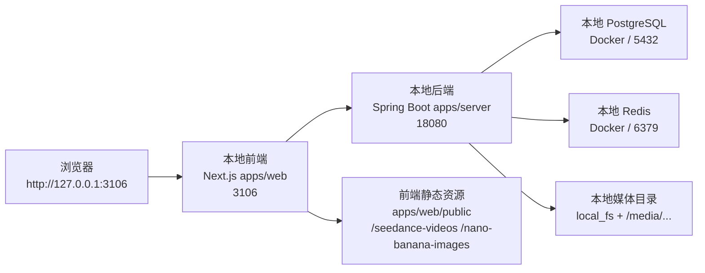
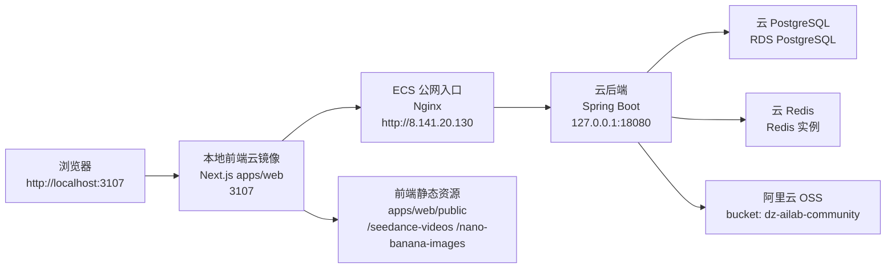
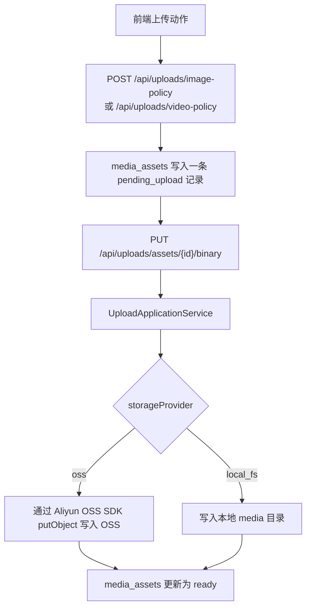
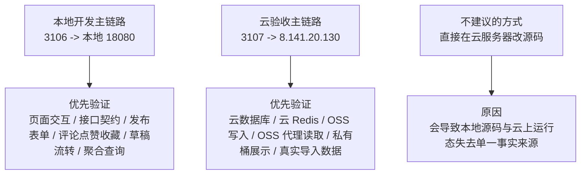

# DramaTV 当前本地与云链路图

更新时间：2026-04-26

这份图只描述当前已经跑通的实际链路，不写理想状态。

对应图形版：`docs/03_架构/DramaTV当前本地与云链路图.drawio`

## 1. 本地完整开发链路

说明：

- 这是现在最稳定的本地开发主链路。
- `3106 -> 18080` 走本机联调。
- 本地历史媒体资源主要还是 `local_fs` 或前端静态目录。

## 2. 本地前端 + 云后端联调链路

说明：

- `3107` 只是本机起的一个“云环境前端镜像”，别人看不到。
- `8.141.20.130` 当前只承载云后端入口，不是完整云前端站点。
- 现在最适合做“本地看页面，后端走云库/云 Redis/云 OSS”的验收。

## 3. 当前媒体读写链路

当前读路径分三类：

- 本地历史资源：返回 `/media/...`，由本地后端或本地静态目录直接提供。
- 前端静态资源：直接来自 `apps/web/public`，例如 `/seedance-videos/...`、`/nano-banana-images/...`。
- 云端新上传资源：当前已经具备“写 OSS + 后端代理读取”能力，无 CDN 时也可以通过云后端 `/media/...` 返回给浏览器。

## 4. 当前正式开发与验收边界

说明：

- 当前正确流程仍然是“本地改代码 -> 本地验证通用逻辑 -> 部署到云后端做媒体和云环境验收”。
- 本地后端并不是不能验收，而是当前更适合验收“业务逻辑”和“页面联调”。
- 云后端当前更适合验收“真实云资源链路”，尤其是云数据库、云 Redis、OSS 写入和 `/media/...` 代理展示。
- 如果后续出现“本地测得通、云上不通”，优先先看环境变量、数据库基线、OSS 权限和云运行版本，而不是先怀疑源码逻辑。

## 5. 为什么本地后端当前不能直接复用测试环境 OSS

当前测试环境给到的 OSS 方案是：

- Bucket：`dz-ailab-community`
- 域名：`dz-ailab-community.oss-cn-beijing-internal.aliyuncs.com`
- 认证方式：`RAM Role` 直接授权给 ECS
- Bucket 权限：私有读写
- 当前无 CDN / 公网展示域名

这意味着本地后端当前不能直接复用同一套测试 OSS，原因是：

1. `internal` 域名是阿里云内网访问方案，适合 ECS，不适合本机直接访问。
2. `RAM Role` 依赖 ECS 元数据服务，本机拿不到 `100.100.100.200` 这类元数据能力。
3. Bucket 是私有读写，浏览器不能直接拿 OSS 链接做公开展示。
4. 当前没有 CDN 或公网展示域名，所以前端展示仍然依赖“后端 `/media/...` 代理 -> OSS 私有对象”这条链路。

换句话说，当前已经跑通的是：

- 云后端写 OSS
- 云后端代理读 OSS
- 本地 `3107` 通过云后端展示 OSS 媒体

当前没有跑通，也不应假设已经具备的是：

- 本地后端直写测试环境 OSS
- 本地后端直读测试环境 OSS
- 本地浏览器直连私有桶资源

## 6. 如果后续要让本地也接 OSS，还缺什么

如果后续希望形成“本地也能直接接 OSS，然后本地先验收再上云”的开发方式，还需要额外补齐以下资源之一：

- 本机可访问的 OSS 公网 endpoint 或自定义域名
- 本地开发可用的 `AK/SK` 或 `STS`，而不是只给 ECS `RAM Role`
- 明确的开发前缀，例如 `community/dev-local/...`，避免本地调试污染测试环境正式数据

如果这三项没补齐，当前最稳妥的工作流仍然是：

1. 本地 `3106 -> 18080` 做业务开发
2. 本地 `3107 -> 8.141.20.130` 做云资源验收
3. 需要看真实 OSS 展示时，统一走云后端 `/media/...` 代理链路

## 7. 当前可见性清单

### 7.1 仅本机可见

- `http://127.0.0.1:3106`
- `http://localhost:3107`
- 本地 Docker PostgreSQL / Redis
- 本地 `local_fs` 媒体目录

### 7.2 当前已公网暴露

- `http://8.141.20.130`
- `http://8.141.20.130/actuator/health`
- `http://8.141.20.130/api/...`

说明：

- 这里是 ECS 的公网 HTTP 入口，当前通过 Nginx 反代到云后端。
- 这不是完整对外发布站点，暂时更适合作为测试入口。

### 7.3 阿里云内网/VPC 可访问

- RDS PostgreSQL 实例
- Redis 实例
- `dz-ailab-community.oss-cn-beijing-internal.aliyuncs.com`

说明：

- 当前给到的是 OSS `internal` 域名，它不是面向公网浏览器展示的域名。
- 现阶段已经通过“后端代理 `/media/...` -> OSS”绕开了这个限制，所以本地 `3107` 联调时也能显示云端 OSS 图片。

## 8. 当前结论

当前已经形成两条可用链路：

1. 本地完整开发链路：`3106 -> 本地 18080 -> 本地 DB/Redis/本地媒体`
2. 本地云镜像链路：`3107 -> 8.141.20.130 -> 云 DB/Redis/OSS`

当前最关键的状态判断：

- 云后端已经可用。
- 云数据库和云 Redis 已接通。
- OSS 写入链路代码已经实装。
- 图片资源的“真实上传 -> OSS 写入 -> `/media/...` 代理展示”烟测已经通过。
- 后续重点不再是证明 OSS 能不能通，而是继续补视频大文件、Range 播放、CDN 或预签名直读等增强链路。

## 9. 2026-04-25 OSS 烟测结论

本次已经完成真实上传烟测：

- 调用云后端 `POST /api/uploads/image-policy`
- 调用云后端 `PUT /api/uploads/assets/{id}/binary`
- 返回结果为 `statusCode=ready`
- 本次测试资产 ID：`1cc0afe3-a8a5-4f18-b652-7676cc662a3d`

当前最新烟测资产：

- 资产 ID：`0acfcdfd-433b-459e-beb2-579fb7507383`
- 返回 `mediaPath`：`/media/community/test/image/attachment/0acfcdfd-433b-459e-beb2-579fb7507383/oss-smoke-20260425035418.png`
- 绝对访问地址：`http://8.141.20.130/media/community/test/image/attachment/0acfcdfd-433b-459e-beb2-579fb7507383/oss-smoke-20260425035418.png`

补充验证结果：

- 云后端 `POST /api/uploads/image-policy` 成功
- 云后端 `PUT /api/uploads/assets/{id}/binary` 成功
- 后端返回状态 `ready`
- 本机对代理地址探测返回 `200`

这说明当前状态是：

1. 后端已经能把文件真实写进 OSS
2. 云后端已经能通过 `/media/...` 代理读取 OSS 私有对象
3. 没有 CDN 时，本地 `3107` 也可以显示云端 OSS 图片

后续可选增强仍然存在：

- CDN/公网域名：优化跨地域访问与缓存
- 私有读 + 预签名 URL：减轻后端代理流量压力
- 视频 Range 代理：为大视频播放做更完整的断点/拖拽支持

## 10. 2026-06-02 公网入口补充

- 当前测试 ECS 已并存多个项目，共用同一个 `:80` 入口。
- 社区前台/后台后续应优先使用带 Host 隔离的专属入口：
  - 社区前台：`http://community.8.141.20.130.nip.io`
  - 管理后台：`http://community.8.141.20.130.nip.io/admin`
- `http://8.141.20.130` 现在只能视为机器原始公网 IP，不再适合作为社区默认业务入口；否则浏览器历史、验活、回滚和压测都可能命中同机其他项目。
- 云端运行态补充：
  - 2026-06-02 已在测试 ECS 上把社区 Nginx `server_name` 从旧的 `_` 收口为 `community.8.141.20.130.nip.io`
  - 当前公网复验已确认：
    - `community.8.141.20.130.nip.io` 返回 `DramaTV 社区`
    - `community.8.141.20.130.nip.io/admin` 返回 `DramaTV 社区后台`
    - `dramaloom.8.141.20.130.nip.io` 与 `novel-similarity.8.141.20.130.nip.io` 仍分别命中各自项目
  - 这意味着“社区专属 Host”现在不只是脚本默认值，也已经是当前测试云的真实生效入口
