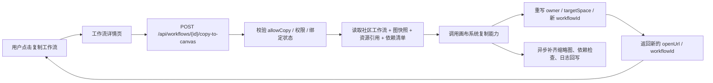

# DramaTV 工作流存储与复制机制设计

更新日期：2026-04-06

## 1. 文档目标

这份文档专门回答一个很容易被直觉误导的问题：

- 类似 TapNow / LibTV / RunningHub 这类“查看工作流并复制到自己空间”的能力，底层通常是怎么做的
- 为什么一个看起来很大的画布，复制到自己工作区往往只要几秒
- 我们项目里，社区工作流和画布工作流到底该怎么拆

说明：

- 以下结论一部分来自公开资料，一部分是基于公开资料做出的工程推断
- 推断依据主要来自 `RunningHub` 官方 API 文档、`LiblibAI` 官方工作流页面，以及 `ComfyUI` 工作流的常见 JSON 形态
- 这份文档的目标不是猜某一家平台的私有实现细节，而是收敛一套对我们项目足够可落地的设计判断

## 2. 一句话结论

大画布复制得快，通常不是因为平台把“整张画布”重新渲染、重新上传、重新计算了一遍，而是因为它复制的主要是：

- 工作流图定义
- 节点参数
- 资源引用
- 权限与归属关系

也就是说，它更像：

- 复制一份结构化 JSON + 元数据

而不是：

- 复制整段视频像素
- 重跑所有节点
- 重新下载所有模型

## 3. 先拆清两个对象

这是最关键的一步。

### 3.1 社区工作流对象

这是给社区用户看的对象，重点是：

- 标题
- 简介
- 标签
- 封面
- 作者
- 适用场景
- 是否允许复制
- 是否允许派生
- 关联作品

它服务的是：

- 浏览
- 搜索
- 推荐
- 评论
- 收藏
- 运营

### 3.2 画布运行时工作流对象

这是给画布系统执行和编辑的对象，重点是：

- 节点图结构
- 连线关系
- 画布坐标
- 节点参数
- 模型依赖
- 插件依赖
- 输入输出定义
- 运行时配置

它服务的是：

- 编辑
- 运行
- 调试
- 派生
- API 调用

### 3.3 我们项目的边界结论

所以我们必须把两个对象拆开：

- `Workflow`：社区展示对象
- `Canvas Workflow Runtime`：画布执行对象

两者通过 `CanvasBinding` 关联，而不是混成一张表。

## 4. 工作流通常怎么存

### 4.1 最小存储分层

一个可复制的工作流，通常至少会拆成下面 6 层：

| 层 | 存什么 | 典型形态 | 为什么要单独存 |
| --- | --- | --- | --- |
| 社区元数据层 | 标题、简介、标签、作者、封面、权限 | 关系表字段 | 给社区浏览和推荐用 |
| 图定义层 | nodes、edges、groups、viewport | `json/jsonb` | 这是复制的核心 |
| 参数层 | prompt、seed、steps、sampler、模型选择等 | 图 JSON 内嵌或参数表 | 支持编辑和运行 |
| 资源引用层 | 输入图、示例图、输出图、视频、蒙版 | 资源 ID / 对象存储 key | 不直接复制大文件 |
| 依赖清单层 | 模型、LoRA、插件、自定义节点版本 | manifest JSON | 保证目标空间可运行 |
| 权限与归属层 | owner、space、allow_copy、allow_fork、license | 关系表字段 | 控制复制和派生边界 |

### 4.2 图定义为什么通常是 JSON

公开信号已经很明显：

- `RunningHub` 官方 API 文档里有“获取工作流 Json”
- 返回结果中的 `prompt` 明确是按节点 ID 组织的 JSON 结构
- `RunningHub` 官方文档还解释了 `nodeId`、`fieldName`、`fieldValue` 与“导出工作流 API”的关系

这说明至少在 ComfyUI 系工作流里，平台内部一定存在一份结构化图定义，而不是只存一张截图。

一个非常典型的工作流图定义，大致会长这样：

```json
{
  "nodes": {
    "3": {
      "class_type": "KSampler",
      "inputs": {
        "steps": 20,
        "cfg": 8,
        "seed": 669816362794144,
        "model": ["4", 0],
        "positive": ["6", 0]
      }
    },
    "4": {
      "class_type": "CheckpointLoaderSimple",
      "inputs": {
        "ckpt_name": "model.safetensors"
      }
    }
  },
  "viewport": {
    "x": 120,
    "y": 80,
    "zoom": 0.8
  }
}
```

注意：

- 真正可复制的是这类结构化定义
- 不是“把画布截图复制过去”

### 4.3 资源通常不是直接嵌进工作流

大文件一般不会直接塞进工作流 JSON。

更常见的是引用：

- `asset_id`
- `object_key`
- `url`
- `file_hash`
- `media_meta`

这样做的好处是：

- 工作流本体很轻
- 复制时不需要立刻复制大文件
- 一个资源可以被多个工作流或多个版本复用

### 4.4 依赖为什么也要单独管理

很多工作流之所以“能看不能跑”，不是图结构丢了，而是依赖没齐。

所以成熟平台通常还会保存：

- 需要哪些模型
- 需要哪些自定义节点
- 需要哪些 LoRA / ControlNet / VAE
- 最低版本要求是什么

这决定了复制后是：

- 直接可运行

还是：

- 先补依赖再可运行

## 5. 工作流复制时通常怎么传

### 5.1 复制主链路

复制动作通常不是前端自己搬数据，而是：



### 5.2 复制请求里真正关键的参数往往很少

从公开资料看，复制或运行相关接口的关键输入通常都很轻：

- 源工作流 ID
- 目标空间 ID
- 调用人身份
- 复制策略

这意味着：

- 复制动作不是“前端把整个画布 JSON 发回去”
- 很多时候只传一个 `workflowId` 就够了

后端或画布服务会在服务端自己把完整图定义取出来。

### 5.3 真正发生的复制动作通常包括

服务端在复制时，通常会做这几件事：

1. 读取源工作流图定义
2. 生成新的目标工作流 ID
3. 重写归属信息到新空间
4. 重映射部分节点内部引用
5. 复用已有资源引用
6. 记录复制来源关系
7. 返回新工作流的打开地址

如果需要复制大资源，一般会放到后续异步阶段。

## 6. 为什么一个很大的画布也能 10 秒内复制完成

### 6.1 因为复制的大多是“结构”，不是“结果”

大画布看起来大，是因为：

- 节点很多
- 连线很多
- 参数很多

但这些东西本质上是文本和结构化数据。

即使节点很多，序列化之后往往也只是：

- 几十 KB
- 几百 KB
- 少数情况下几 MB

这和复制一个几百 MB 的视频完全不是一个量级。

### 6.2 因为资源通常是引用复制，不是字节复制

复制工作流时，平台经常不会立刻复制：

- 原视频
- 示例图
- 大模型文件
- 插件包

而是先复制这些资源的引用关系：

- 指向同一个对象存储资源
- 指向同一个模型版本
- 指向同一个插件依赖

这一步几乎只是数据库写入。

### 6.3 因为重活经常被延后了

真正重的事情，往往被放到了异步阶段，比如：

- 检查目标空间缺不缺模型
- 生成新的预览图
- 做访问权限换签
- 复制私有附件
- 补齐依赖安装

所以用户看到的是：

- “复制成功，马上可打开”

而不是：

- “等所有底层资源搬完再给你返回”

### 6.4 因为很多平台本来就是同一套云端环境

像 RunningHub 这类平台，本身就是云端 ComfyUI 环境。

这意味着：

- 节点运行环境是平台预装的
- 模型库是平台托管的
- 画布工作区也是平台自己的

因此复制往往只是：

- 在同一云端系统里新建一份项目记录

不是跨系统大搬家。

### 6.5 因为打开工作流不等于立刻执行全图

很多用户会把“打开工作流”误以为是“立刻跑完整个工作流”。

实际上通常不是。

更多时候只是：

- 加载节点图
- 渲染编辑界面
- 挂载已有参数

真正执行通常要等用户点击：

- 运行
- 开始生图
- 提交任务

所以“复制很快”不代表“重算很快”。

## 7. 对 LiblibAI / RunningHub 公开信号的工程判断

### 7.1 来自 RunningHub 的信号

公开资料显示：

- 工作流通过 `workflowId` 被寻址
- 官方 API 可以“获取工作流 Json”
- 返回值里有节点化的 `prompt` JSON
- 官方文档明确讲 `nodeId`、`fieldName` 和导出 API JSON 的关系
- 官方首页明确把工作流定义成可“在线分享、学习、编辑和运行”的对象

这说明：

- 工作流本质上是结构化对象
- 平台内部一定存在可序列化、可传输、可复用的工作流定义

### 7.2 来自 LiblibAI 的信号

LiblibAI 的公开工作流页面反复出现几种模式：

- 下载工作流后，拖入 ComfyUI 即可加载
- 下载工作流图片，拖入 ComfyUI 可以直接加载
- 打开 ComfyUI 工作流空间后，把例图拖到工作空间，也可以自动加载工作流
- 缺失节点时，需要补模型或补插件依赖

这些信号非常重要，因为它说明：

- 工作流本体和示例资源是可分离的
- “例图”有时只是工作流载体或索引入口
- 平台默认依赖一套可导入、可解析、可还原的工作流描述格式

所以从工程角度看，LibTV / LiblibAI 这类“复制工作流”能力，大概率不是复制最终成片，而是复制：

- 工作流描述
- 参数
- 依赖信息
- 资源引用

这个判断属于工程推断，但和公开信号高度一致。

## 8. 我们项目该怎么设计

### 8.1 第一阶段设计目标

我们现在不需要一上来就做完整的云端 ComfyUI 平台，但必须先把边界留对。

第一阶段建议采用：

- `workflows` 保存社区工作流对象
- `canvas_bindings` 保存社区对象与画布对象的映射
- `canvas_bindings.snapshot_json` 保存可公开、可复制的工作流快照
- `media_assets` 保存封面、示例图、示例视频等资源元数据
- `async_task_records` 跟踪复制补偿、依赖检查、预览生成等异步动作

### 8.2 第一阶段建议补充的字段

在不推翻现有表设计的前提下，建议后续给 `canvas_bindings` 或其关联对象补这些信息：

| 字段 | 作用 |
| --- | --- |
| `source_workflow_version` | 标记复制所基于的版本 |
| `graph_checksum` | 判断图定义是否变化 |
| `copy_strategy` | `reference_only/shallow_copy/lazy_clone/full_clone` |
| `dependency_manifest_json` | 模型、节点、插件依赖清单 |
| `asset_manifest_json` | 输入图、示例图、蒙版、视频等引用 |
| `source_runtime_type` | 来源是 `comfyui/internal/external` |

### 8.3 第二阶段建议拆出的表

如果后面真的进入 PUGC / UGC 放量期，建议补三张表：

| 表 | 作用 |
| --- | --- |
| `workflow_versions` | 一份工作流的多版本快照 |
| `workflow_asset_refs` | 工作流和资源引用的明细关系 |
| `canvas_copy_tasks` | 复制任务、补偿任务、失败重试记录 |

这样后面做：

- 派生关系
- 版本回滚
- 差异比较
- 复制失败恢复

都会容易很多。

## 9. 建议的复制策略

### 9.1 第一阶段最稳的策略

建议默认采用：

- `浅复制图定义 + 复用资源引用 + 异步补偿`

也就是：

1. 同步复制图定义与元数据
2. 同步生成新空间下的新 runtime ID
3. 先复用可公开资源引用
4. 对私有资源或重资源走异步补偿

这是当前最符合你们阶段的方案。

### 9.2 不建议第一阶段默认做的事

- 不建议复制时立即克隆所有媒体文件
- 不建议复制时立即重新跑完整工作流
- 不建议让前端直接持有完整私有运行态 JSON
- 不建议把社区工作流表直接当画布运行时表

## 10. 安全与风控要点

“复制工作流”不是纯产品功能，它天然带安全问题。

至少要防这几类风险：

### 10.1 秘钥和私密参数泄露

工作流里可能藏着：

- 私有 API Key
- 私有 webhook
- 内部模型地址
- 本地文件路径

所以复制前必须做：

- 参数脱敏
- 字段白名单导出
- 高风险字段清洗

### 10.2 私有资源越权引用

如果工作流引用了私有图、私有视频、私有模型，不能直接把原引用透给别人。

需要区分：

- 可公开引用
- 仅作者可见
- 复制时必须重新授权
- 不允许复制

### 10.3 依赖注入和恶意节点

如果未来支持外部工作流导入或 UGC 工作流，必须防：

- 恶意自定义节点
- 非法插件依赖
- 非白名单模型
- 指向内部网络的路径

### 10.4 复制刷量

复制动作后面可能接：

- 派生数
- 热门排序
- 创作者收益

所以需要：

- 幂等键
- 频率限制
- 来源关系记录
- 审计日志

## 11. 我们对外接口应该长什么样

现有接口方向是对的：

- `GET /api/workflows/{id}/canvas-link`
- `POST /api/workflows/{id}/copy-to-canvas`

建议 `copy-to-canvas` 后续响应补成下面这种结构：

```json
{
  "workflowId": "community-workflow-uuid",
  "targetSpaceId": "space_001",
  "targetCanvasWorkflowId": "canvas_wf_9527",
  "copyMode": "reference_then_async_clone",
  "status": "ready",
  "copyTaskId": "uuid",
  "openUrl": "https://canvas.example.com/workflow/canvas_wf_9527"
}
```

这样前端能明确区分：

- 已同步完成
- 已创建但仍在补依赖
- 复制失败需重试

## 12. 对你刚才那个疑问的直接回答

你看到一个很大的画布，结果不到 10 秒就“复制到我的工作空间”，大概率原因就是：

1. 复制的是工作流图定义，不是把整张画布当图片搬过去  
2. 复制的是资源引用关系，不是立刻复制所有大文件  
3. 复制的是同一云端系统内的一份新项目记录，不是跨平台大迁移  
4. 真正重的动作被放到异步补偿里了  
5. 打开工作流不等于立刻执行整条生成链路

所以它看起来像“复制了一个巨大工程”，但底层更接近：

- “新建一份指向同一套结构和依赖的副本”

## 13. 这份文档之后最该接什么

最适合继续往下接的有两件事：

1. 把 `数据库初版表设计.md` 里的 `canvas_bindings` 扩成更明确的复制模型
2. 把 `第一阶段 API 清单.md` 里的 `copy-to-canvas` 响应结构和状态机补完整

## 14. 参考公开资料

- [RunningHub 首页](https://www.runninghub.cn/)
- [RunningHub API: 开始](https://www.runninghub.cn/runninghub-api-doc-cn/doc-8287334)
- [RunningHub API: 获取工作流Json](https://www.runninghub.cn/runninghub-api-doc/api-276613251)
- [RunningHub API: 关于 nodeInfoList](https://www.runninghub.cn/runninghub-api-doc-cn/doc-6332955)
- [RunningHub API: WorkflowDuplicateRequest](https://www.runninghub.cn/runninghub-api-doc-cn/schema-155888538)
- [LiblibAI 工作流示例：下载工作流图片拖入 ComfyUI 可加载](https://www.liblib.art/modelinfo/c5fadc14ad7a45fc92385d3ec9d33311?from=feed)
- [LiblibAI 工作流示例：打开工作流空间后拖例图可自动加载](https://www.liblib.art/modelinfo/839d31e073b7479f8b4b2dbf370676a0?from=personal_page)
- [LiblibAI 工作流教程：在 ComfyUI 中运行工作流](https://www.liblib.art/activities/388fcb1b3f5b42838bc20af2cfdf9351/Confyui_Expand)
