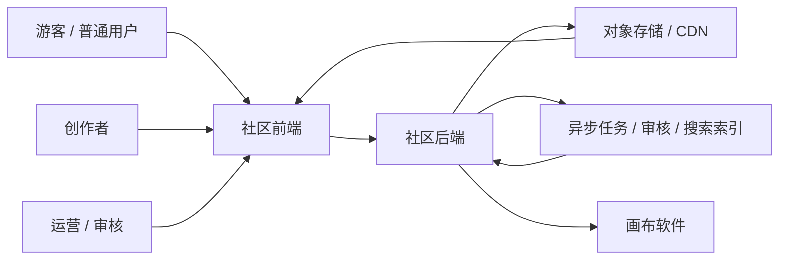
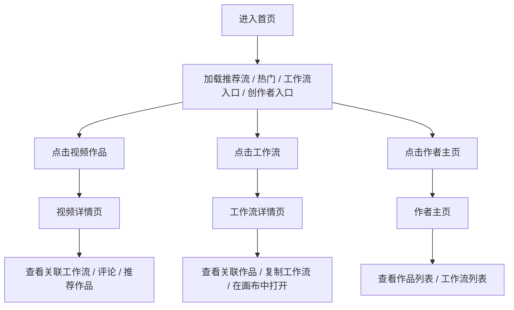
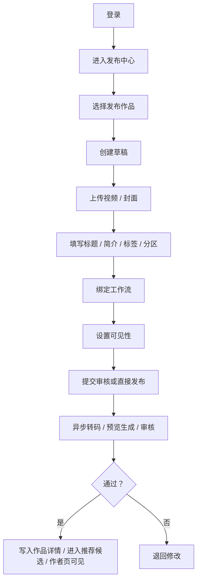
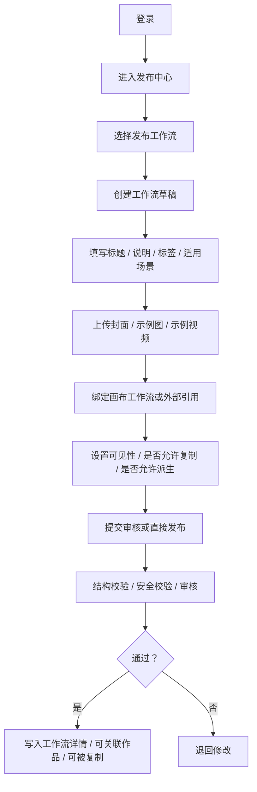
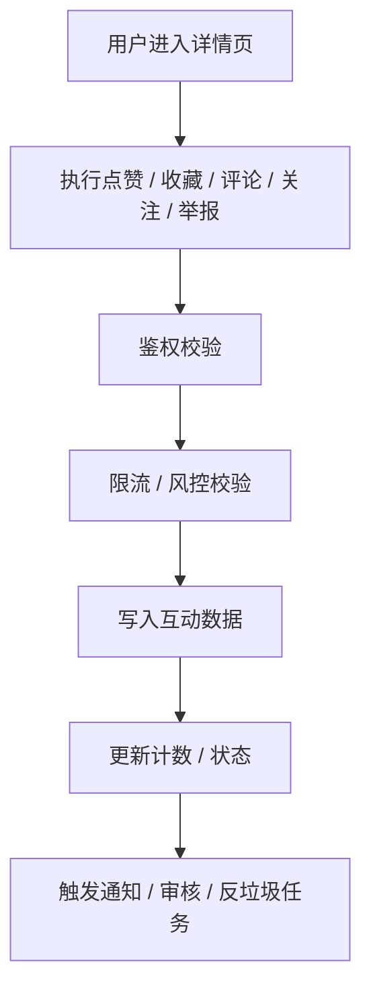
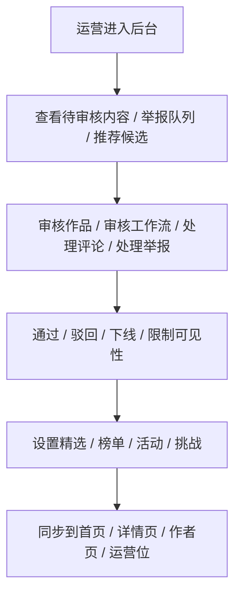

# DramaTV 社区全栈业务流程

更新日期：2026-04-06

## 1. 文档目标

这份文档用于把 DramaTV 社区从“页面视角”升级为“全栈业务流视角”。

重点不是描述某一页长什么样，而是回答：

- 用户和创作者在系统里怎么流动
- 哪些步骤是同步请求
- 哪些步骤必须异步处理
- 哪些地方需要审核、鉴权、风控
- 哪些地方会影响后续技术栈选择

## 2. 业务流范围

当前先固定 5 条核心业务流：

1. 游客浏览流
2. 创作者发布视频流
3. 创作者发布工作流流
4. 社区互动流
5. 运营治理流

参与角色包括：

- 游客 / 普通用户
- 创作者
- 运营 / 审核
- 社区前端
- 社区后端
- 媒体处理与异步任务系统
- 画布软件

## 3. 全局总览图

这个总览对应的真实含义是：

- 所有角色先通过社区前端进入系统
- 社区后端承担业务编排、鉴权、数据落库、状态变更
- 重媒体和重处理任务不应阻塞主请求，而应进入异步任务层
- 视频、封面、预览图等大资源应交给对象存储和 CDN
- 画布软件应通过明确的联动边界接入，而不是直接写死在页面逻辑里

## 4. 业务流一：游客浏览流

### 4.1 目标

让用户快速完成：

- 发现视频作品
- 发现工作流
- 发现作者
- 理解作品与工作流的关系
- 被引导进入登录、收藏、关注、继续创作

### 4.2 主流程

### 4.3 系统动作

- 首页优先读取缓存化的 feed 数据
- 视频详情页读取视频、作者、评论、关联工作流
- 工作流详情页读取工作流、作者、关联作品、复制状态、可见性
- 作者主页读取作者信息、作品列表、工作流列表

### 4.4 异步与缓存

- 首页 feed、热门榜、工作流榜尽量缓存
- 详情页访问、热门内容、曝光日志异步写埋点
- 推荐流和榜单结果可以异步生成，不应每次实时重算

### 4.5 风险点

- 首页视频资源过重
- 热门详情页请求过多
- 评论读取导致接口膨胀
- 未登录用户误以为可以直接执行受限交互

### 4.6 对架构的要求

- 必须有 `首页聚合接口`
- 必须有缓存层
- 必须有媒体资源分层：`cover / poster / preview / source`
- 必须把“读路径”和“写路径”区分开

## 5. 业务流二：创作者发布视频流

### 5.1 目标

让创作者完成一条作品从本地素材到社区发布的全流程。

### 5.2 主流程

### 5.3 系统动作

- 登录后创建作品草稿
- 上传视频、封面时应优先走对象存储直传或受控上传接口
- 元数据保存到数据库
- 绑定工作流时校验工作流是否存在、是否有权限引用
- 发布后触发转码、预览生成、封面处理、审核任务

### 5.4 异步任务

- 视频转码
- 预览视频生成
- 封面图抽帧
- 内容审核
- 搜索索引更新
- Feed 候选更新
- 创作者动态更新

### 5.5 风险点

- 大文件上传超时
- 非法视频格式或超规格文件
- 未审核内容直接暴露
- 绑定工作流时出现越权引用
- 上传接口被滥用

### 5.6 对架构的要求

- 需要 `草稿机制`
- 需要 `对象存储 + 异步任务队列`
- 需要 `发布状态机`：草稿、待审核、已发布、已拒绝、已下线
- 需要上传校验、鉴权、限流和审计日志

## 6. 业务流三：创作者发布工作流流

### 6.1 目标

让创作者把工作流作为独立内容对象发布，而不是作品附件。

### 6.2 主流程

### 6.3 系统动作

- 创建工作流草稿
- 存储工作流元数据、工作流引用、封面、示例案例
- 校验工作流引用是否合法
- 记录可见性、派生权限、复制权限
- 发布后写入详情页、作者页、关联作品能力

### 6.4 异步任务

- 示例资源处理
- 工作流结构校验
- 审核与敏感信息检查
- 搜索索引更新
- 推荐候选更新

### 6.5 风险点

- 工作流引用失效
- 私有工作流误被公开
- 可复制权限与可见性不一致
- 工作流中包含不应公开的参数或外部凭据

### 6.6 对架构的要求

- 工作流必须有独立服务和独立数据模型
- 工作流对象与“运行时对象 / 画布对象”建议分开建模
- 需要权限模型：公开、仅链接、私有、可复制、可派生
- 需要和画布软件保持清晰的接口边界

## 7. 业务流四：社区互动流

### 7.1 目标

支撑社区的最基本互动闭环：

- 评论
- 点赞
- 收藏
- 关注
- 举报

### 7.2 主流程

### 7.3 系统动作

- 鉴权判断用户身份
- 风控判断请求频率、异常行为、垃圾内容
- 写入互动表或计数表
- 评论和举报进入审核链路
- 关注、收藏、点赞更新统计和用户状态

### 7.4 异步任务

- 通知作者
- 评论审核
- 违规检测
- 互动计数汇总
- 热门排序更新

### 7.5 风险点

- 评论刷屏
- 点赞刷量
- 举报滥用
- 关注与收藏写放大
- 热门榜被异常行为污染

### 7.6 对架构的要求

- 互动服务建议独立于内容服务
- 计数聚合应避免每次实时扫主表
- 评论与举报必须有审核入口
- 所有写接口需要限流和审计

## 8. 业务流五：运营治理流

### 8.1 目标

让社区具备最低限度的治理和运营能力，而不是只做一个开放上传站。

### 8.2 主流程

### 8.3 系统动作

- 审核运营读取审核队列和举报队列
- 修改内容状态、推荐状态、可见性状态
- 记录操作人、操作时间、原因和结果
- 对精选、活动、挑战进行配置

### 8.4 异步任务

- 审核通知
- 下线缓存失效
- 搜索索引更新
- 推荐池重算
- 榜单刷新

### 8.5 风险点

- 审核记录缺失
- 下线后缓存未失效
- 精选和活动逻辑与真实内容状态不一致
- 权限不足的角色可执行高风险操作

### 8.6 对架构的要求

- 需要基础运营后台
- 需要操作审计日志
- 需要后台 RBAC 权限模型
- 需要内容状态与前台展示状态清晰解耦

## 9. 横切能力

下面这些能力不属于某一条单独业务流，但会影响所有流程。

### 9.1 鉴权与权限

- 用户登录态
- 普通用户与创作者权限
- 运营后台权限
- 工作流复制和派生权限
- 私有 / 链接可见 / 公开的访问控制

### 9.2 媒体处理

- 视频上传
- 封面抽帧
- 预览生成
- 大文件校验
- 对象存储和 CDN 分发

### 9.3 搜索与推荐

- 作品搜索
- 工作流搜索
- 作者搜索
- 热门与推荐流
- 榜单与精选

### 9.4 审核与安全

- 上传安全
- 评论反垃圾
- 举报处理
- 内容审核
- 接口限流
- 审计日志

### 9.5 画布联动

- 从工作流详情页打开画布
- 复制工作流到画布
- 发布作品时绑定工作流
- 作品详情页回看来源工作流

## 10. 对技术栈选择的直接影响

业务流程一旦确定，后面的技术栈选择至少要回答这些问题：

- 前端是否需要 SSR，以支撑首页、详情页、作者页的 SEO 和首屏性能
- 后端是采用模块化单体，还是从一开始拆出多个服务
- 上传和转码链路如何设计
- 是否需要消息队列承接异步任务
- 是否需要搜索引擎承接作品、工作流和作者检索
- 缓存层和 CDN 如何配合
- 画布联动通过 HTTP API、回调还是 SDK / 插件

结论：

- 技术栈不能脱离业务流单独讨论
- 业务流文档就是下一步“技术栈分析文档”的输入

## 11. 当前结论

当前最重要的不是继续补页面，而是先把这 5 条链路固定下来。

只有业务流稳定之后，下面这些事情才适合继续推进：

- 候选技术栈对照
- 服务拆分方式
- 新版 `AGENTS.md`
- 正式 API 设计
- 页面与组件继续落地
