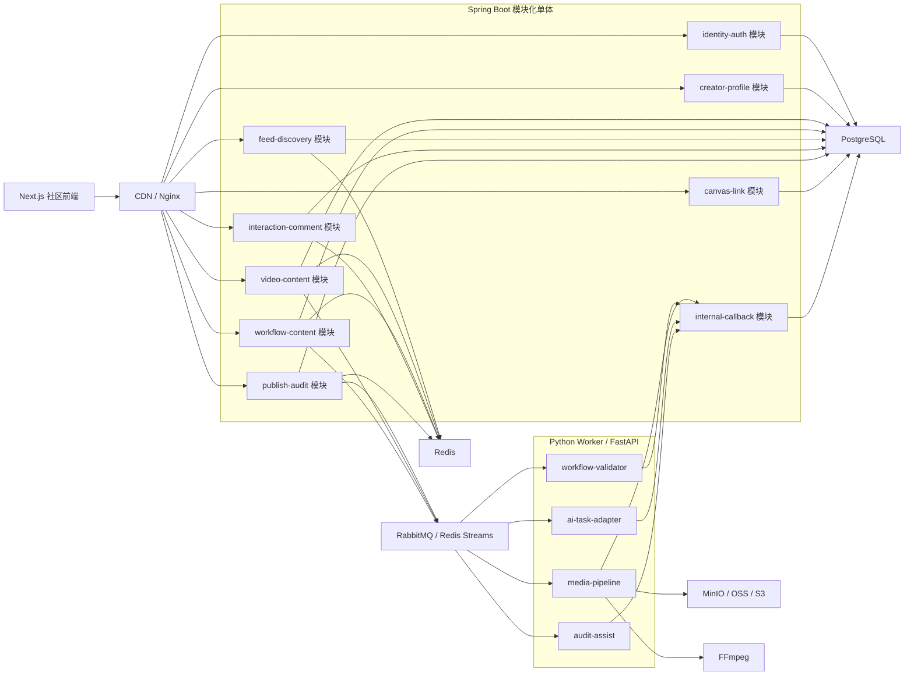
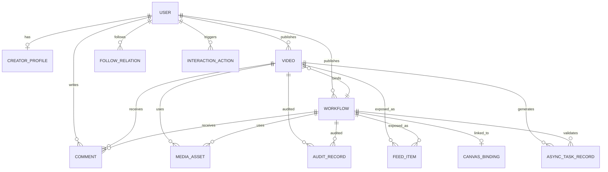
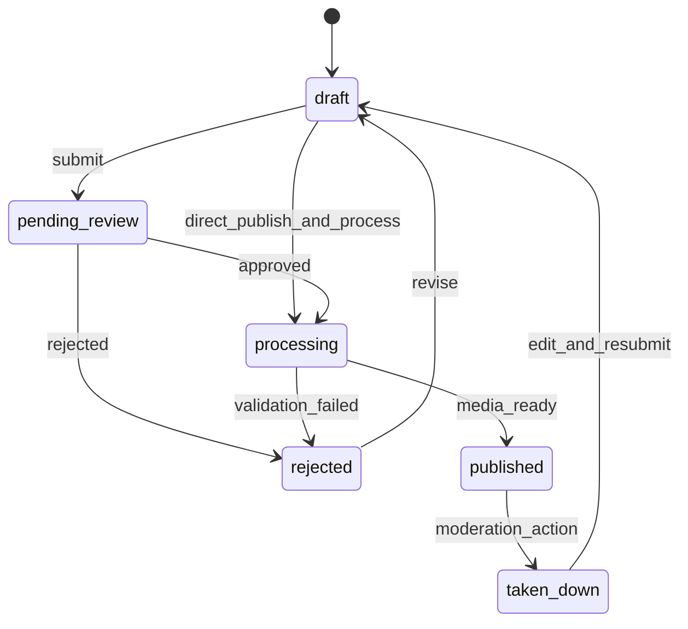
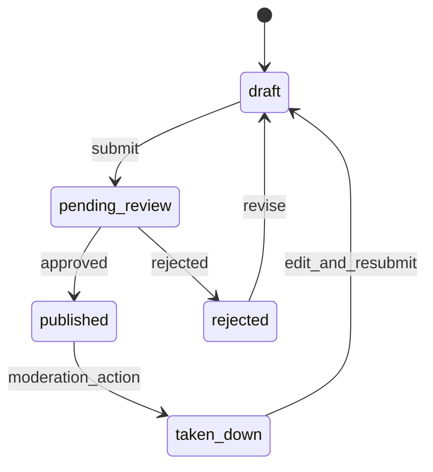
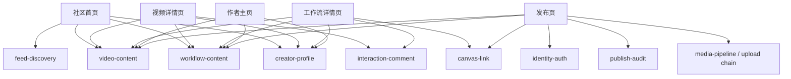

# DramaTV 社区第一阶段领域模型与服务拆分

更新日期：2026-04-06

## 1. 文档目标

这份文档用于把“技术栈已经定稿”进一步推进到“第一阶段怎么拆模块、拆服务、拆领域模型”。

重点回答 5 个问题：

- 第一阶段到底按什么粒度拆
- 哪些能力归 `Spring Boot`
- 哪些能力归 `Python Worker / FastAPI`
- 核心实体之间是什么关系
- 后续前后端开发该围绕哪些接口组推进

这份文档默认服务于第一阶段，不追求一上来就把系统拆成很多微服务。

## 2. 第一阶段拆分原则

第一阶段推荐采用：

- `Next.js` 作为社区前端
- `Spring Boot` 作为平台主后端
- `Python Worker / FastAPI` 作为 AI / 工作流 / 媒体处理侧
- `PostgreSQL + Redis + Queue + Object Storage` 作为基础设施

架构策略建议为：

- 前端单站点
- 后端采用 `模块化单体`
- Worker 采用 `单 Worker 服务 + 多任务类型`
- 暂不进入微服务化

原因很明确：

- 当前团队规模和推进节奏，不适合一开始拆太散
- 平台主业务必须有统一 owner
- 你对 `Python` 更熟，AI 与媒体处理继续放大强项
- `Spring Boot` 负责主业务，能让后续社区治理和运营扩展更稳

第一阶段的原则是：

1. 先把边界拆清楚
2. 再把代码组织成模块
3. 不急着把模块拆成独立部署服务

## 3. 第一阶段总体结论

### 3.1 一句话结论

第一阶段最稳的落地方式是：

`Next.js + Spring Boot 模块化单体 + Python Worker / FastAPI 单 Worker 服务`

### 3.2 所有权规则

- 社区主业务真相数据由 `Spring Boot + PostgreSQL` 维护
- 大文件二进制资源由 `MinIO / OSS / S3` 维护
- 异步处理过程由 `Queue + Python Worker` 负责
- `Python Worker` 不直接成为社区主域入口
- Worker 处理完成后，优先通过回调接口或任务结果表回写平台状态

### 3.3 第一阶段不建议做的事

- 不建议一开始就拆独立用户服务、评论服务、推荐服务的独立部署
- 不建议让 `Python Worker` 直接改动大量社区主表
- 不建议在前端页面里临时拼业务状态机
- 不建议现在就上复杂推荐系统和复杂搜索链路

## 4. 第一阶段模块拆分图

这张图对应的实际意思是：

- `Spring Boot` 是平台主业务编排层
- `Python Worker` 是重任务处理层
- `internal-callback` 是 Worker 回写平台结果的受控入口
- 第一阶段可以是一个 `Spring Boot` 应用里的多个模块，而不是多个独立服务

## 5. Spring Boot 首批模块拆分

第一阶段推荐按下面方式在 `Spring Boot` 内组织模块。

| 模块 | 主要职责 | 主要实体 | 主要接口组 | 是否第一阶段必须 |
| --- | --- | --- | --- | --- |
| `identity-auth` | 登录、鉴权、角色、会话、基础权限 | `User` | 登录、会话、鉴权 | 是 |
| `creator-profile` | 作者主页、作者资料、作者内容聚合 | `User`、`CreatorProfile` | 作者主页、作者资料 | 是 |
| `video-content` | 视频元数据、视频详情、视频与工作流绑定 | `Video`、`MediaAsset` | 视频详情、视频列表 | 是 |
| `workflow-content` | 工作流详情、权限、与作品关联 | `Workflow`、`CanvasBinding` | 工作流详情、工作流列表 | 是 |
| `feed-discovery` | 首页推荐流、热门、工作流入口、专题聚合 | `FeedItem` | 首页聚合接口 | 是 |
| `interaction-comment` | 评论、点赞、收藏、关注、举报 | `Comment`、`InteractionAction`、`FollowRelation` | 互动接口 | 是 |
| `publish-audit` | 草稿、发布状态机、审核状态、下线状态 | `PublishDraft`、`AuditRecord`、`ReportTicket` | 发布、审核、提交 | 是 |
| `canvas-link` | 工作流与画布引用、跳转、复制入口位 | `CanvasBinding` | 在画布中打开、复制工作流 | 是 |
| `internal-callback` | 接收 Worker 回调、更新任务结果 | `TaskCallbackLog` | 内部回调接口 | 是 |

### 5.1 当前阶段模块优先级

为了和当前社区主线保持一致，第一阶段模块优先级建议明确为：

- `P0 主线模块`
  - `identity-auth`
  - `creator-profile`
  - `video-content`
  - `workflow-content`
  - `feed-discovery`
  - `publish-audit`
- `P1 补强模块`
  - `interaction-comment`
  - `internal-callback`
- `P2 二级增强模块`
  - `canvas-link`

规则：

- `canvas-link` 必须保留清晰边界，但不应高于社区主链路排期
- `interaction-comment` 虽然重要，但应跟在首页、详情页、发布主链路之后补强
- 第一阶段真正的 owner 应集中在“读链路 + 发布链路”

### 5.2 模块组织建议

第一阶段不建议为每个模块建立独立仓库。

推荐组织方式：

- 一个 `Spring Boot` 仓库
- 按模块分 package
- 模块之间通过 service interface 调用
- 公共事务、鉴权、中间件统一维护

这会比现在直接上微服务稳很多。

## 6. Python Worker / FastAPI 首批模块拆分

`Python Worker / FastAPI` 第一阶段不建议拆成多个独立服务，推荐一个 Worker 服务里按任务类型拆模块。

| 模块 | 主要职责 | 输入 | 输出 | 是否第一阶段必须 |
| --- | --- | --- | --- | --- |
| `media-pipeline` | 视频转码、封面抽帧、预览生成 | 视频源文件、媒体任务 | 预览地址、封面地址、处理结果 | 是 |
| `workflow-validator` | 工作流结构检查、引用检查、公开信息清洗 | 工作流草稿、画布引用 | 校验结果、风险项 | 是 |
| `ai-task-adapter` | 未来 AI 生成任务接入、任务编排占位 | 生成任务请求 | 任务状态、结果引用 | 否，但建议预留 |
| `audit-assist` | 内容审核辅助、敏感项检测、违规辅助判断 | 视频、简介、工作流说明 | 审核建议、风险标签 | 是 |
| `callback-client` | 将处理结果回写平台后端 | 任务结果 | 平台状态更新 | 是 |

### 6.1 Worker 的边界规则

- Worker 不拥有社区主域模型
- Worker 处理的是任务，不是平台主流程页面
- Worker 输出应尽量标准化为任务结果
- Worker 不应直接对外暴露社区业务 API

## 7. 第一阶段实体总表

| 实体 | Owner | 说明 | 第一阶段作用 |
| --- | --- | --- | --- |
| `User` | Spring Boot | 账号主体 | 登录、鉴权、作者、互动 |
| `CreatorProfile` | Spring Boot | 作者扩展信息 | 作者主页展示 |
| `Video` | Spring Boot | 视频作品主对象 | 视频详情、首页内容 |
| `Workflow` | Spring Boot | 工作流主对象 | 工作流详情、复制入口 |
| `MediaAsset` | Spring Boot 元数据 + 对象存储二进制 | 封面、预览、源文件 | 列表与详情媒体展示 |
| `PublishDraft` | Spring Boot | 发布草稿 | 视频和工作流发布链路 |
| `Comment` | Spring Boot | 评论数据 | 互动闭环 |
| `InteractionAction` | Spring Boot | 点赞、收藏、举报等行为 | 互动状态与计数 |
| `FollowRelation` | Spring Boot | 关注关系 | 作者主页与关系链 |
| `FeedItem` | Spring Boot | 首页聚合对象 | 首页推荐流 |
| `AuditRecord` | Spring Boot | 审核记录 | 待审核、通过、驳回、下线 |
| `CanvasBinding` | Spring Boot | 工作流与画布引用关系 | 在画布中打开、复制工作流 |
| `AsyncTaskRecord` | Spring Boot | 任务派发与回写记录 | 任务跟踪与审计 |

## 8. 核心实体关系图

这张图里最关键的关系有 4 个：

- `Video` 和 `Workflow` 必须可以绑定，但工作流不是附件
- `User` 既是登录主体，也是创作者主体
- `MediaAsset` 只是资源描述，不应该把二进制塞进主表
- `AuditRecord` 和 `AsyncTaskRecord` 必须独立存在，不能只靠状态字段硬扛

## 9. 发布状态机

### 9.1 视频发布状态机

### 9.2 工作流发布状态机

规则：

- 前端不能猜状态，只能读后端返回的状态
- 审核状态和发布状态必须可追踪
- 下线不等于删除

## 10. 页面到模块依赖关系图

这张图的作用是让前端和后端都知道：

- 每一页最终依赖的是哪些业务模块
- 首页和详情页的聚合逻辑不应该直接写死在页面文件里
- 发布页是依赖最重的一页，必须尽早单独建模

## 11. 首批接口组建议

这一部分不是最终 API 定义，而是告诉我们第一阶段应该按哪些接口组来拆开发任务。

### 11.1 公共读接口

- `GET /api/feed/home`
- `GET /api/videos/{id}`
- `GET /api/workflows/{id}`
- `GET /api/creators/{id}`
- `GET /api/creators/{id}/videos`
- `GET /api/creators/{id}/workflows`

### 11.2 鉴权与会话接口

- `POST /api/auth/login`
- `POST /api/auth/logout`
- `GET /api/auth/me`

### 11.3 视频发布接口

- `POST /api/video-drafts`
- `PUT /api/video-drafts/{id}`
- `POST /api/video-drafts/{id}/submit`
- `POST /api/uploads/video-policy`
- `POST /api/internal/media-callback`

### 11.4 工作流发布接口

- `POST /api/workflow-drafts`
- `PUT /api/workflow-drafts/{id}`
- `POST /api/workflow-drafts/{id}/submit`
- `POST /api/internal/workflow-validate-callback`

### 11.5 互动接口

- `POST /api/comments`
- `POST /api/interactions/like`
- `POST /api/interactions/favorite`
- `POST /api/interactions/follow`
- `POST /api/reports`

### 11.6 画布联动接口

- `GET /api/workflows/{id}/canvas-link`
- `POST /api/workflows/{id}/copy-to-canvas`

## 12. 所有权矩阵

| 对象 / 能力 | 前端 | Spring Boot | Python Worker | 对象存储 / 基础设施 |
| --- | --- | --- | --- | --- |
| 页面展示 | 读与渲染 | 提供接口 | 不负责 | CDN 分发 |
| 用户与权限 | 状态显示 | 主 owner | 不负责 | Redis 可辅助会话 |
| 视频与工作流元数据 | 展示与提交 | 主 owner | 只消费任务输入 | 不负责 |
| 评论与互动 | 展示与触发 | 主 owner | 不负责 | Redis 可做限流 |
| 草稿与发布状态 | 表单与状态展示 | 主 owner | 接收任务触发 | 不负责 |
| 视频源文件 | 上传入口 | 发放上传策略 | 消费处理 | 主 owner |
| 预览图 / 封面 / 预览视频 | 展示 | 保存元数据 | 生成处理 | 保存文件 |
| 工作流结构校验 | 提交与结果展示 | 发起任务、落校验结果 | 主处理者 | 不负责 |
| 审核辅助 | 展示最终结果 | 主 owner | 提供辅助判断 | 不负责 |

## 13. 第一阶段推荐开发顺序

### 13.1 第一步

先定库表和领域对象：

- `User`
- `CreatorProfile`
- `Video`
- `Workflow`
- `MediaAsset`
- `PublishDraft`
- `Comment`
- `InteractionAction`
- `FollowRelation`
- `AuditRecord`
- `CanvasBinding`
- `AsyncTaskRecord`

### 13.2 第二步

先搭 `Spring Boot` 模块化骨架：

- `identity-auth`
- `video-content`
- `workflow-content`
- `publish-audit`
- `creator-profile`

### 13.3 第三步

补 `Python Worker` 最小任务链：

- 视频转码
- 封面抽帧
- 预览生成
- 工作流校验

### 13.4 第四步

前端开始按页面消费接口：

- 首页读接口
- 视频详情页读接口
- 工作流详情页读接口
- 作者主页读接口
- 发布页写接口

### 13.5 第五步

最后再补：

- 评论与互动
- 审核辅助
- 画布联动
- 缓存与限流优化

## 14. 当前仍未锁定的问题

- `QL / QC` 的业务口径仍需老板确认
- 画布软件对“复制工作流”的真实接口形式还未锁定
- AI 视频生成任务是走平台内任务中心，还是暂时先做外部引用入口，还需再定
- 第二阶段是否接 `Meilisearch`，要看第一阶段内容规模和搜索需求

## 15. 这份文档之后最该接的文档

这份文档产出后，后续最适合继续补的两份文档是：

1. `docs/04_实施设计/数据库初版表设计.md`
2. `docs/04_实施设计/第一阶段 API 清单.md`

原因是：

- 领域模型已经定了，下一步就该落库表
- 模块边界已经定了，下一步就该落接口
