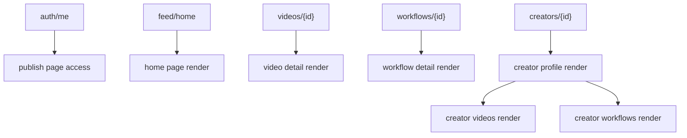

# DramaTV Next.js 页面数据契约

更新日期：2026-04-06

## 1. 文档目标

这份文档用于把“第一阶段 API 清单”继续压到前端页面层。

重点回答：

- `Next.js` 每个页面该吃哪些接口
- 页面级数据对象长什么样
- 哪些数据应该服务端取，哪些动作应该客户端触发
- 页面组件该如何围绕数据契约组织

这份文档默认服务于当前正式 `Next.js` 社区工程的数据契约设计与接口联调。

## 2. 前端组织原则

第一阶段推荐：

- 使用 `Next.js App Router`
- 页面级读取优先走服务端
- 评论、点赞、收藏、关注、发布提交等动作走客户端交互
- 页面拿到的数据对象尽量是“页面视图模型”，而不是直接拼原始 API

## 2.1 当前阶段优先级约束

为了避免前端继续被二级能力带偏，当前阶段明确分层如下：

- `P0 主线页面`：
  - `/`
  - `/videos/[id]`
  - `/workflows/[id]`
  - `/creators/[id]`
  - `/publish`
- `P1 补强页面与交互`：
  - 评论、点赞、收藏、关注的完整状态
  - 发布页草稿与审核状态
  - 作者页内容聚合优化
- `P2 二级增强`：
  - `/canvas/[runtimeId]`
  - 工作流复制后 runtime 渐进加载
  - 更复杂的派生与联动画布体验

规则：

- 当前排期先保证 `P0` 页面主路径全部成立
- `canvas` 页面保留，但不应继续抢占首页、详情页、作者页、发布页的实现资源
- 页面契约设计时，优先围绕“社区闭环”而不是“画布深功能”展开

## 3. 路由结构建议

```text
app/
├─ (community)/
│  ├─ page.tsx
│  ├─ videos/[id]/page.tsx
│  ├─ workflows/[id]/page.tsx
│  ├─ creators/[id]/page.tsx
│  ├─ publish/page.tsx
│  └─ canvas/[runtimeId]/page.tsx
├─ api/
└─ layout.tsx
```

说明：

- 首页、详情页、作者页、发布页都进入 `(community)` 分组
- 第一阶段不急着拆独立后台路由
- `/canvas/[runtimeId]` 保留为增强型路由，不是当前主线交付 owner

## 4. 页面到接口依赖图

```mermaid
flowchart TD
    HOME["/"] --> FEED["GET /api/feed/home"]
    VIDEO["/videos/[id]"] --> VIDEO_API["GET /api/videos/{id}"]
    VIDEO --> COMMENT_API["GET /api/comments"]
    WF["/workflows/[id]"] --> WF_API["GET /api/workflows/{id}"]
    WF --> COMMENT_API
    WF --> COPY_API["POST /api/workflows/{id}/copy-to-canvas"]
    CREATOR["/creators/[id]"] --> CREATOR_API["GET /api/creators/{id}"]
    CREATOR --> CV["GET /api/creators/{id}/videos"]
    CREATOR --> CW["GET /api/creators/{id}/workflows"]
    PUBLISH["/publish"] --> ME["GET /api/auth/me"]
    PUBLISH --> VD["GET/POST/PUT /api/video-drafts/**"]
    PUBLISH --> WD["GET/POST/PUT /api/workflow-drafts/**"]
    PUBLISH --> UP["POST /api/uploads/**"]
    CANVAS_RT["/canvas/[runtimeId]"] --> RT["GET /api/canvas-runtimes/{id}"]
    CANVAS_RT --> SNAP["GET /api/canvas-runtimes/{id}/snapshot?mode=light"]
    CANVAS_RT --> VA["POST /api/canvas-runtimes/{id}/visible-assets"]
    CANVAS_RT --> TASK["GET /api/canvas-copy-tasks/{id}"]
```



## 5. 页面视图模型原则

页面层不要直接把每个接口原样传到组件树。

建议在页面层统一转换为页面视图模型：

- `HomePageView`
- `VideoDetailPageView`
- `WorkflowDetailPageView`
- `CanvasRuntimePageView`
- `CreatorPageView`
- `PublishPageView`

作用：

- 前端组件只关心自己需要的数据
- 后端字段轻微变化时，页面层能吸收差异
- 后续做 SSR / 缓存 / 占位状态也更稳

## 6. 首页数据契约

### 6.1 页面目标

- 分发视频
- 分发工作流
- 分发作者入口
- 引导创作

### 6.2 首页页面模型

```ts
type HomePageView = {
  feedItems: HomeFeedCardView[]
  hotWorkflows: WorkflowMiniCardView[]
  featuredCreators: CreatorMiniCardView[]
  nextCursor?: string
  hasMore: boolean
}

type HomeFeedCardView = {
  itemType: 'video' | 'workflow'
  targetId: string
  title: string
  summary?: string
  coverUrl: string
  author: {
    id: string
    displayName: string
    avatarUrl?: string
  }
  workflow?: {
    id: string
    title: string
  }
  stats?: {
    likeCount?: number
    playCount?: number
  }
}
```

### 6.3 数据获取策略

- 首屏：服务端取 `GET /api/feed/home`
- 翻页：客户端通过 cursor 继续请求

### 6.4 页面组件建议

```text
HomePage
├─ HeroEntryStrip
├─ FeedSection
│  ├─ VideoCard
│  └─ WorkflowCard
├─ HotWorkflowSection
└─ FeaturedCreatorSection
```

## 7. 视频详情页数据契约

### 7.1 页面模型

```ts
type VideoDetailPageView = {
  id: string
  title: string
  summary?: string
  tags: string[]
  media: {
    coverUrl?: string
    posterUrl?: string
    previewUrl?: string
    sourceUrl?: string
    durationMs?: number
  }
  author: {
    id: string
    displayName: string
    avatarUrl?: string
    followed?: boolean
  }
  workflow?: {
    id: string
    title: string
    allowCopy: boolean
  }
  stats: {
    playCount: number
    likeCount: number
    favoriteCount: number
    commentCount: number
  }
  viewerActions: {
    liked: boolean
    favorited: boolean
  }
  relatedVideos: VideoMiniCardView[]
}
```

### 7.2 数据来源

- 服务端：
  - `GET /api/videos/{id}`
  - `GET /api/videos/{id}/related`
- 客户端：
  - `GET /api/comments?targetType=video&targetId=...`
  - 点赞 / 收藏 / 评论 / 关注动作

### 7.3 页面组件建议

```text
VideoDetailPage
├─ VideoPlayerPanel
├─ VideoMetaPanel
├─ WorkflowRelationCard
├─ CommentThread
└─ RelatedVideoList
```

## 8. 工作流详情页数据契约

### 8.1 页面模型

```ts
type WorkflowDetailPageView = {
  id: string
  title: string
  summary?: string
  scenarioText?: string
  tagNames: string[]
  author: {
    id: string
    displayName: string
    avatarUrl?: string
  }
  permissions: {
    allowCopy: boolean
    allowFork: boolean
  }
  canvasBinding?: {
    bindingType: 'internal' | 'external'
    openUrl?: string
    canCopy: boolean
  }
  stats: {
    likeCount: number
    favoriteCount: number
    commentCount: number
    videoBindCount: number
  }
  relatedVideos: VideoMiniCardView[]
  viewerActions: {
    liked: boolean
    favorited: boolean
  }
}
```

### 8.2 数据来源

- 服务端：
  - `GET /api/workflows/{id}`
  - `GET /api/workflows/{id}/related-videos`
- 客户端：
  - `GET /api/comments?targetType=workflow&targetId=...`
  - `POST /api/workflows/{id}/copy-to-canvas`

### 8.3 页面组件建议

```text
WorkflowDetailPage
├─ WorkflowHero
├─ WorkflowMetaPanel
├─ CanvasActionPanel
├─ RelatedVideoSection
└─ CommentThread
```

### 8.4 复制后的前端动作

`POST /api/workflows/{id}/copy-to-canvas` 成功后，前端不应等待所有资源补齐再跳转。

建议行为：

1. 拿到 `targetRuntimeId`
2. 立即跳转 `/canvas/[runtimeId]`
3. 在画布页内继续读取 `light snapshot`
4. 再按视口批量拉取节点资源

## 9. 作者主页数据契约

### 9.1 页面模型

```ts
type CreatorPageView = {
  profile: {
    id: string
    displayName: string
    avatarUrl?: string
    bio?: string
    headline?: string
    followed: boolean
  }
  stats: {
    videoCount: number
    workflowCount: number
    followerCount: number
  }
  videos: VideoMiniCardView[]
  workflows: WorkflowMiniCardView[]
  nextVideoCursor?: string
  nextWorkflowCursor?: string
}
```

### 9.2 数据来源

- 服务端：
  - `GET /api/creators/{id}`
  - `GET /api/creators/{id}/videos`
  - `GET /api/creators/{id}/workflows`
- 客户端：
  - 关注 / 取消关注
  - 内容 tab 切换与翻页

### 9.3 页面组件建议

```text
CreatorPage
├─ CreatorHeader
├─ CreatorStatsBar
├─ CreatorTabs
│  ├─ VideoGrid
│  └─ WorkflowGrid
```

## 10. 发布页数据契约

### 10.1 页面目标

- 区分发布视频和发布工作流
- 支持草稿
- 支持上传
- 支持提交审核

### 10.2 页面模型

```ts
type PublishPageView = {
  currentUser: {
    id: string
    displayName: string
    roleCode: string
  }
  activeTab: 'video' | 'workflow'
  videoDraft?: VideoDraftView
  workflowDraft?: WorkflowDraftView
}

type VideoDraftView = {
  draftId: string
  targetId?: string
  title?: string
  summary?: string
  categoryCode?: string
  tagNames: string[]
  workflowId?: string
  visibility: 'public' | 'link' | 'private'
  coverAssetId?: string
  sourceAssetId?: string
  statusCode: string
}

type WorkflowDraftView = {
  draftId: string
  targetId?: string
  title?: string
  summary?: string
  scenarioText?: string
  tagNames: string[]
  allowCopy: boolean
  allowFork: boolean
  visibility: 'public' | 'link' | 'private'
  coverAssetId?: string
  statusCode: string
}
```

### 10.3 数据来源

- 服务端：
  - `GET /api/auth/me`
- 客户端：
  - `POST /api/video-drafts`
  - `GET /api/video-drafts/{id}`
  - `PUT /api/video-drafts/{id}`
  - `POST /api/video-drafts/{id}/submit`
  - `POST /api/workflow-drafts`
  - `GET /api/workflow-drafts/{id}`
  - `PUT /api/workflow-drafts/{id}`
  - `POST /api/workflow-drafts/{id}/submit`
  - `POST /api/uploads/video-policy`
  - `POST /api/uploads/image-policy`

### 10.4 页面组件建议

```text
PublishPage
├─ PublishTypeTabs
├─ VideoPublishForm
│  ├─ UploadPanel
│  ├─ BasicInfoSection
│  ├─ WorkflowBindingSection
│  └─ VisibilitySection
└─ WorkflowPublishForm
   ├─ CoverUploadSection
   ├─ BasicInfoSection
   ├─ CanvasBindingSection
   └─ PermissionSection
```

## 11. 页面组件共享类型

```ts
type VideoMiniCardView = {
  id: string
  title: string
  coverUrl: string
  durationMs?: number
  author: {
    id: string
    displayName: string
  }
}

type WorkflowMiniCardView = {
  id: string
  title: string
  coverUrl?: string
  author: {
    id: string
    displayName: string
  }
  allowCopy: boolean
}

type CreatorMiniCardView = {
  id: string
  displayName: string
  avatarUrl?: string
  headline?: string
}
```

## 12. 服务端 / 客户端边界

### 12.1 优先服务端获取

- 首页首屏
- 视频详情主内容
- 工作流详情主内容
- 作者主页首屏
- 登录态基础信息

### 12.2 优先客户端动作

- 点赞
- 收藏
- 关注
- 评论
- 翻页
- 草稿自动保存
- 上传
- 提交审核

## 13. 加载与空态规则

第一阶段页面必须显式处理：

- `loading`
- `empty`
- `error`
- `not_found`
- `forbidden`

规则：

- 页面首屏数据异常时要有独立状态页
- 评论区和相关推荐可以局部失败，不要把整页打死
- 私有内容和下线内容要区分文案

## 14. 页面数据依赖顺序



## 15. 推荐目录结构

```text
src/
├─ app/
├─ features/
│  ├─ home/
│  ├─ video-detail/
│  ├─ workflow-detail/
│  ├─ creator/
│  └─ publish/
├─ components/
│  ├─ cards/
│  ├─ comments/
│  └─ shared/
├─ lib/
│  ├─ api/
│  ├─ mappers/
│  └─ auth/
└─ types/
```

说明：

- `features` 按页面领域拆
- `lib/mappers` 负责把 API 响应映射成页面视图模型
- 不要把所有 TS 类型都塞进一个超大 `types.ts`

## 16. 当前阶段最该先实现的页面契约

优先顺序建议：

1. 首页
2. 视频详情页
3. 工作流详情页
4. 作者主页
5. 发布页

原因：

- 首页和详情页先打通读链路
- 作者页复用视频与工作流卡片
- 发布页最后接写链路和上传链路

## 17. 这份文档之后最该接的动作

这份文档产出后，最适合继续做的是：

1. 建立 `Next.js` 目录骨架
2. 按页面建立页面视图模型 mapper
3. 开始把现有 `React + Vite` 原型页面迁移到 `Next.js`

## 18. 画布运行时页数据契约

### 18.1 页面目标

- 复制后快速打开副本
- 先显示节点骨架和小地图
- 再渐进加载当前视口资源

### 18.2 页面模型

```ts
type CanvasRuntimePageView = {
  runtime: {
    id: string
    sourceWorkflowId?: string
    canvasSpaceId: string
    canvasWorkflowId: string
    runtimeStatus: 'creating' | 'runtime_ready' | 'reconciling' | 'failed' | 'archived'
    lightSnapshotVersion: number
  }
  snapshot: CanvasLightSnapshotView
  copyTask?: {
    id: string
    statusCode: string
    progressPercent: number
  }
}

type CanvasLightSnapshotView = {
  viewport: {
    x: number
    y: number
    zoom: number
  }
  minimapBounds: {
    minX: number
    minY: number
    maxX: number
    maxY: number
  }
  nodes: CanvasNodeShellView[]
  edges: CanvasEdgeView[]
}

type CanvasNodeShellView = {
  id: string
  type: string
  x: number
  y: number
  width: number
  height: number
  title?: string
  assetState: 'empty' | 'placeholder' | 'ready' | 'failed'
}

type CanvasNodeAssetView = {
  nodeId: string
  thumbnailUrl?: string
  posterUrl?: string
  previewUrl?: string
  statusCode: 'placeholder' | 'ready' | 'forbidden' | 'refreshing' | 'failed'
}

type CanvasEdgeView = {
  id: string
  sourceNodeId: string
  targetNodeId: string
}
```

### 18.3 数据来源

- 服务端：
  - `GET /api/canvas-runtimes/{id}`
  - `GET /api/canvas-runtimes/{id}/snapshot?mode=light`
- 客户端：
  - `POST /api/canvas-runtimes/{id}/visible-assets`
  - `GET /api/canvas-copy-tasks/{id}`

### 18.4 页面组件建议

```text
CanvasRuntimePage
├─ CanvasTopBar
├─ CanvasViewport
│  ├─ EdgeLayer
│  ├─ NodeShellLayer
│  ├─ NodeAssetLayer
│  └─ MiniMap
└─ CopyTaskStatusToast
```

### 18.5 渲染规则

- 首屏只靠 `light snapshot` 渲染 `NodeShellLayer`
- 小地图只使用几何数据，不依赖真实媒体
- 当前视口之外的节点不挂真实图片组件
- 图片先 `thumbnail`，视频先 `poster`
- 只有进入视口后，才请求 `preview`
