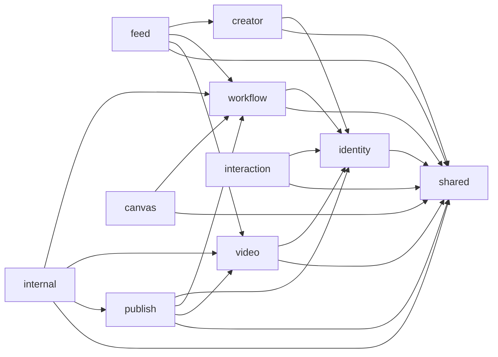

# DramaTV Spring Boot 模块目录设计

更新日期：2026-04-06

## 1. 文档目标

这份文档用于把“第一阶段领域模型、数据库和 API 清单”继续往代码组织层落地。

重点回答：

- `Spring Boot` 仓库第一阶段怎么搭
- 模块应该怎么切
- package 应该怎么分
- 哪些模块能互相依赖，哪些不能
- 从哪里开始写，才不会一上来就乱

默认前提：

- 第一阶段采用 `Spring Boot 模块化单体`
- 不拆成多个独立部署服务
- 但代码层必须先按模块边界组织

## 2. 目标结构

一句话结论：

第一阶段推荐采用：

`一个 Spring Boot 仓库 + 按领域模块切 package + 每个模块内部按 controller / application / domain / infrastructure 分层`

## 3. 仓库级结构建议

```text
dramatv-community-server/
├─ build.gradle.kts / pom.xml
├─ settings.gradle.kts
├─ src/
│  ├─ main/
│  │  ├─ java/com/dramatv/community/
│  │  │  ├─ bootstrap/
│  │  │  ├─ shared/
│  │  │  ├─ identity/
│  │  │  ├─ creator/
│  │  │  ├─ video/
│  │  │  ├─ workflow/
│  │  │  ├─ feed/
│  │  │  ├─ interaction/
│  │  │  ├─ publish/
│  │  │  ├─ canvas/
│  │  │  └─ internal/
│  │  └─ resources/
│  │     ├─ application.yml
│  │     ├─ application-dev.yml
│  │     ├─ application-test.yml
│  │     └─ db/migration/
│  └─ test/
│     └─ java/com/dramatv/community/
└─ docs/
```

说明：

- `bootstrap` 放启动配置
- `shared` 放跨模块公共能力
- 业务模块按领域拆
- 迁移文件统一放 `db/migration`

## 4. 模块拆分图



这张图表达的是：

- `shared` 是基础公共层
- `identity` 是几乎所有业务模块的上游基础依赖
- `feed` 是读聚合模块，不反向被内容模块依赖
- `publish` 负责状态机和提交流程，不负责承载所有详情读逻辑
- `internal` 只处理内部回调，不应该被页面接口直接使用

## 5. 每个模块内部推荐分层

每个业务模块内部统一采用下面结构：

```text
video/
├─ controller/
├─ application/
├─ domain/
├─ infrastructure/
└─ dto/
```

职责建议：

- `controller`
  - HTTP 入口
  - 参数校验
  - 调用 application service
- `application`
  - 用例编排
  - 事务边界
  - 跨 domain 组装
- `domain`
  - 领域模型
  - 业务规则
  - repository interface
- `infrastructure`
  - JPA/MyBatis 实现
  - 第三方依赖
  - cache / mq / storage adapter
- `dto`
  - request / response / query view

规则：

- `controller` 不直连 repository
- `domain` 不依赖 web dto
- `application` 不直接泄漏数据库实体给前端

## 6. 模块清单与职责

### 6.1 `shared`

职责：

- 通用异常
- 通用响应结构
- 枚举
- 安全工具
- ID / 时间工具
- 审计基础能力
- 限流注解和拦截器

推荐目录：

```text
shared/
├─ config/
├─ security/
├─ exception/
├─ response/
├─ enums/
├─ audit/
└─ util/
```

### 6.2 `identity`

职责：

- 登录
- 当前用户
- Token / Session
- 基础角色判断

核心对象：

- `User`
- `AuthSessionView`

### 6.3 `creator`

职责：

- 作者主页信息
- 作者视频列表
- 作者工作流列表
- 作者统计数据

核心对象：

- `CreatorProfile`

### 6.4 `video`

职责：

- 视频详情
- 视频列表
- 视频与工作流绑定
- 视频媒体信息读取

核心对象：

- `Video`
- `MediaAsset`

### 6.5 `workflow`

职责：

- 工作流详情
- 工作流列表
- 权限与可见性
- 关联视频

核心对象：

- `Workflow`
- `CanvasBinding`

### 6.6 `feed`

职责：

- 首页推荐流
- 热门流
- 工作流入口位
- 作者精选位

核心对象：

- `FeedItem`

### 6.7 `interaction`

职责：

- 评论
- 点赞
- 收藏
- 关注

核心对象：

- `Comment`
- `InteractionAction`
- `FollowRelation`

### 6.8 `publish`

职责：

- 草稿
- 发布状态机
- 审核记录
- 举报工单
- 提交发布

核心对象：

- `PublishDraft`
- `AuditRecord`
- `ReportTicket`
- `AsyncTaskRecord`

### 6.9 `canvas`

职责：

- 在画布中打开
- 复制工作流
- 工作流与画布映射
- 运行时副本查询
- 可视区域资源批量返回
- 复制任务状态查询

核心对象：

- `CanvasBinding`
- `CanvasWorkflowRuntime`
- `CanvasCopyTask`

推荐再拆 3 个 application service：

- `CanvasCopyAppService`
- `CanvasRuntimeQueryService`
- `CanvasVisibleAssetQueryService`

### 6.10 `internal`

职责：

- 媒体回调
- 工作流校验回调
- 审核辅助回调
- 回调签名校验
- 幂等处理

核心对象：

- `TaskCallbackLog`

## 7. 推荐 package 示例

以 `video` 模块为例：

```text
video/
├─ controller/
│  ├─ VideoQueryController.java
│  └─ VideoRelatedController.java
├─ application/
│  ├─ VideoQueryService.java
│  ├─ VideoRelatedService.java
│  └─ assembler/
├─ domain/
│  ├─ model/
│  ├─ repository/
│  └─ service/
├─ infrastructure/
│  ├─ persistence/
│  ├─ cache/
│  └─ mapper/
└─ dto/
   ├─ response/
   └─ query/
```

以 `publish` 模块为例：

```text
publish/
├─ controller/
│  ├─ VideoDraftController.java
│  ├─ WorkflowDraftController.java
│  └─ ReportController.java
├─ application/
│  ├─ VideoDraftAppService.java
│  ├─ WorkflowDraftAppService.java
│  ├─ PublishSubmitService.java
│  └─ AuditCommandService.java
├─ domain/
│  ├─ model/
│  ├─ repository/
│  ├─ command/
│  └─ state/
├─ infrastructure/
│  ├─ persistence/
│  ├─ mq/
│  └─ storage/
└─ dto/
```

以 `canvas` 模块为例：

```text
canvas/
├─ controller/
│  ├─ CanvasLinkController.java
│  ├─ CanvasCopyController.java
│  ├─ CanvasRuntimeController.java
│  └─ CanvasVisibleAssetController.java
├─ application/
│  ├─ CanvasCopyAppService.java
│  ├─ CanvasRuntimeQueryService.java
│  ├─ CanvasVisibleAssetQueryService.java
│  └─ CanvasCopyTaskQueryService.java
├─ domain/
│  ├─ model/
│  ├─ repository/
│  └─ service/
├─ infrastructure/
│  ├─ persistence/
│  ├─ client/
│  └─ mapper/
└─ dto/
```

## 8. 模块与表映射

| 模块 | 核心表 |
| --- | --- |
| `identity` | `users` |
| `creator` | `creator_profiles`、`users` |
| `video` | `videos`、`media_assets` |
| `workflow` | `workflows`、`canvas_bindings`、`media_assets` |
| `feed` | `feed_items`、`videos`、`workflows` |
| `interaction` | `comments`、`interaction_actions`、`follow_relations` |
| `publish` | `publish_drafts`、`audit_records`、`report_tickets`、`async_task_records` |
| `canvas` | `canvas_bindings`、`canvas_workflow_runtimes`、`canvas_runtime_assets`、`canvas_copy_tasks` |
| `internal` | `task_callback_logs`、`async_task_records` |

## 9. 模块与 API 映射

| 模块 | 负责接口 |
| --- | --- |
| `identity` | `/api/auth/**` |
| `creator` | `/api/creators/**` |
| `video` | `/api/videos/**` |
| `workflow` | `/api/workflows/**` |
| `feed` | `/api/feed/**` |
| `interaction` | `/api/comments/**`、`/api/interactions/**` |
| `publish` | `/api/video-drafts/**`、`/api/workflow-drafts/**`、`/api/reports`、`/api/uploads/**` |
| `canvas` | `/api/workflows/{id}/canvas-link`、`/api/workflows/{id}/copy-to-canvas`、`/api/canvas-runtimes/**`、`/api/canvas-copy-tasks/**` |
| `internal` | `/api/internal/**` |

## 10. 依赖规则

第一阶段建议显式遵守：

1. `feed` 不写主业务状态，只做读聚合。
2. `internal` 只服务 Worker 回调，不提供页面接口。
3. `publish` 可以调 `video / workflow / identity`，但反向不成立。
4. `video` 和 `workflow` 可以通过 application 层做轻度互查，但不要互相深度嵌套。
5. `interaction` 不负责维护详情页聚合结构，只负责互动事实和计数更新。

## 11. 基础配置目录建议

```text
shared/config/
├─ WebMvcConfig.java
├─ JacksonConfig.java
├─ OpenApiConfig.java
├─ RedisConfig.java
├─ SecurityConfig.java
├─ RateLimitConfig.java
└─ AsyncCallbackSecurityConfig.java
```

说明：

- 鉴权与限流放共享配置
- 回调验签单独配
- 不把业务模块配置分散到无法追踪

## 12. 第一阶段最小实现顺序

### 12.1 第一步

先搭这些模块外壳：

- `shared`
- `identity`
- `video`
- `workflow`
- `publish`

### 12.2 第二步

再补读聚合：

- `creator`
- `feed`

### 12.3 第三步

最后补互动和联动：

- `interaction`
- `canvas`
- `internal`

## 13. 代码组织上的红线

- 不要把所有 controller 都堆进一个 `controller` 包
- 不要让页面响应 DTO 直接复用数据库实体
- 不要让 Worker 回调直接改多个业务表而没有应用服务编排
- 不要先写一堆“通用 BaseService / BaseRepository”再开始业务
- 不要在第一阶段就为了“高级”而过度抽象

## 14. 这份文档之后最该接的动作

这份文档之后，最适合继续做的是：

1. 建立 `Spring Boot` 项目骨架目录
2. 补数据库迁移脚手架
3. 先实现 `auth / feed / video / workflow / drafts` 这几组最小接口
