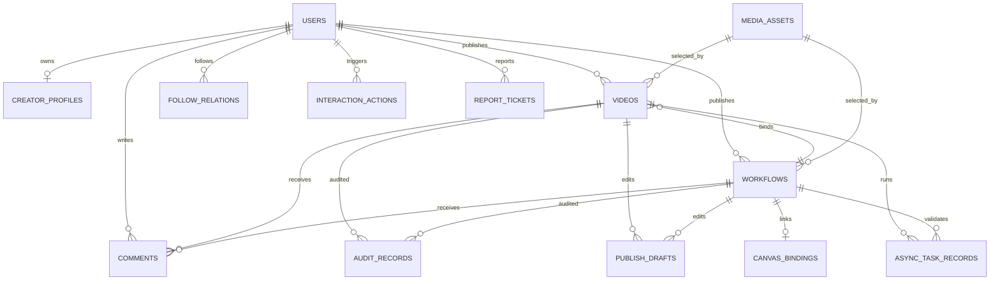

# DramaTV 数据库初版表设计

更新日期：2026-04-06

## 1. 文档目标

这份文档用于把第一阶段领域模型正式落到 PostgreSQL 的初版表结构上。

目标不是一次把未来三年的表全部设计完，而是先满足第一阶段的核心闭环：

- 首页浏览
- 视频详情
- 工作流详情
- 作者主页
- 发布页
- 草稿与审核
- 评论与互动
- 媒体处理任务回写

## 2. 设计原则

### 2.1 数据库角色

- 主数据库：`PostgreSQL`
- 缓存：`Redis`
- 二进制大文件：`MinIO / OSS / S3`

数据库里只保存：

- 业务真相数据
- 媒体元数据
- 发布与审核状态
- 任务记录

数据库里不保存：

- 视频原文件二进制
- 大图二进制
- 长时间中间处理产物

### 2.2 第一阶段建模原则

- 以 `Spring Boot` 为主 owner
- 尽量模块化，但不强行拆成多个数据库
- 先保证一致性和可追踪性，再做高级优化
- 通用扩展字段优先 `jsonb`
- 内容对象尽量显式建表，不依赖过度泛化

### 2.3 主键与公共字段约定

推荐统一约定：

- 主键：`uuid`
- 时间：`timestamptz`
- 软删除：优先 `deleted_at`
- 创建时间：`created_at`
- 更新时间：`updated_at`

推荐扩展：

```sql
create extension if not exists pgcrypto;
```

主键默认：

```sql
id uuid primary key default gen_random_uuid()
```

### 2.4 命名约定

- 表名：`snake_case` 复数
- 唯一索引：`uk_表名_字段`
- 普通索引：`idx_表名_字段`
- 外键：`fk_表名_字段`

## 3. 数据域拆分

第一阶段数据库按下面 6 个域理解最清楚：

- 账号与作者域
- 内容域
- 发布与审核域
- 互动域
- 画布联动域
- 异步任务域

## 4. 总体关系图



## 5. 表清单总览

| 表名 | 所属域 | Owner | 第一阶段是否必须 | 说明 |
| --- | --- | --- | --- | --- |
| `users` | 账号与作者域 | Spring Boot | 是 | 账号主体 |
| `creator_profiles` | 账号与作者域 | Spring Boot | 是 | 作者扩展信息 |
| `media_assets` | 内容域 | Spring Boot 元数据 | 是 | 媒体资源注册表 |
| `videos` | 内容域 | Spring Boot | 是 | 视频作品主表 |
| `workflows` | 内容域 | Spring Boot | 是 | 工作流主表 |
| `feed_items` | 内容域 | Spring Boot | 是 | 首页聚合表 |
| `publish_drafts` | 发布与审核域 | Spring Boot | 是 | 草稿表 |
| `audit_records` | 发布与审核域 | Spring Boot | 是 | 审核记录 |
| `report_tickets` | 发布与审核域 | Spring Boot | 是 | 举报工单 |
| `comments` | 互动域 | Spring Boot | 是 | 评论与回复 |
| `interaction_actions` | 互动域 | Spring Boot | 是 | 点赞、收藏等行为 |
| `follow_relations` | 互动域 | Spring Boot | 是 | 关注关系 |
| `canvas_bindings` | 画布联动域 | Spring Boot | 是 | 工作流与画布映射 |
| `canvas_workflow_runtimes` | 画布联动域 | Spring Boot | 建议有 | 用户复制后的运行时副本 |
| `canvas_runtime_assets` | 画布联动域 | Spring Boot | 建议有 | runtime 节点媒体引用与渐进加载状态 |
| `canvas_copy_tasks` | 画布联动域 | Spring Boot | 建议有 | 复制任务、补偿任务、失败重试 |
| `async_task_records` | 异步任务域 | Spring Boot | 是 | 异步任务跟踪 |
| `task_callback_logs` | 异步任务域 | Spring Boot | 建议有 | Worker 回调日志 |

## 6. 账号与作者域

### 6.1 `users`

用途：

- 登录主体
- 作者主体
- 权限主体

| 字段 | 类型 | 约束 | 说明 |
| --- | --- | --- | --- |
| `id` | `uuid` | PK | 用户 ID |
| `email` | `varchar(128)` | nullable, unique | 邮箱登录预留 |
| `phone` | `varchar(32)` | nullable, unique | 手机号预留 |
| `username` | `varchar(64)` | not null, unique | 登录或公开唯一名 |
| `display_name` | `varchar(64)` | not null | 展示名 |
| `avatar_url` | `text` | nullable | 头像地址 |
| `bio` | `varchar(512)` | nullable | 简介 |
| `role_code` | `varchar(32)` | not null | `user/creator/moderator/admin` |
| `status_code` | `varchar(32)` | not null | `active/blocked/pending` |
| `last_login_at` | `timestamptz` | nullable | 最近登录时间 |
| `created_at` | `timestamptz` | not null | 创建时间 |
| `updated_at` | `timestamptz` | not null | 更新时间 |
| `deleted_at` | `timestamptz` | nullable | 软删除时间 |

关键索引：

- `uk_users_username`
- `uk_users_email`
- `uk_users_phone`
- `idx_users_role_code`
- `idx_users_status_code`

### 6.2 `creator_profiles`

用途：

- 作者主页扩展信息
- 统计字段缓存

| 字段 | 类型 | 约束 | 说明 |
| --- | --- | --- | --- |
| `id` | `uuid` | PK | 主键 |
| `user_id` | `uuid` | unique, FK | 对应 `users.id` |
| `headline` | `varchar(128)` | nullable | 一句话介绍 |
| `website_url` | `text` | nullable | 外链 |
| `location_text` | `varchar(64)` | nullable | 地域 |
| `video_count` | `integer` | not null default 0 | 视频数 |
| `workflow_count` | `integer` | not null default 0 | 工作流数 |
| `follower_count` | `integer` | not null default 0 | 粉丝数 |
| `like_received_count` | `integer` | not null default 0 | 获赞数 |
| `featured_status` | `varchar(32)` | not null default 'normal' | 是否精选作者 |
| `created_at` | `timestamptz` | not null | 创建时间 |
| `updated_at` | `timestamptz` | not null | 更新时间 |

关键索引：

- `uk_creator_profiles_user_id`
- `idx_creator_profiles_featured_status`

## 7. 内容域

### 7.1 `media_assets`

用途：

- 统一记录封面、poster、preview、source 等资源元数据
- 二进制文件本体仍保存在对象存储

| 字段 | 类型 | 约束 | 说明 |
| --- | --- | --- | --- |
| `id` | `uuid` | PK | 资源 ID |
| `asset_kind` | `varchar(32)` | not null | `cover/poster/preview/source/image` |
| `biz_type` | `varchar(32)` | nullable | `video/workflow/draft/avatar` |
| `biz_id` | `uuid` | nullable | 业务对象 ID |
| `storage_provider` | `varchar(32)` | not null | `minio/oss/s3` |
| `bucket_name` | `varchar(128)` | not null | bucket |
| `object_key` | `varchar(512)` | not null | 对象路径 |
| `file_name` | `varchar(256)` | nullable | 原文件名 |
| `mime_type` | `varchar(128)` | nullable | MIME |
| `size_bytes` | `bigint` | nullable | 文件大小 |
| `width` | `integer` | nullable | 宽 |
| `height` | `integer` | nullable | 高 |
| `duration_ms` | `integer` | nullable | 视频时长 |
| `checksum` | `varchar(128)` | nullable | 去重 / 校验 |
| `status_code` | `varchar(32)` | not null | `uploaded/processing/ready/failed` |
| `is_public` | `boolean` | not null default false | 是否可公开访问 |
| `created_by` | `uuid` | nullable | 上传人 |
| `created_at` | `timestamptz` | not null | 创建时间 |
| `updated_at` | `timestamptz` | not null | 更新时间 |

关键索引：

- `idx_media_assets_biz_type_biz_id`
- `idx_media_assets_asset_kind`
- `idx_media_assets_status_code`
- `idx_media_assets_checksum`

### 7.2 `videos`

用途：

- 视频作品主对象
- 详情页和首页内容基础

| 字段 | 类型 | 约束 | 说明 |
| --- | --- | --- | --- |
| `id` | `uuid` | PK | 视频 ID |
| `author_id` | `uuid` | not null, FK | 作者 |
| `workflow_id` | `uuid` | nullable, FK | 关联工作流 |
| `title` | `varchar(128)` | not null | 标题 |
| `summary` | `text` | nullable | 简介 |
| `category_code` | `varchar(32)` | nullable | 分区 |
| `tag_names` | `text[]` | not null default '{}' | 标签 |
| `visibility` | `varchar(16)` | not null | `public/link/private` |
| `publish_status` | `varchar(32)` | not null | `draft/pending_review/processing/published/rejected/taken_down` |
| `cover_asset_id` | `uuid` | nullable, FK | 封面 |
| `poster_asset_id` | `uuid` | nullable, FK | poster |
| `preview_asset_id` | `uuid` | nullable, FK | 预览视频 |
| `source_asset_id` | `uuid` | nullable, FK | 原视频 |
| `duration_ms` | `integer` | nullable | 时长 |
| `comment_count` | `integer` | not null default 0 | 评论数 |
| `like_count` | `integer` | not null default 0 | 点赞数 |
| `favorite_count` | `integer` | not null default 0 | 收藏数 |
| `play_count` | `integer` | not null default 0 | 播放数 |
| `published_at` | `timestamptz` | nullable | 发布时间 |
| `created_at` | `timestamptz` | not null | 创建时间 |
| `updated_at` | `timestamptz` | not null | 更新时间 |
| `deleted_at` | `timestamptz` | nullable | 软删除时间 |

关键索引：

- `idx_videos_author_id`
- `idx_videos_workflow_id`
- `idx_videos_publish_status`
- `idx_videos_visibility`
- `idx_videos_published_at`
- `idx_videos_tag_names_gin`

推荐：

```sql
create index idx_videos_tag_names_gin on videos using gin (tag_names);
```

### 7.3 `workflows`

用途：

- 工作流主对象
- 独立详情页和复制入口

| 字段 | 类型 | 约束 | 说明 |
| --- | --- | --- | --- |
| `id` | `uuid` | PK | 工作流 ID |
| `author_id` | `uuid` | not null, FK | 作者 |
| `title` | `varchar(128)` | not null | 标题 |
| `summary` | `text` | nullable | 简介 |
| `scenario_text` | `varchar(256)` | nullable | 适用场景 |
| `tag_names` | `text[]` | not null default '{}' | 标签 |
| `visibility` | `varchar(16)` | not null | `public/link/private` |
| `publish_status` | `varchar(32)` | not null | `draft/pending_review/published/rejected/taken_down` |
| `allow_copy` | `boolean` | not null default false | 允许复制 |
| `allow_fork` | `boolean` | not null default false | 允许派生 |
| `cover_asset_id` | `uuid` | nullable, FK | 封面 |
| `example_asset_id` | `uuid` | nullable, FK | 示例图或示例视频 |
| `video_bind_count` | `integer` | not null default 0 | 绑定视频数 |
| `comment_count` | `integer` | not null default 0 | 评论数 |
| `like_count` | `integer` | not null default 0 | 点赞数 |
| `favorite_count` | `integer` | not null default 0 | 收藏数 |
| `published_at` | `timestamptz` | nullable | 发布时间 |
| `created_at` | `timestamptz` | not null | 创建时间 |
| `updated_at` | `timestamptz` | not null | 更新时间 |
| `deleted_at` | `timestamptz` | nullable | 软删除时间 |

关键索引：

- `idx_workflows_author_id`
- `idx_workflows_publish_status`
- `idx_workflows_visibility`
- `idx_workflows_allow_copy`
- `idx_workflows_published_at`
- `idx_workflows_tag_names_gin`

### 7.4 `feed_items`

用途：

- 首页推荐流和热门流的轻量聚合表

| 字段 | 类型 | 约束 | 说明 |
| --- | --- | --- | --- |
| `id` | `uuid` | PK | 主键 |
| `channel_code` | `varchar(32)` | not null | `recommend/hot/workflow/topic` |
| `item_type` | `varchar(16)` | not null | `video/workflow` |
| `target_id` | `uuid` | not null | 指向内容对象 |
| `rank_score` | `numeric(12,4)` | not null default 0 | 排序分 |
| `status_code` | `varchar(32)` | not null | `active/inactive` |
| `published_at` | `timestamptz` | nullable | 内容发布时间 |
| `created_at` | `timestamptz` | not null | 创建时间 |
| `updated_at` | `timestamptz` | not null | 更新时间 |

关键索引：

- `idx_feed_items_channel_code_rank_score`
- `idx_feed_items_item_type_target_id`
- `idx_feed_items_status_code`

说明：

- 第一阶段不需要复杂推荐表
- 这个表更像“首页投放池”
- 推荐算法成熟后可以再拆生成链路

## 8. 发布与审核域

### 8.1 `publish_drafts`

用途：

- 存视频和工作流发布草稿
- 支持自动保存和回填

设计选择：

- 第一阶段采用一张通用草稿表
- `videos` 和 `workflows` 继续保存主对象
- `publish_drafts` 负责编辑态和提交流程态

| 字段 | 类型 | 约束 | 说明 |
| --- | --- | --- | --- |
| `id` | `uuid` | PK | 草稿 ID |
| `draft_type` | `varchar(16)` | not null | `video/workflow` |
| `author_id` | `uuid` | not null, FK | 作者 |
| `target_id` | `uuid` | nullable | 对应视频或工作流 ID |
| `title_draft` | `varchar(128)` | nullable | 草稿标题 |
| `payload_json` | `jsonb` | not null | 草稿完整内容 |
| `current_step` | `varchar(32)` | not null | 当前步骤 |
| `status_code` | `varchar(32)` | not null | `editing/submitted/locked/archived` |
| `autosave_version` | `integer` | not null default 1 | 自动保存版本 |
| `submitted_at` | `timestamptz` | nullable | 提交时间 |
| `created_at` | `timestamptz` | not null | 创建时间 |
| `updated_at` | `timestamptz` | not null | 更新时间 |

关键索引：

- `idx_publish_drafts_author_id`
- `idx_publish_drafts_target_id`
- `idx_publish_drafts_draft_type_status_code`

### 8.2 `audit_records`

用途：

- 保存审核动作
- 支撑通过、驳回、下线
- 区分系统辅助审核和人工审核

| 字段 | 类型 | 约束 | 说明 |
| --- | --- | --- | --- |
| `id` | `uuid` | PK | 审核记录 ID |
| `target_type` | `varchar(16)` | not null | `video/workflow/comment` |
| `target_id` | `uuid` | not null | 对象 ID |
| `audit_type` | `varchar(32)` | not null | `publish/review/report/takedown` |
| `status_code` | `varchar(32)` | not null | `pending/approved/rejected/taken_down` |
| `risk_level` | `varchar(16)` | nullable | `low/medium/high` |
| `reason_code` | `varchar(64)` | nullable | 原因码 |
| `reason_text` | `text` | nullable | 原因说明 |
| `operator_type` | `varchar(16)` | not null | `system/moderator/admin` |
| `operator_id` | `uuid` | nullable | 操作人 |
| `detail_json` | `jsonb` | nullable | 细节 |
| `created_at` | `timestamptz` | not null | 创建时间 |

关键索引：

- `idx_audit_records_target_type_target_id`
- `idx_audit_records_status_code`
- `idx_audit_records_created_at`

### 8.3 `report_tickets`

用途：

- 举报工单

| 字段 | 类型 | 约束 | 说明 |
| --- | --- | --- | --- |
| `id` | `uuid` | PK | 工单 ID |
| `reporter_id` | `uuid` | not null, FK | 举报人 |
| `target_type` | `varchar(16)` | not null | `video/workflow/comment/user` |
| `target_id` | `uuid` | not null | 对象 ID |
| `reason_code` | `varchar(64)` | not null | 举报原因 |
| `description_text` | `text` | nullable | 说明 |
| `status_code` | `varchar(32)` | not null | `open/processing/resolved/rejected` |
| `assignee_id` | `uuid` | nullable | 处理人 |
| `result_note` | `text` | nullable | 处理说明 |
| `created_at` | `timestamptz` | not null | 创建时间 |
| `updated_at` | `timestamptz` | not null | 更新时间 |

关键索引：

- `idx_report_tickets_target_type_target_id`
- `idx_report_tickets_reporter_id`
- `idx_report_tickets_status_code`

## 9. 互动域

### 9.1 `comments`

用途：

- 评论与回复

| 字段 | 类型 | 约束 | 说明 |
| --- | --- | --- | --- |
| `id` | `uuid` | PK | 评论 ID |
| `target_type` | `varchar(16)` | not null | `video/workflow` |
| `target_id` | `uuid` | not null | 评论对象 |
| `author_id` | `uuid` | not null, FK | 评论人 |
| `parent_id` | `uuid` | nullable | 父评论 |
| `root_id` | `uuid` | nullable | 根评论 |
| `content_text` | `text` | not null | 评论内容 |
| `status_code` | `varchar(32)` | not null | `visible/hidden/deleted/pending_review` |
| `reply_count` | `integer` | not null default 0 | 回复数 |
| `like_count` | `integer` | not null default 0 | 点赞数 |
| `created_at` | `timestamptz` | not null | 创建时间 |
| `updated_at` | `timestamptz` | not null | 更新时间 |
| `deleted_at` | `timestamptz` | nullable | 软删除时间 |

关键索引：

- `idx_comments_target_type_target_id`
- `idx_comments_author_id`
- `idx_comments_root_id`
- `idx_comments_parent_id`
- `idx_comments_status_code`

### 9.2 `interaction_actions`

用途：

- 保存点赞、收藏等显式行为

设计说明：

- 第一阶段采用一张通用行为表
- `report` 不放进这张表，单独用 `report_tickets`

| 字段 | 类型 | 约束 | 说明 |
| --- | --- | --- | --- |
| `id` | `uuid` | PK | 行为 ID |
| `actor_id` | `uuid` | not null, FK | 发起人 |
| `action_type` | `varchar(16)` | not null | `like/favorite` |
| `target_type` | `varchar(16)` | not null | `video/workflow/comment` |
| `target_id` | `uuid` | not null | 目标对象 |
| `status_code` | `varchar(16)` | not null | `active/canceled` |
| `created_at` | `timestamptz` | not null | 创建时间 |
| `updated_at` | `timestamptz` | not null | 更新时间 |

关键索引：

- `uk_interaction_actions_actor_action_target`
- `idx_interaction_actions_target_type_target_id`
- `idx_interaction_actions_actor_id`

推荐唯一约束：

```sql
unique (actor_id, action_type, target_type, target_id)
```

### 9.3 `follow_relations`

用途：

- 作者关注关系

| 字段 | 类型 | 约束 | 说明 |
| --- | --- | --- | --- |
| `id` | `uuid` | PK | 主键 |
| `follower_id` | `uuid` | not null, FK | 关注人 |
| `followee_id` | `uuid` | not null, FK | 被关注人 |
| `status_code` | `varchar(16)` | not null | `active/canceled` |
| `created_at` | `timestamptz` | not null | 创建时间 |
| `updated_at` | `timestamptz` | not null | 更新时间 |

关键索引：

- `uk_follow_relations_follower_followee`
- `idx_follow_relations_followee_id`

## 10. 画布联动域

### 10.1 `canvas_bindings`

用途：

- 记录工作流与画布对象的映射
- 为“在画布中打开”和“复制工作流”留接口位

| 字段 | 类型 | 约束 | 说明 |
| --- | --- | --- | --- |
| `id` | `uuid` | PK | 主键 |
| `workflow_id` | `uuid` | unique, FK | 工作流 ID |
| `binding_type` | `varchar(16)` | not null | `internal/external` |
| `canvas_space_id` | `varchar(128)` | nullable | 画布空间 ID |
| `canvas_workflow_id` | `varchar(128)` | nullable | 画布工作流 ID |
| `open_url` | `text` | nullable | 打开链接 |
| `copy_url` | `text` | nullable | 复制链接 |
| `binding_status` | `varchar(32)` | not null | `active/invalid/revoked` |
| `snapshot_json` | `jsonb` | nullable | 绑定快照 |
| `last_synced_at` | `timestamptz` | nullable | 最近同步时间 |
| `created_at` | `timestamptz` | not null | 创建时间 |
| `updated_at` | `timestamptz` | not null | 更新时间 |

关键索引：

- `uk_canvas_bindings_workflow_id`
- `idx_canvas_bindings_binding_status`

说明：

- `canvas_bindings` 只描述“社区工作流”和“源画布对象”的映射关系
- 它适合表达“在画布中打开”
- 但它不适合直接承载“用户复制后得到的副本”

如果我们要实现“点击复制后秒开副本、资源再渐进出现”，还需要下面 3 张表。

### 10.2 `canvas_workflow_runtimes`

用途：

- 表示用户复制后实际拿到的运行时副本
- 支撑“先打开空骨架，再逐步补资源”的体验

| 字段 | 类型 | 约束 | 说明 |
| --- | --- | --- | --- |
| `id` | `uuid` | PK | runtime ID |
| `source_workflow_id` | `uuid` | nullable, FK | 来源社区工作流 |
| `source_binding_id` | `uuid` | nullable, FK | 来源 `canvas_bindings.id` |
| `owner_id` | `uuid` | not null, FK | 副本拥有者 |
| `canvas_space_id` | `varchar(128)` | not null | 目标空间 ID |
| `canvas_workflow_id` | `varchar(128)` | not null | 目标画布工作流 ID |
| `runtime_status` | `varchar(32)` | not null | `creating/runtime_ready/reconciling/failed/archived` |
| `light_snapshot_json` | `jsonb` | not null | 轻量快照，给首屏骨架和小地图 |
| `full_snapshot_json` | `jsonb` | nullable | 完整图快照，给深编辑和运行 |
| `light_snapshot_version` | `integer` | not null default 1 | 轻量快照版本 |
| `graph_checksum` | `varchar(128)` | nullable | 图结构校验值 |
| `visible_node_count` | `integer` | not null default 0 | 节点数缓存 |
| `last_opened_at` | `timestamptz` | nullable | 最近打开时间 |
| `created_at` | `timestamptz` | not null | 创建时间 |
| `updated_at` | `timestamptz` | not null | 更新时间 |

关键索引：

- `idx_canvas_workflow_runtimes_owner_id_created_at`
- `uk_canvas_workflow_runtimes_canvas_workflow_id`
- `idx_canvas_workflow_runtimes_source_workflow_id`
- `idx_canvas_workflow_runtimes_runtime_status`

### 10.3 `canvas_runtime_assets`

用途：

- 记录 runtime 下每个节点的媒体引用
- 给“当前视口资源批量加载”提供直接索引

| 字段 | 类型 | 约束 | 说明 |
| --- | --- | --- | --- |
| `id` | `uuid` | PK | 主键 |
| `runtime_id` | `uuid` | not null, FK | 对应 `canvas_workflow_runtimes.id` |
| `node_id` | `varchar(64)` | not null | 画布节点 ID |
| `asset_role` | `varchar(32)` | not null | `thumbnail/poster/preview/source/mask` |
| `media_asset_id` | `uuid` | nullable, FK | 对应 `media_assets.id` |
| `asset_url` | `text` | nullable | 外部或临时授权 URL |
| `load_priority` | `smallint` | not null default 5 | 加载优先级 |
| `status_code` | `varchar(32)` | not null | `placeholder/ready/forbidden/refreshing/failed` |
| `width` | `integer` | nullable | 宽 |
| `height` | `integer` | nullable | 高 |
| `duration_ms` | `integer` | nullable | 视频时长 |
| `created_at` | `timestamptz` | not null | 创建时间 |
| `updated_at` | `timestamptz` | not null | 更新时间 |

关键索引：

- `idx_canvas_runtime_assets_runtime_id_node_id`
- `idx_canvas_runtime_assets_runtime_id_priority_status`
- `idx_canvas_runtime_assets_media_asset_id`

### 10.4 `canvas_copy_tasks`

用途：

- 跟踪复制主流程
- 表达“已创建 runtime，但资源还在补齐”的中间态
- 支撑失败重试、状态轮询、审计

| 字段 | 类型 | 约束 | 说明 |
| --- | --- | --- | --- |
| `id` | `uuid` | PK | copy task ID |
| `source_workflow_id` | `uuid` | not null, FK | 来源工作流 |
| `source_binding_id` | `uuid` | nullable, FK | 来源绑定 |
| `target_runtime_id` | `uuid` | nullable, FK | 目标 runtime |
| `operator_id` | `uuid` | not null, FK | 发起复制的人 |
| `target_space_id` | `varchar(128)` | not null | 目标空间 |
| `idempotency_key` | `varchar(128)` | nullable, unique | 幂等键 |
| `copy_mode` | `varchar(32)` | not null | `reference_only/reference_then_async_clone/full_clone` |
| `status_code` | `varchar(32)` | not null | `queued/copying/runtime_ready/reconciling/succeeded/failed/canceled` |
| `progress_percent` | `smallint` | not null default 0 | 进度百分比 |
| `error_code` | `varchar(64)` | nullable | 错误码 |
| `error_message` | `text` | nullable | 错误信息 |
| `result_json` | `jsonb` | nullable | 返回结果、补偿结果 |
| `started_at` | `timestamptz` | nullable | 开始时间 |
| `finished_at` | `timestamptz` | nullable | 完成时间 |
| `created_at` | `timestamptz` | not null | 创建时间 |
| `updated_at` | `timestamptz` | not null | 更新时间 |

关键索引：

- `idx_canvas_copy_tasks_operator_id_created_at`
- `idx_canvas_copy_tasks_source_workflow_id_status_code`
- `idx_canvas_copy_tasks_target_space_id_status_code`

## 11. 异步任务域

### 11.1 `async_task_records`

用途：

- 跟踪转码、审核辅助、工作流校验、复制补偿等异步任务

| 字段 | 类型 | 约束 | 说明 |
| --- | --- | --- | --- |
| `id` | `uuid` | PK | 任务 ID |
| `task_type` | `varchar(32)` | not null | `transcode/extract_cover/generate_preview/workflow_validate/audit_assist/canvas_asset_authorize/canvas_preview_warmup/canvas_copy_reconcile` |
| `target_type` | `varchar(16)` | not null | `video/workflow/canvas_runtime/canvas_copy_task` |
| `target_id` | `uuid` | not null | 目标对象 |
| `queue_name` | `varchar(64)` | not null | 队列名 |
| `priority_level` | `smallint` | not null default 5 | 优先级 |
| `status_code` | `varchar(32)` | not null | `queued/running/succeeded/failed/canceled` |
| `payload_json` | `jsonb` | not null | 投递参数 |
| `result_json` | `jsonb` | nullable | 结果 |
| `retry_count` | `integer` | not null default 0 | 重试次数 |
| `max_retry_count` | `integer` | not null default 3 | 最大重试次数 |
| `error_message` | `text` | nullable | 错误信息 |
| `scheduled_at` | `timestamptz` | nullable | 调度时间 |
| `started_at` | `timestamptz` | nullable | 开始时间 |
| `finished_at` | `timestamptz` | nullable | 完成时间 |
| `created_at` | `timestamptz` | not null | 创建时间 |
| `updated_at` | `timestamptz` | not null | 更新时间 |

关键索引：

- `idx_async_task_records_target_type_target_id`
- `idx_async_task_records_task_type_status_code`
- `idx_async_task_records_queue_name_status_code`

### 11.2 `task_callback_logs`

用途：

- 保存 Worker 回调原始日志
- 排查回调重复、签名错误、状态回写异常

| 字段 | 类型 | 约束 | 说明 |
| --- | --- | --- | --- |
| `id` | `uuid` | PK | 主键 |
| `task_id` | `uuid` | nullable, FK | 对应任务 |
| `callback_type` | `varchar(32)` | not null | `media/workflow/audit` |
| `source_name` | `varchar(64)` | not null | 回调来源 |
| `request_id` | `varchar(128)` | nullable | 请求 ID |
| `verify_status` | `varchar(32)` | not null | `passed/failed/skipped` |
| `process_status` | `varchar(32)` | not null | `accepted/ignored/failed` |
| `raw_payload_json` | `jsonb` | not null | 原始载荷 |
| `created_at` | `timestamptz` | not null | 创建时间 |

关键索引：

- `idx_task_callback_logs_task_id`
- `idx_task_callback_logs_callback_type`
- `idx_task_callback_logs_created_at`

## 12. 关键约束建议

### 12.1 内容可见性

以下字段必须统一枚举：

- `videos.visibility`
- `workflows.visibility`

统一值：

- `public`
- `link`
- `private`

### 12.2 发布状态

视频：

- `draft`
- `pending_review`
- `processing`
- `published`
- `rejected`
- `taken_down`

工作流：

- `draft`
- `pending_review`
- `published`
- `rejected`
- `taken_down`

### 12.3 删除策略

第一阶段默认采用软删除：

- `users`
- `videos`
- `workflows`
- `comments`

原因：

- 社区内容需要可恢复和可审计
- 举报和审核链路需要追踪历史

## 13. 推荐查询路径与索引重点

第一阶段最常见的读路径有 6 条：

1. 首页 feed
2. 视频详情
3. 工作流详情
4. 作者主页
5. 评论列表
6. 画布副本打开

对应重点索引：

- `feed_items(channel_code, status_code, rank_score desc)`
- `videos(id, publish_status, visibility)`
- `workflows(id, publish_status, visibility)`
- `videos(author_id, published_at desc)`
- `workflows(author_id, published_at desc)`
- `comments(target_type, target_id, created_at asc)`
- `canvas_workflow_runtimes(owner_id, created_at desc)`
- `canvas_runtime_assets(runtime_id, load_priority, status_code)`

## 14. 初版不急着建的表

下面这些能力先不急着建表：

- 复杂通知中心
- 活动系统
- 榜单历史快照
- 交易与结算
- 复杂推荐画像
- 站内搜索倒排索引表

原因是第一阶段还不需要它们进入主链路。

## 15. 建表顺序建议

推荐实际建表顺序：

1. `users`
2. `creator_profiles`
3. `media_assets`
4. `workflows`
5. `videos`
6. `canvas_bindings`
7. `canvas_workflow_runtimes`
8. `canvas_runtime_assets`
9. `canvas_copy_tasks`
10. `publish_drafts`
11. `audit_records`
12. `comments`
13. `interaction_actions`
14. `follow_relations`
15. `feed_items`
16. `report_tickets`
17. `async_task_records`
18. `task_callback_logs`

## 16. 下一步最该做什么

这份文档之后，最适合接的动作是：

1. 按这些表补 `Spring Boot` 实体与迁移脚手架
2. 对照这些表补 `第一阶段 API 清单`
3. 再按 API 去拆页面联调任务
