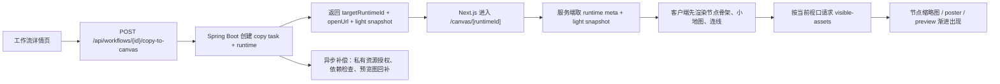

# DramaTV 画布复制与渐进加载实现设计

更新日期：2026-04-06

## 1. 文档目标

这份文档用于把“工作流复制机制”进一步压到可开发的实现层。

重点回答：

- 如何做出“点击复制后秒开副本”的体验
- 为什么打开时可以先看到空骨架，再渐进加载图片和视频
- 后端接口、数据库、前端渲染应该怎么配合
- 第一阶段能做到什么程度，哪些能力放到后续补

这份文档默认服务于：

- `Spring Boot` 平台后端
- `Next.js` 工作流详情页与画布页
- 后续可能接入的画布系统 / 工作流运行时

## 2. 目标体验

我们希望用户看到的效果是：

1. 在工作流详情页点击“复制工作流”
2. 1 到 3 秒内拿到一个自己的副本入口
3. 进入画布页后，先看到完整节点骨架和小地图
4. 当前视口内的图片、视频缩略图快速出现
5. 远处节点的媒体随着视口移动再逐步加载
6. 整体过程不卡顿、不白屏、不把浏览器压死

这里最关键的不是“所有资源瞬间全部到齐”，而是：

- 先可见结构
- 再可见内容
- 重资源永远按需加载

## 3. 一句话实现原则

实现这套体验的核心原则是：

`同步复制轻结构，异步补齐重资源，前端只按视口加载媒体`

拆开就是三件事：

- 复制时先只处理 `graph + metadata + refs`
- 打开时先只拿 `light snapshot`
- 渲染时只请求“当前视口真正需要的媒体”

## 4. 端到端实现链路



## 5. 同步复制阶段怎么做

### 5.1 同步阶段必须做的事

点击复制之后，同步阶段只做这些：

1. 校验是否允许复制
2. 校验用户是否有目标空间权限
3. 读取源工作流的图快照
4. 新建一个目标 runtime
5. 写入基础归属关系
6. 记录复制任务
7. 返回 `targetRuntimeId`、`openUrl`、基础状态

### 5.2 同步阶段不要做的事

不要在同步链路里做这些重动作：

- 复制原始大图
- 复制原始视频
- 重新转码
- 重新跑整条工作流
- 重新生成全部缩略图
- 等待依赖检查完全结束

只要把这些动作从同步链路里拿掉，首屏体验就会立刻轻很多。

## 6. 数据层怎么支持这个效果

### 6.1 最小需要的 4 类对象

要稳定实现“秒开 + 渐进加载”，后端至少要有下面 4 类对象：

| 对象 | 作用 |
| --- | --- |
| `Workflow` | 社区展示工作流 |
| `CanvasBinding` | 社区工作流与源画布对象的绑定 |
| `CanvasWorkflowRuntime` | 用户复制后得到的运行时副本 |
| `CanvasCopyTask` | 复制过程、异步补偿和失败重试记录 |

### 6.2 为什么一定要有 Runtime

只靠 `canvas_bindings` 不够，因为它只描述：

- 社区里的源工作流

但用户点击复制之后得到的是：

- 一个属于自己的副本

所以必须单独建 `runtime` 对象，否则你没法表达：

- 谁复制的
- 复制到了哪个空间
- 这个副本当前是否 ready
- 它的资源是否还在渐进补齐

### 6.3 Light Snapshot 和 Full Snapshot

为了实现“先空骨架后内容”，建议把快照拆成两层：

#### `light_snapshot_json`

只保存前端首屏渲染必须用到的轻数据：

- 节点 id
- 节点 type
- x / y / width / height
- 边关系
- group
- viewport
- 节点占位媒体状态

它的作用是：

- 让前端秒画骨架
- 让小地图秒出来
- 避免首屏拉全量媒体元数据

#### `full_snapshot_json`

保存完整可编辑图定义：

- 所有节点参数
- 完整输入输出
- 依赖 manifest
- 详细媒体引用

它的作用是：

- 后续深编辑
- 运行
- 调试

第一阶段如果要控复杂度，可以允许：

- 社区页复制时先只返回 `light snapshot`
- `full snapshot` 在进入真正编辑态时再拿

## 7. API 应该怎么拆

### 7.1 复制入口接口

`POST /api/workflows/{id}/copy-to-canvas`

返回值建议至少包含：

```json
{
  "copyTaskId": "uuid",
  "targetRuntimeId": "uuid",
  "targetCanvasWorkflowId": "canvas_wf_9527",
  "status": "runtime_ready",
  "openUrl": "/canvas/runtime_001",
  "lightSnapshotVersion": 3
}
```

这里的关键不是把一切都返回，而是给前端一个：

- 可立即跳转的目标

### 7.2 画布页元信息接口

`GET /api/canvas-runtimes/{id}`

用来返回：

- runtime 基本信息
- 当前状态
- 是否还在补偿
- 小地图统计
- 复制来源

### 7.3 轻快照接口

`GET /api/canvas-runtimes/{id}/snapshot?mode=light`

只返回首屏渲染需要的数据。

这个接口要尽量轻，目标是：

- gzip 后尽量控制在几百 KB 内

### 7.4 可视区域资源接口

`POST /api/canvas-runtimes/{id}/visible-assets`

请求体建议按视口传：

```json
{
  "viewport": {
    "x": 1200,
    "y": 800,
    "width": 1680,
    "height": 980,
    "zoom": 0.22
  },
  "nodeIds": ["n_11", "n_12", "n_98"],
  "limit": 40
}
```

返回：

- 当前视口节点的 `thumbnailUrl`
- `posterUrl`
- `previewUrl`
- 加载状态
- 资源权限状态

### 7.5 复制任务状态接口

`GET /api/canvas-copy-tasks/{id}`

用于：

- 轮询异步补偿进度
- 在 UI 上提示“副本已就绪 / 正在补资源 / 有资源不可见”

## 8. 前端渲染怎么做才不卡

### 8.1 首屏只渲染 Node Shell

画布页首屏不要直接渲染真实媒体节点，而是分两层：

- `NodeShellLayer`
- `NodeAssetLayer`

首屏先渲染 `NodeShellLayer`：

- 节点外框
- 标题
- 类型图标
- 占位骨架
- 连线

这样页面能很快“成型”。

### 8.2 小地图只吃几何数据

小地图绝不能依赖真实图片。

它只需要：

- 节点坐标
- 节点尺寸
- 连线摘要
- 当前视口框

所以小地图应该完全由 `light snapshot` 生成。

### 8.3 按视口裁剪渲染

不要在 DOM 里把整张超大画布的全部图片节点都挂上。

建议做视口裁剪：

- 只渲染当前视口内节点
- 再加一圈扩展缓冲区
- 远处节点只保留几何壳，不挂真实媒体组件

第一阶段如果节点规模在几百到一两千，DOM + 绝对定位 + 裁剪渲染就够用，不必一上来上 WebGL。

### 8.4 媒体永远分三级

每个节点媒体建议都拆成：

- `thumbnail`
- `poster`
- `preview/source`

加载顺序：

1. 先 `thumbnail`
2. 再 `poster`
3. 最后按需拿 `preview` 或 `source`

### 8.5 视频节点默认不要自动播放

视频节点默认只显示：

- poster
- 时长
- 播放图标

只有满足下列条件才请求 `preview`：

- 节点进入当前视口
- 用户停留一段时间
- 浏览器资源允许

这样能大幅减少解码压力。

### 8.6 资源请求要做批量和并发控制

不要让每个节点各自发一个请求。

应采用：

- `visible-assets` 批量接口
- 客户端并发上限控制
- 已加载资源缓存

建议第一阶段：

- 每批最多 `20-40` 个节点
- 并发资源拉取控制在 `6-12`

## 9. 用户为何会感知“越来越完整”

这是我们刻意设计出来的，不是缺陷。

用户看到的过程应该是：

1. 副本已经创建
2. 画布结构已经出现
3. 当前视口资源逐步出现
4. 远处资源在移动过去时再出现
5. 少量缺资源节点显示“待补齐”

这个过程的关键是：

- 始终让用户觉得“页面是活的，在推进”

而不是：

- 卡住几秒什么都没有

## 10. 后端模块怎么分工

### 10.1 `canvas` 模块负责

- 复制工作流
- 创建 runtime
- 输出 light snapshot
- 查询 visible-assets
- 查询 copy task 状态

### 10.2 `workflow` 模块负责

- 社区工作流源数据
- 源图快照和绑定关系
- 权限基础信息

### 10.3 `publish` / `internal` / Worker 负责

- 缩略图补齐
- 私有资源授权补偿
- 依赖检查
- 错误回写

## 11. 第一阶段可落地版本

### 11.1 第一阶段 MVP

第一阶段其实就能做出接近你截图里的体验，但先收口为：

- 复制后创建 runtime 副本
- 进入画布页先显示 light snapshot
- 当前视口图片节点渐进加载
- 视频节点先只显示 poster
- 复制任务状态支持轮询

这已经足够让用户感知到：

- “复制得很快”
- “打开不会卡死”

### 11.2 第一阶段先不做

- 全量实时协作
- 巨型画布的 WebGL 渲染
- 所有节点媒体的离线本地缓存
- 全自动依赖安装和环境修复

这些可以放第二阶段。

## 12. 性能目标建议

建议第一阶段先给自己定这些硬约束：

| 指标 | 建议值 |
| --- | --- |
| `copy-to-canvas` 同步响应 | `1-3s` |
| `light snapshot` 响应体 | gzip 后尽量 `< 300KB` |
| 首屏可见节点资源批次 | `20-40` 个 |
| 首屏缩略图请求完成 | 尽量 `< 2s` |
| 小地图渲染 | 不依赖真实媒体 |
| 视频节点默认真实预览数 | 同屏尽量 `<= 2` |

## 13. 风险点

### 13.1 快照过重

如果把完整节点参数、媒体明细、历史输出全塞进首屏快照，首屏还是会卡。

### 13.2 前端不过滤视口

如果所有节点都挂真实图片组件，再好的后端也救不回来。

### 13.3 视频节点解码过多

同时解码太多视频预览，会直接把浏览器打爆。

### 13.4 资源权限边界不清

如果私有图、私有视频、私有模型的引用直接继承，后续会出现越权问题。

## 14. 最推荐的开发顺序

1. 先补数据库：`runtime + copy task + runtime assets`
2. 再补 API：`copy-to-canvas / runtime / snapshot / visible-assets / copy-task`
3. 再做前端画布页：先 Node Shell，后 visible-assets
4. 最后补 Worker 异步补偿和错误提示

## 15. 这份文档之后最该接的动作

这份文档产出后，最适合继续做的是：

1. 把 `数据库初版表设计.md` 补到支持 runtime 和 copy task
2. 把 `第一阶段 API 清单.md` 补出画布页接口
3. 把 `Next.js 页面数据契约.md` 补出画布页视图模型
