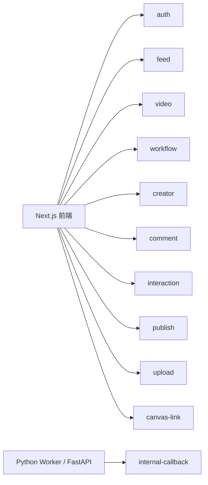
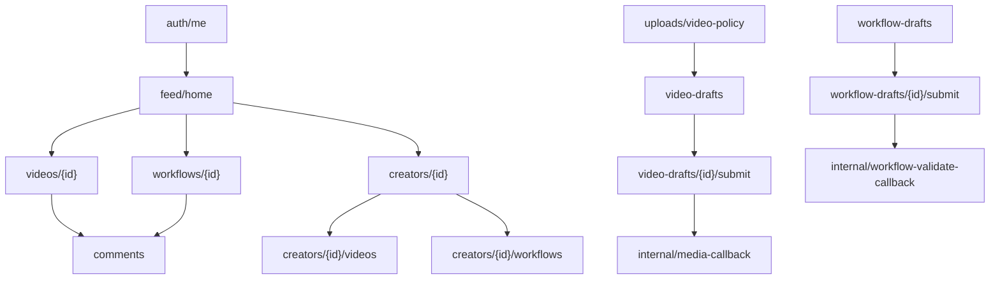

# DramaTV 第一阶段 API 清单

更新日期：2026-04-06

## 1. 文档目标

这份文档用于把第一阶段模块边界进一步落成前后端联调可用的 API 清单。

目标不是一次写完整 OpenAPI，而是先把：

- 接口分组
- 路径
- 权限要求
- 请求与响应核心字段
- 主要错误码
- 联调顺序

全部收口，避免后续前端、后端、Worker 三边各写一套。

## 2. 第一阶段 API 设计原则

### 2.1 接口分层

第一阶段接口只分两层：

- 对外业务接口：给前端调用
- 内部回调接口：给 `Python Worker / FastAPI` 调用

不在第一阶段引入额外网关协议和复杂 BFF 层。

### 2.2 基础约定

- Base Path：`/api`
- 协议：`HTTPS`
- 编码：`application/json`
- 身份凭证：`Bearer Token`
- 时间格式：ISO 8601
- ID：`uuid`

### 2.3 返回结构约定

统一返回：

```json
{
  "code": "OK",
  "message": "ok",
  "data": {},
  "requestId": "9e6dd28c-3ca4-4d5b-b0d5-69df7ef9e4f1"
}
```

分页返回建议：

```json
{
  "code": "OK",
  "message": "ok",
  "data": {
    "items": [],
    "nextCursor": "opaque-cursor",
    "hasMore": true
  },
  "requestId": "..."
}
```

### 2.4 权限标记

- `public`：游客可访问
- `login`：登录后可访问
- `creator`：创作者及以上
- `internal`：仅内部回调

### 2.5 当前阶段联调优先级

为了避免接口设计继续被二级能力带偏，当前阶段接口分成三层：

| 优先级 | 接口组 | 当前定位 |
| --- | --- | --- |
| `P0` | `feed / video / workflow / creator / auth-me / uploads / video-drafts / comments / media-callback` | 必须先打通的社区主线 |
| `P1` | `interactions / reports / workflow-drafts / workflow-validate-callback / audit-callback` | 主线补强能力 |
| `P2` | `canvas-link / copy-to-canvas / canvas-runtimes / snapshot / visible-assets / canvas-copy-tasks` | 二级增强能力 |

规则：

- 当前先以 `P0` 接口组作为主联调目标
- `P2` 接口继续保留设计，但实现节奏不高于主线读写链路
- 如果排期冲突，优先保证“发布视频并绑定工作流”，而不是“复制到画布”

## 3. API 总览图



## 4. 认证与会话接口

### 4.1 `POST /api/auth/login`

- 权限：`public`
- Owner：`identity-auth`
- 用途：用户登录

请求体：

```json
{
  "loginType": "password",
  "username": "creator_a",
  "password": "******"
}
```

返回核心字段：

```json
{
  "accessToken": "jwt-or-session-token",
  "expiresIn": 7200,
  "user": {
    "id": "uuid",
    "displayName": "Creator A",
    "roleCode": "creator"
  }
}
```

错误码重点：

- `AUTH_INVALID_CREDENTIALS`
- `AUTH_USER_BLOCKED`

### 4.2 `POST /api/auth/logout`

- 权限：`login`
- Owner：`identity-auth`
- 用途：退出登录

### 4.3 `GET /api/auth/me`

- 权限：`login`
- Owner：`identity-auth`
- 用途：获取当前登录态

返回核心字段：

- `id`
- `displayName`
- `avatarUrl`
- `roleCode`
- `creatorProfile`

## 5. 首页与发现接口

### 5.1 `GET /api/feed/home`

- 权限：`public`
- Owner：`feed-discovery`
- 用途：首页聚合数据

查询参数：

- `cursor`：可选
- `channel`：可选，默认 `recommend`

返回核心字段：

```json
{
  "items": [
    {
      "itemType": "video",
      "targetId": "uuid",
      "title": "片头实验",
      "coverUrl": "https://...",
      "author": {
        "id": "uuid",
        "displayName": "A"
      },
      "workflow": {
        "id": "uuid",
        "title": "赛博雨夜工作流"
      }
    }
  ],
  "nextCursor": "opaque-cursor",
  "hasMore": true,
  "sections": {
    "hotWorkflows": [],
    "featuredCreators": []
  }
}
```

说明：

- 首页不要求一次返回所有内容
- 推荐流与侧边区块一起返回，避免前端多接口拼装

错误码重点：

- `FEED_CHANNEL_INVALID`

## 6. 视频内容接口

### 6.1 `GET /api/videos/{id}`

- 权限：`public`
- Owner：`video-content`
- 用途：视频详情页

返回核心字段：

- `id`
- `title`
- `summary`
- `visibility`
- `publishStatus`
- `media.coverUrl`
- `media.posterUrl`
- `media.previewUrl`
- `media.sourceUrl`
- `author`
- `workflow`
- `stats`
- `viewerActions`

示例响应结构：

```json
{
  "id": "uuid",
  "title": "片头实验",
  "summary": "夜景镜头测试",
  "media": {
    "coverUrl": "https://...",
    "previewUrl": "https://...",
    "sourceUrl": "https://..."
  },
  "author": {
    "id": "uuid",
    "displayName": "Creator A"
  },
  "workflow": {
    "id": "uuid",
    "title": "赛博雨夜工作流",
    "allowCopy": true
  },
  "stats": {
    "playCount": 3200,
    "likeCount": 128,
    "commentCount": 36
  },
  "viewerActions": {
    "liked": false,
    "favorited": false,
    "followedAuthor": false
  }
}
```

错误码重点：

- `VIDEO_NOT_FOUND`
- `VIDEO_NOT_VISIBLE`

### 6.2 `GET /api/videos/{id}/related`

- 权限：`public`
- Owner：`video-content`
- 用途：相关推荐

## 7. 工作流内容接口

### 7.1 `GET /api/workflows/{id}`

- 权限：`public`
- Owner：`workflow-content`
- 用途：工作流详情页

返回核心字段：

- `id`
- `title`
- `summary`
- `scenarioText`
- `tagNames`
- `allowCopy`
- `allowFork`
- `author`
- `stats`
- `canvasBinding`
- `relatedVideos`
- `viewerActions`

错误码重点：

- `WORKFLOW_NOT_FOUND`
- `WORKFLOW_NOT_VISIBLE`

### 7.2 `GET /api/workflows/{id}/related-videos`

- 权限：`public`
- Owner：`workflow-content`
- 用途：工作流详情下的关联作品

## 8. 作者主页接口

### 8.1 `GET /api/creators/{id}`

- 权限：`public`
- Owner：`creator-profile`
- 用途：作者主页头部信息

返回核心字段：

- `id`
- `displayName`
- `avatarUrl`
- `bio`
- `headline`
- `stats.videoCount`
- `stats.workflowCount`
- `stats.followerCount`
- `viewerActions.followed`

### 8.2 `GET /api/creators/{id}/videos`

- 权限：`public`
- Owner：`creator-profile`
- 用途：作者发布的视频列表

查询参数：

- `cursor`
- `sort`：默认 `latest`

### 8.3 `GET /api/creators/{id}/workflows`

- 权限：`public`
- Owner：`creator-profile`
- 用途：作者发布的工作流列表

## 9. 评论与互动接口

### 9.1 `GET /api/comments`

- 权限：`public`
- Owner：`interaction-comment`
- 用途：读取评论列表

查询参数：

- `targetType`
- `targetId`
- `cursor`

返回核心字段：

- `id`
- `author`
- `content`
- `createdAt`
- `replyCount`
- `likeCount`
- `viewerActions.liked`

### 9.2 `POST /api/comments`

- 权限：`login`
- Owner：`interaction-comment`
- 用途：发表评论或回复

请求体：

```json
{
  "targetType": "video",
  "targetId": "uuid",
  "content": "这个镜头控制得很好",
  "parentId": null
}
```

错误码重点：

- `COMMENT_TARGET_NOT_FOUND`
- `COMMENT_RISK_BLOCKED`
- `RATE_LIMITED`

### 9.3 `POST /api/interactions/like`

- 权限：`login`
- Owner：`interaction-comment`
- 用途：点赞

请求体：

```json
{
  "targetType": "video",
  "targetId": "uuid"
}
```

### 9.4 `DELETE /api/interactions/like`

- 权限：`login`
- Owner：`interaction-comment`
- 用途：取消点赞

### 9.5 `POST /api/interactions/favorite`

- 权限：`login`
- Owner：`interaction-comment`
- 用途：收藏

### 9.6 `DELETE /api/interactions/favorite`

- 权限：`login`
- Owner：`interaction-comment`
- 用途：取消收藏

### 9.7 `POST /api/interactions/follow`

- 权限：`login`
- Owner：`interaction-comment`
- 用途：关注作者

请求体：

```json
{
  "followeeId": "uuid"
}
```

### 9.8 `DELETE /api/interactions/follow/{followeeId}`

- 权限：`login`
- Owner：`interaction-comment`
- 用途：取消关注

### 9.9 `POST /api/reports`

- 权限：`login`
- Owner：`publish-audit`
- 用途：举报内容

请求体：

```json
{
  "targetType": "video",
  "targetId": "uuid",
  "reasonCode": "violence",
  "descriptionText": "疑似违规内容"
}
```

## 10. 上传与媒体接口

### 10.1 `POST /api/uploads/video-policy`

- 权限：`creator`
- Owner：`publish-audit`
- 用途：获取视频上传策略或预签名信息

请求体：

```json
{
  "fileName": "demo.mp4",
  "mimeType": "video/mp4",
  "sizeBytes": 102400000
}
```

返回核心字段：

- `uploadUrl`
- `assetId`
- `headers`
- `expiresAt`

错误码重点：

- `UPLOAD_FILE_TOO_LARGE`
- `UPLOAD_MIME_NOT_ALLOWED`

### 10.2 `POST /api/uploads/image-policy`

- 权限：`creator`
- Owner：`publish-audit`
- 用途：获取封面或示意图上传策略

## 11. 视频发布接口

### 11.1 `POST /api/video-drafts`

- 权限：`creator`
- Owner：`publish-audit`
- 用途：创建视频草稿

返回核心字段：

- `draftId`
- `targetId`
- `statusCode`

### 11.2 `GET /api/video-drafts/{id}`

- 权限：`creator`
- Owner：`publish-audit`
- 用途：读取视频草稿详情

### 11.3 `PUT /api/video-drafts/{id}`

- 权限：`creator`
- Owner：`publish-audit`
- 用途：保存视频草稿

请求体核心字段：

- `title`
- `summary`
- `categoryCode`
- `tagNames`
- `workflowId`
- `visibility`
- `coverAssetId`
- `sourceAssetId`

### 11.4 `POST /api/video-drafts/{id}/submit`

- 权限：`creator`
- Owner：`publish-audit`
- 用途：提交视频审核或发布

请求体：

```json
{
  "submitMode": "review"
}
```

返回核心字段：

- `videoId`
- `publishStatus`
- `taskIds`

错误码重点：

- `VIDEO_DRAFT_INCOMPLETE`
- `WORKFLOW_BIND_FORBIDDEN`
- `VIDEO_SOURCE_NOT_READY`

## 12. 工作流发布接口

### 12.1 `POST /api/workflow-drafts`

- 权限：`creator`
- Owner：`publish-audit`
- 用途：创建工作流草稿

### 12.2 `GET /api/workflow-drafts/{id}`

- 权限：`creator`
- Owner：`publish-audit`
- 用途：读取工作流草稿

### 12.3 `PUT /api/workflow-drafts/{id}`

- 权限：`creator`
- Owner：`publish-audit`
- 用途：保存工作流草稿

请求体核心字段：

- `title`
- `summary`
- `scenarioText`
- `tagNames`
- `visibility`
- `allowCopy`
- `allowFork`
- `coverAssetId`
- `canvasBinding`

### 12.4 `POST /api/workflow-drafts/{id}/submit`

- 权限：`creator`
- Owner：`publish-audit`
- 用途：提交工作流审核或发布

返回核心字段：

- `workflowId`
- `publishStatus`
- `taskIds`

错误码重点：

- `WORKFLOW_DRAFT_INCOMPLETE`
- `WORKFLOW_BINDING_INVALID`
- `WORKFLOW_SECRET_DETECTED`

## 13. 画布联动接口

这一组接口当前统一归类为 `P2 二级增强接口`。

规则：

- 设计要保留
- 联调顺序要后置
- 优先级不高于首页、详情页、作者页、发布页主链路

### 13.1 `GET /api/workflows/{id}/canvas-link`

- 权限：`public`
- Owner：`canvas-link`
- 用途：获取在画布中打开所需信息

返回核心字段：

- `bindingType`
- `openUrl`
- `allowCopy`
- `sourceRuntimeType`
- `lightSnapshotVersion`

### 13.2 `POST /api/workflows/{id}/copy-to-canvas`

- 权限：`login`
- Owner：`canvas-link`
- 用途：复制工作流到用户画布空间

请求体：

```json
{
  "targetSpaceId": "space_001",
  "copyMode": "reference_then_async_clone",
  "openAfterCopy": true,
  "idempotencyKey": "workflow-copy-user123-space001"
}
```

返回核心字段：

```json
{
  "copyTaskId": "uuid",
  "targetRuntimeId": "uuid",
  "targetCanvasWorkflowId": "canvas_wf_9527",
  "status": "runtime_ready",
  "openUrl": "/canvas/runtime_001",
  "lightSnapshotVersion": 3
}
```

错误码重点：

- `CANVAS_BINDING_NOT_AVAILABLE`
- `WORKFLOW_COPY_FORBIDDEN`

### 13.3 `GET /api/canvas-runtimes/{id}`

- 权限：`login`
- Owner：`canvas-link`
- 用途：获取画布副本运行时元信息

返回核心字段：

- `runtimeId`
- `sourceWorkflowId`
- `runtimeStatus`
- `canvasSpaceId`
- `canvasWorkflowId`
- `lightSnapshotVersion`
- `copyTask`

### 13.4 `GET /api/canvas-runtimes/{id}/snapshot`

- 权限：`login`
- Owner：`canvas-link`
- 用途：获取画布页首屏渲染快照

查询参数：

- `mode`：`light/full`，默认 `light`

`mode=light` 返回核心字段：

- `nodes[].id`
- `nodes[].type`
- `nodes[].x/y/width/height`
- `nodes[].assetState`
- `edges[]`
- `viewport`
- `minimapBounds`

### 13.5 `POST /api/canvas-runtimes/{id}/visible-assets`

- 权限：`login`
- Owner：`canvas-link`
- 用途：按当前视口批量获取节点媒体资源

请求体：

```json
{
  "viewport": {
    "x": 1200,
    "y": 800,
    "width": 1680,
    "height": 980,
    "zoom": 0.22
  },
  "nodeIds": ["n_11", "n_12", "n_98"],
  "limit": 40
}
```

返回核心字段：

- `items[].nodeId`
- `items[].thumbnailUrl`
- `items[].posterUrl`
- `items[].previewUrl`
- `items[].statusCode`

### 13.6 `GET /api/canvas-copy-tasks/{id}`

- 权限：`login`
- Owner：`canvas-link`
- 用途：查询复制任务与异步补偿状态

返回核心字段：

- `statusCode`
- `progressPercent`
- `targetRuntimeId`
- `warnings`
- `errorCode`
- `errorMessage`

## 14. 内部回调接口

### 14.1 `POST /api/internal/media-callback`

- 权限：`internal`
- Owner：`internal-callback`
- 用途：媒体处理结果回写

请求体核心字段：

```json
{
  "taskId": "uuid",
  "statusCode": "succeeded",
  "targetType": "video",
  "targetId": "uuid",
  "result": {
    "coverAssetId": "uuid",
    "previewAssetId": "uuid",
    "durationMs": 18234
  }
}
```

### 14.2 `POST /api/internal/workflow-validate-callback`

- 权限：`internal`
- Owner：`internal-callback`
- 用途：工作流结构校验回写

### 14.3 `POST /api/internal/audit-callback`

- 权限：`internal`
- Owner：`internal-callback`
- 用途：审核辅助结果回写

请求体核心字段：

```json
{
  "taskId": "audit-task-uuid",
  "targetType": "workflow",
  "targetId": "uuid",
  "statusCode": "approved",
  "riskTags": ["copyright"]
}
```

当前阶段回写语义：

- `approved`：把目标内容推进到 `published`，同步更新草稿状态、审核记录，并写入首页 `feed_items`
- `rejected` / `taken_down`：目标内容保持非公开状态，并把已有 `feed_items` 设为 `inactive`
- 公开查询接口只暴露 `published` 内容，所以审核回写是内容进入社区首页、详情页、作者页的真实闸门

内部接口规则：

- 必须校验来源签名
- 必须落 `task_callback_logs`
- 必须保证幂等

## 15. 错误码建议

| 错误码 | 含义 | 常见场景 |
| --- | --- | --- |
| `AUTH_INVALID_CREDENTIALS` | 登录失败 | 用户名或密码错误 |
| `AUTH_FORBIDDEN` | 无权限 | 非作者调用发布接口 |
| `VIDEO_NOT_FOUND` | 视频不存在 | 详情页读取 |
| `WORKFLOW_NOT_FOUND` | 工作流不存在 | 详情页读取 |
| `VIDEO_NOT_VISIBLE` | 视频不可见 | 私有或被下线 |
| `WORKFLOW_NOT_VISIBLE` | 工作流不可见 | 私有或被下线 |
| `VIDEO_DRAFT_INCOMPLETE` | 视频草稿不完整 | 提交发布 |
| `WORKFLOW_DRAFT_INCOMPLETE` | 工作流草稿不完整 | 提交发布 |
| `WORKFLOW_BIND_FORBIDDEN` | 无权绑定工作流 | 发布视频 |
| `WORKFLOW_BINDING_INVALID` | 画布绑定失效 | 发布工作流 |
| `CANVAS_RUNTIME_NOT_FOUND` | 画布副本不存在 | 打开副本页 |
| `CANVAS_RUNTIME_FORBIDDEN` | 无权访问画布副本 | 打开副本页 |
| `CANVAS_COPY_IN_PROGRESS` | 复制仍在补偿中 | 轮询复制任务 |
| `UPLOAD_FILE_TOO_LARGE` | 文件过大 | 上传 |
| `UPLOAD_MIME_NOT_ALLOWED` | 文件类型不允许 | 上传 |
| `RATE_LIMITED` | 请求过快 | 评论、登录、发布 |
| `INTERNAL_CALLBACK_INVALID_SIGN` | 回调签名错误 | Worker 回调 |

## 16. 接口依赖顺序图



这张图的意思是：

- 读链路可以先完成首页和详情
- 写链路重点先打通上传、草稿、提交、内部回调
- 评论和互动可以在详情页稳定后接入

## 17. 第一阶段联调顺序建议

### 17.1 第一批

先联通读接口：

- `GET /api/feed/home`
- `GET /api/videos/{id}`
- `GET /api/workflows/{id}`
- `GET /api/creators/{id}`

### 17.2 第二批

再联通登录态与评论互动：

- `POST /api/auth/login`
- `GET /api/auth/me`
- `GET /api/comments`
- `POST /api/comments`
- like / favorite / follow

### 17.3 第三批

最后联通发布链路：

- 上传策略接口
- 草稿接口
- 提交接口
- 内部回调接口

### 17.4 第四批

在工作流详情页稳定后，再联通画布复制链路：

- `POST /api/workflows/{id}/copy-to-canvas`
- `GET /api/canvas-runtimes/{id}`
- `GET /api/canvas-runtimes/{id}/snapshot?mode=light`
- `POST /api/canvas-runtimes/{id}/visible-assets`
- `GET /api/canvas-copy-tasks/{id}`

## 18. 这份文档之后最该接的动作

这份 API 清单定下来后，最适合继续做的是：

1. 输出 `Spring Boot` 模块目录设计
2. 输出 `Next.js` 页面数据契约
3. 开始补数据库迁移和后端骨架
