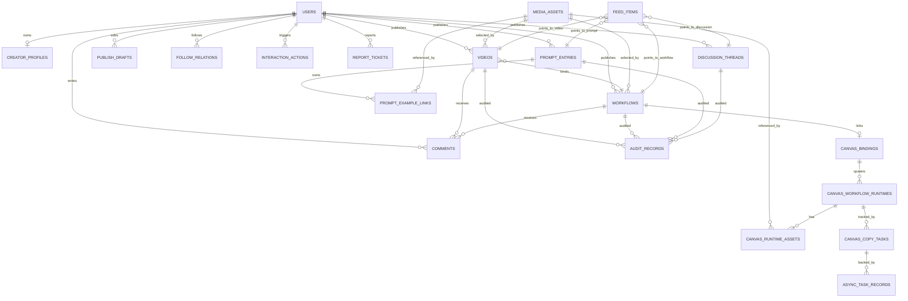

# DramaTV 社区项目现状总览、运行入口与数据结构说明

日期：`2026-06-20`
文档性质：项目交接 / 接手 / 排障总览文档

## 1. 文档目的

本文档用于让新接手人快速建立对 `DramaTV` 社区项目的完整认知，重点回答以下问题：

- 项目当前是什么系统，边界在哪里
- 当前正式代码主线、运行主线、发布主线分别是什么
- 本地、测试环境、共享 ECS 的真实访问入口是什么
- 当前如何更新、发布、验收、回滚
- 数据库当前有哪些核心表，表关系是什么
- 当前有哪些关键风险，排障时优先看哪里

本文档优先面向以下角色：

- 新研发接手
- 协作开发同学
- 测试、运维、产品需要快速建立系统认知时

## 2. 信息来源与口径优先级

本文档基于以下材料收口：

- [社区全栈项目总览与推进路线.md](/E:/点众/DramaTV社区搭建/docs/01_总览/社区全栈项目总览与推进路线.md)
- [PGC阶段社区主线闭环与优先级.md](/E:/点众/DramaTV社区搭建/docs/01_总览/PGC阶段社区主线闭环与优先级.md)
- [社区全栈业务流程.md](/E:/点众/DramaTV社区搭建/docs/03_架构/社区全栈业务流程.md)
- [数据库初版表设计.md](/E:/点众/DramaTV社区搭建/docs/04_实施设计/数据库初版表设计.md)
- [第一阶段 API 清单.md](/E:/点众/DramaTV社区搭建/docs/04_实施设计/第一阶段 API 清单.md)
- [Next.js 页面数据契约.md](/E:/点众/DramaTV社区搭建/docs/04_实施设计/Next.js 页面数据契约.md)
- [测试ECS三项目共享现状说明-2026-06-11.md](/E:/点众/DramaTV社区搭建/docs/03_架构/测试ECS三项目共享现状说明-2026-06-11.md)
- [共享ECS公网入口现状总结-2026-06-11.md](/E:/点众/DramaTV社区搭建/docs/03_架构/共享ECS公网入口现状总结-2026-06-11.md)
- [测试环境社区前台发布与回滚方案-2026-05-19.md](/E:/点众/DramaTV社区搭建/docs/04_实施设计/测试环境社区前台发布与回滚方案-2026-05-19.md)
- [测试环境管理后台云发布补充-2026-05-21.md](/E:/点众/DramaTV社区搭建/docs/04_实施设计/测试环境管理后台云发布补充-2026-05-21.md)
- [本地手动启动操作指南-2026-05-21.md](/E:/点众/DramaTV社区搭建/docs/04_实施设计/本地手动启动操作指南-2026-05-21.md)
- [test-env-release-ledger.md](/E:/点众/DramaTV社区搭建/ops/releases/test-env-release-ledger.md)
- 当前仓库代码：
  - [apps/web](/E:/点众/DramaTV社区搭建/apps/web)
  - [apps/admin](/E:/点众/DramaTV社区搭建/apps/admin)
  - [apps/server](/E:/点众/DramaTV社区搭建/apps/server)

### 2.1 口径优先级

当以下信息互相冲突时：

- 脚本默认值
- 历史文档
- 当前真实测试环境入口

采用以下优先级：

1. `ops/releases/test-env-release-ledger.md` 中最近已验证的 release 记录
2. `docs/03_架构` 与 `docs/04_实施设计` 中明确标记为现状的文档
3. 脚本默认参数

结论：

- 仓库脚本里仍保留的 `community.8.141.20.130.nip.io` 不能直接视为当前正式测试入口
- 当前测试环境真实入口应优先以最近 release 台账中的显式发布参数为准

## 3. 项目定义与当前阶段

## 3.1 项目定义

`DramaTV` 当前不是普通短视频站，也不是单纯官网。

当前项目定义是：

- AI 视频 / 图片 / 提示词 / 工作流社区
- 创作者主页与内容分发社区
- 带运营配置、内容治理、后台管理的内容平台
- 后续与画布软件联动的社区前置入口

## 3.2 当前阶段

当前固定判断为：`PGC 冷启动阶段`

当前主线能力：

- 首页与精选页内容分发
- 视频、工作流、提示词详情消费
- 作者主页内容聚合
- 发布链路
- 讨论互动
- 后台运营与治理

当前不是主线的能力：

- 完整 UGC 治理体系
- 高级推荐与召回系统
- 复杂商业化
- 深度画布 runtime 编辑

## 3.3 当前工程成熟度

项目已经不是原型，而是进入真实工程维护阶段的多端系统。当前已具备：

- 正式前台工程
- 正式后台工程
- 正式后端工程
- PostgreSQL + Redis + OSS 的分层结构
- 测试环境脚本化发布与回滚
- `release` 目录、`current` 切换、`release.json`
- 共享 ECS Host 分流
- 媒体代理、审核、举报、运营编排、异步任务等真实链路

## 4. 代码与运行拓扑

## 4.1 代码主线

| 模块 | 目录 | 技术栈 | 角色 |
| --- | --- | --- | --- |
| 社区前台 | [apps/web](/E:/点众/DramaTV社区搭建/apps/web) | Next.js + React + TypeScript | 用户侧页面与交互主线 |
| 管理后台 | [apps/admin](/E:/点众/DramaTV社区搭建/apps/admin) | Next.js + React + TypeScript | 运营、治理、配置后台 |
| 社区后端 | [apps/server](/E:/点众/DramaTV社区搭建/apps/server) | Spring Boot | 读写 API、权限、运营、发布、媒体代理 |
| 发布与验收脚本 | [scripts](/E:/点众/DramaTV社区搭建/scripts) | PowerShell + Node | 云发布、回滚、readiness、smoke |
| 文档与实施材料 | [docs](/E:/点众/DramaTV社区搭建/docs) | Markdown / xlsx / drawio | 架构、研究、实施、接手材料 |
| 发布台账 | [ops/releases/test-env-release-ledger.md](/E:/点众/DramaTV社区搭建/ops/releases/test-env-release-ledger.md) | Markdown | 测试环境 release 历史 |

## 4.2 后端领域划分

后端当前主要目录包括：

- `admin`
- `bootstrap`
- `canvas`
- `creator`
- `discussion`
- `feed`
- `identity`
- `interaction`
- `internal`
- `me`
- `prompt`
- `publish`
- `shared`
- `video`
- `workflow`

当前职责划分可概括为：

| 领域 | 当前职责 |
| --- | --- |
| `feed` | 首页、精选、落地页分发 |
| `video` / `workflow` | 详情读取 |
| `creator` | 作者主页读取 |
| `discussion` | 社区帖子 |
| `prompt` | 提示词与资源域读取 |
| `interaction` | 点赞、收藏、关注、评论等行为 |
| `publish` | 上传、草稿、媒体处理、提交流程 |
| `canvas` | 画布绑定、复制、runtime |
| `admin` | 后台治理与运营接口 |
| `shared` | 媒体代理、错误处理、权限、公共配置 |

## 4.3 运行时拓扑

| 层 | 实体 | 监听 | 说明 |
| --- | --- | --- | --- |
| 前台服务 | `dramatv-community-web` | `127.0.0.1:3106` | 社区页面服务 |
| 后台服务 | `dramatv-community-admin` | `0.0.0.0:3206` | 管理后台服务 |
| 后端服务 | `dramatv-community-server` | `0.0.0.0:18080` | 统一 API 服务 |
| Nginx | `/etc/nginx/conf.d/dramatv-community-http.conf` | `:80` | Host 分流与反向代理 |
| 数据库 | PostgreSQL | `5432` | 主业务数据 |
| 缓存 | Redis | `6379` | 会话、短状态、限流 |
| 媒体层 | OSS + `/media/**` 代理 | 对外经 Nginx/应用代理 | 媒体文件不直接放源码仓库 |

## 4.4 当前路由分发关系

共享 ECS 上当前社区链路本质如下：

- `/` 与社区页面 -> `apps/web :3106`
- `/admin` -> `apps/admin :3206`
- `/api/**` -> `apps/server :18080`
- `/media/**` -> `apps/server :18080`

## 5. 环境、域名与访问入口

## 5.1 本地标准入口

| 场景 | 地址 | 说明 |
| --- | --- | --- |
| 前台 | `http://127.0.0.1:3106/` | 社区主入口 |
| 后台 | `http://127.0.0.1:3206/login` | 后台登录页 |
| 后端健康检查 | `http://127.0.0.1:18080/actuator/health` | Spring Boot 健康检查 |
| 云镜像前台 | `http://localhost:3107/` | 本地模拟云构建版本 |

本地标准端口：

- 后端：`18080`
- 前台：`3106`
- 后台：`3206`
- 云镜像：`3107`
- PostgreSQL：`5432`
- Redis：`6379`

## 5.2 测试环境入口矩阵

共享测试 ECS：

- 公网 IP：`8.141.20.130`
- 当前同机项目数：`3`
- 当前同机项目：
  - `DramaTV` 社区
  - `DramaLoom`
  - 小说相似度项目

### 5.2.1 社区入口矩阵

| 类型 | 地址 | 当前判断 | 说明 |
| --- | --- | --- | --- |
| 当前测试环境正式入口 | `http://drama-community-dev.dzkjm.cn` | 当前优先口径 | 最近台账已明确用该域名发布并验收 |
| 当前测试环境后台入口 | `http://drama-community-dev.dzkjm.cn/admin` | 当前优先口径 | 与前台同 Host，经 `/admin` 反代 |
| 历史入口 | `http://community.8.141.20.130.nip.io` | 历史 / 已废弃口径 | 多份旧文档和脚本默认值仍保留 |
| 历史后台入口 | `http://community.8.141.20.130.nip.io/admin` | 历史 / 已废弃口径 | 当前不应再当正式验收入口 |
| 临时高位端口前台 | `http://8.141.20.130:8086/login` | 临时应急入口 | `nip.io` 被备案/接入层拦截期间保留 |
| 临时高位端口后台 | `http://8.141.20.130:8206/admin/login` | 临时应急入口 | 仅作恢复链路 |
| 裸 IP | `http://8.141.20.130` | 机器级探活入口 | 不能视作社区正式业务入口 |

### 5.2.2 同机其他项目入口

| 项目 | 入口 | 说明 |
| --- | --- | --- |
| DramaLoom | `http://dramaloom.8.141.20.130.nip.io` | 同机独立 Host |
| 小说相似度项目 | `http://novel-similarity.8.141.20.130.nip.io` | 同机独立 Host |

### 5.2.3 当前环境判断结论

- 当前问题排查必须先判断是 Host 分流问题还是应用问题
- 裸 IP 打开错误页面，不等于社区前后端挂了
- `nip.io` 历史域名曾被阿里云备案 / 接入校验拦截，这类问题发生在应用之前
- 如果公网异常但云机内 `curl -H 'Host: ...' http://127.0.0.1/...` 正常，应优先查入口层

## 6. 当前更新、发布与回滚方式

## 6.1 发布模式结论

当前测试环境不是全自动 CI/CD，而是脚本化半自动发布。

当前已具备：

- `releases/<timestamp>` 目录
- `current` 切换
- `release.json`
- 发布台账
- 发布前验证
- 发布后 readiness / smoke
- 独立回滚脚本

当前仍需明确的现实限制：

- 发布源默认仍来自本地当前工作区，不是制品仓库
- 数据库没有完整自动回滚
- 部分脚本默认域名仍是历史 `nip.io`

## 6.2 部署命令速查

| 场景 | 命令 | 说明 |
| --- | --- | --- |
| 前台发布 | `npm run deploy:test:web` | 默认会跑 pre verify + post verify |
| 后端发布 | `npm run deploy:test:backend` | 默认会打 jar、上传、重启 |
| 后台发布 | `npm run deploy:test:admin` | 默认会跑 public/internal smoke |
| 列出 release | `npm run release:list:test` | 支持 `web/server/admin/all` |
| 前台回滚 | `npm run rollback:test:web -- -ReleaseName <release> -VerifyAfterRollback` | 代码级回退 |
| 后端回滚 | `npm run rollback:test:backend -- -ReleaseName <release> -VerifyAfterRollback` | 代码级回退 |
| 后台回滚 | `npm run rollback:test:admin -- -ReleaseName <release> -VerifyAfterRollback` | 代码级回退 |
| 统一 readiness | `npm run readiness:test` | 根命令默认仍指向历史 `nip.io`，使用前需确认 |

## 6.3 当前真实发布口径与脚本默认值差异

当前脚本默认值仍有以下历史残留：

- `deploy-test-web.ps1`
  - `PublicBaseUrl = http://community.8.141.20.130.nip.io`
  - `ServerNames = community.8.141.20.130.nip.io`
- `deploy-test-backend.ps1`
  - `PublicBaseUrl = http://community.8.141.20.130.nip.io`
- `deploy-test-admin.ps1`
  - `CommunityPublicBaseUrl = http://community.8.141.20.130.nip.io`
  - `AdminPublicBaseUrl = http://community.8.141.20.130.nip.io/admin`
- `package.json`
  - `readiness:test` 默认也仍指向旧 `nip.io`

但最近真实测试环境发布记录显示，当前推荐应显式传入：

```powershell
powershell -NoProfile -ExecutionPolicy Bypass -File scripts/deploy-test-web.ps1 `
  -PublicBaseUrl http://drama-community-dev.dzkjm.cn `
  -ServerNames drama-community-dev.dzkjm.cn `
  -VerifyAfterDeploy
```

如果使用后端 / 后台脚本，也应同步把验收入口显式改成 `drama-community-dev.dzkjm.cn` 口径。

## 6.4 远端目录结构

### 前台

```text
/opt/dramatv-community-web/
  releases/<timestamp>/
  current -> releases/<timestamp>
  shared/dramatv-community-web.env
```

### 后台

```text
/opt/dramatv-community-admin/
  releases/<timestamp>/
  current -> releases/<timestamp>
  shared/dramatv-community-admin.env
```

### 后端

```text
/opt/dramatv-community-server/
  releases/<timestamp>/dramatv-community-server.jar
  current/dramatv-community-server.jar -> releases/<timestamp>/dramatv-community-server.jar
  shared/dramatv-community.env
  shared/logs/server/
```

## 6.5 标准发布动作

### 前台 `apps/web`

1. 从本地当前工作区打包源码。
2. 上传到云机 `releases/<timestamp>`。
3. 远端执行 `npm ci`、`npm run build`。
4. 切换 `current`。
5. 重启 `dramatv-community-web`。
6. 运行 readiness 校验。

### 后端 `apps/server`

1. 本地 Maven 打包 jar。
2. 上传到 `releases/<timestamp>/dramatv-community-server.jar`。
3. 上传 `release.json`。
4. 切换 `current`。
5. 重启 `dramatv-community-server`。
6. 运行健康检查与 readiness。

### 后台 `apps/admin`

1. 从本地当前工作区打包源码。
2. 上传到 `releases/<timestamp>`。
3. 远端执行 `npm ci`、`npm run build`。
4. 切换 `current`。
5. 重启 `dramatv-community-admin`。
6. 运行 public smoke 与 internal smoke。

## 6.6 当前回滚结论

当前具备的是代码 release 级回滚能力，不是数据库与外部状态的全量回滚能力。

可以回滚的：

- 前台代码
- 后台代码
- 后端 jar

不能简单承诺完全回滚的：

- 已执行的数据库 migration
- 已修改的运营配置数据
- 已写入的举报、审核、导入数据

## 6.7 最近已验证的 release 锚点

截至 `2026-06-20`，最近台账中可直接作为接手参考的批次如下：

| 组件 | release | 标签 | 说明 |
| --- | --- | --- | --- |
| web | `20260618-193956` | `featured-cross-page-restore-fix` | 精选页跨页面返回恢复修复 |
| backend | `20260618-185556` | `featured-prompt-preview-fix-followup` | 精选页 preview 修复，并补了 `current` 指向校验 |
| admin | `20260611-194322` | `large-sync-20260611-admin` | 后台大版本同步批次 |

完整历史台账见：

- [test-env-release-ledger.md](/E:/点众/DramaTV社区搭建/ops/releases/test-env-release-ledger.md)

## 7. 业务现状与页面主线

## 7.1 当前主业务域

当前主线业务包括：

- 首页内容分发
- 精选页内容分发
- 视频详情
- 工作流详情
- 提示词资源浏览
- 作者主页
- 发布链路
- 讨论区
- 后台运营与治理
- 画布联动预留

## 7.2 关键页面说明

| 页面 | 作用 | 当前特点 |
| --- | --- | --- |
| 首页 `/` | 社区主入口 | 走 feed 聚合，不是直接扫主内容表 |
| 精选页 `/featured` | 资源主浏览区 | 分类切换、分页、返回定位、瀑布流是高复杂区 |
| 视频 / 工作流详情 | 内容消费页 | 承接作者、评论、相关推荐、工作流绑定 |
| 作者主页 `/creators/[id]` | 创作者资产页 | 聚合作品、工作流、返回恢复 |
| 发布页 `/publish` | 发布入口 | 草稿、上传、封面、预览、提交审核 |
| 讨论区 `/discussions` | 社区帖子域 | 帖子流、详情、评论与互动 |

## 7.3 后台治理域

后台当前已经是正式运营后台，不是演示壳页。

当前后台能力至少包括：

- `feed-ops`
  - `home`
  - `featured`
  - `landing`
  - `discussions`
- `taxonomy`
- `resources`
- `reports`
- `moderation`
- `comments`
- `users`
- `media-tasks`
- `audit-logs`

## 8. 数据库与数据结构

## 8.1 数据层职责划分

| 层 | 介质 | 当前职责 |
| --- | --- | --- |
| 主数据层 | PostgreSQL | 业务真相、关系数据、审核、任务、运营配置 |
| 缓存层 | Redis | 会话、短状态、限流、热点短缓存 |
| 媒体层 | OSS + `/media/**` 代理 | 视频、图片、preview、cover、source 等实际文件 |

数据库中保存的是：

- 用户、作者、内容、评论、互动关系
- 草稿、审核、举报、运营配置
- 媒体元数据
- 异步任务状态

数据库中不保存的是：

- 视频 / 图片二进制本体
- 大型预览文件
- 长期中间转码产物

## 8.2 当前数据域分组

### A. 账号与作者域

- `users`
- `creator_profiles`
- `auth_sessions`

### B. 内容主域

- `media_assets`
- `videos`
- `workflows`
- `feed_items`

### C. 发布与治理域

- `publish_drafts`
- `audit_records`
- `report_tickets`

### D. 互动与讨论域

- `comments`
- `interaction_actions`
- `follow_relations`
- `discussion_threads`

### E. 提示词与资源域

- `prompt_entries`
- `prompt_example_links`

### F. 画布联动与异步域

- `canvas_bindings`
- `canvas_workflow_runtimes`
- `canvas_runtime_assets`
- `canvas_copy_tasks`
- `async_task_records`
- `task_callback_logs`

### G. 后台运营配置域

- `admin_taxonomy_configs`
- `admin_feed_slot_configs`
- 后台操作日志相关表

## 8.3 必须优先理解的主骨架表

如果是第一次接手，最先需要掌握的是：

- `users`
- `creator_profiles`
- `media_assets`
- `videos`
- `workflows`
- `feed_items`
- `publish_drafts`
- `audit_records`
- `report_tickets`
- `comments`
- `interaction_actions`
- `follow_relations`
- `canvas_bindings`
- `canvas_workflow_runtimes`
- `canvas_runtime_assets`
- `canvas_copy_tasks`
- `async_task_records`
- `task_callback_logs`

原因：

- 这些表覆盖了前台主链路、发布主链路、治理主链路和画布桥接主链路
- 很多页面问题最终都能落到这些表之间的关系和状态判断上

## 8.4 核心关系图



## 8.5 关键表功能说明

| 表 | 作用 | 备注 |
| --- | --- | --- |
| `users` | 登录、权限、创作者主体 | 几乎所有业务都围绕它关联 |
| `creator_profiles` | 作者主页扩展信息与统计缓存 | 创作者头部与统计展示依赖 |
| `media_assets` | 媒体元数据注册表 | `cover/poster/preview/source/image` 的语义中心 |
| `videos` | 视频作品主表 | 首页、精选、作者页、详情页依赖 |
| `workflows` | 工作流主表 | 与视频绑定、与画布绑定 |
| `feed_items` | 分发投放池 | 解释“为什么前台不是直接扫主内容表” |
| `prompt_entries` | 提示词 / 资源主表 | 精选页资源浏览的重要数据源 |
| `discussion_threads` | 帖子主表 | 社区讨论域主对象 |
| `publish_drafts` | 编辑态与提交流程中间态 | 发布页草稿与自动保存依赖 |
| `audit_records` | 审核留痕 | 审核通过、驳回、下线、治理留痕 |
| `report_tickets` | 举报工单 | 前台举报到后台处理主链路 |
| `comments` | 评论与回复 | 视频、工作流、帖子多目标复用 |
| `interaction_actions` | 点赞、收藏等行为 | 互动状态中心 |
| `follow_relations` | 关注关系 | 作者主页和关系链依赖 |
| `admin_feed_slot_configs` | 后台运营编排配置 | 首页 / 精选 / 落地页编排控制 |
| `admin_taxonomy_configs` | 后台分类配置 | 分类、section、taxonomy 管理 |
| `canvas_*` 系列表 | 画布绑定、复制、runtime、资源渐进加载 | 工作流联动画布主链路 |
| `async_task_records` | 异步任务状态 | 转码、预览、复制补偿等 |
| `task_callback_logs` | Worker 回调留痕 | 幂等、签名、排障关键表 |

## 8.6 页面 -> API -> 表 对照

| 页面 / 场景 | 主要 API | 主要表 | 说明 |
| --- | --- | --- | --- |
| 首页 `/` | `GET /api/feed/home` | `feed_items`, `videos`, `workflows`, `users`, `media_assets` | 首页走聚合分发 |
| 精选页 `/featured` | `GET /api/feed/featured`、`GET /api/feed/featured-inventory` | `feed_items`, `videos`, `workflows`, `prompt_entries`, `media_assets` | 精选页兼顾运营精选与资源池 |
| 视频详情 `/videos/[id]` | `GET /api/videos/{id}`、`GET /api/videos/{id}/related`、`GET /api/comments` | `videos`, `workflows`, `comments`, `interaction_actions`, `follow_relations`, `media_assets`, `users` | 作品消费入口 |
| 工作流详情 `/workflows/[id]` | `GET /api/workflows/{id}`、`GET /api/workflows/{id}/related-videos`、`POST /api/workflows/{id}/copy-to-canvas` | `workflows`, `videos`, `comments`, `canvas_bindings`, `canvas_workflow_runtimes`, `canvas_copy_tasks`, `media_assets`, `users` | 方法详情与画布桥接入口 |
| 作者主页 `/creators/[id]` | `GET /api/creators/{id}`、`GET /api/creators/{id}/videos`、`GET /api/creators/{id}/workflows` | `users`, `creator_profiles`, `videos`, `workflows`, `follow_relations`, `media_assets` | 创作者资产页 |
| 发布页 `/publish` | `GET /api/auth/me`、`POST /api/video-drafts`、`POST /api/workflow-drafts`、`POST /api/uploads/**` | `users`, `publish_drafts`, `videos`, `workflows`, `media_assets`, `async_task_records`, `audit_records` | 编辑态与提交态入口 |
| 讨论区 `/discussions` | `GET /api/discussions/**` | `discussion_threads`, `comments`, `interaction_actions`, `users` | 帖子流与帖子详情 |
| 后台运营 `/admin/feed-ops/*` | `GET/PUT /api/admin/feed-ops/**` | `admin_feed_slot_configs`, `feed_items`, `audit_records` | 决定前台编排 |
| 后台资源治理 `/admin/resources` | `GET /api/admin/resources/**` | `media_assets`, `videos`, `workflows`, `prompt_entries`, `discussion_threads`, `audit_records` | 决定前台内容是否可见 |
| 画布 runtime `/canvas/[runtimeId]` | `GET /api/canvas-runtimes/{id}`、`GET /snapshot`、`POST /visible-assets` | `canvas_workflow_runtimes`, `canvas_runtime_assets`, `canvas_copy_tasks`, `media_assets` | 复制后的渐进加载页 |

## 8.7 Migration 演进现状

当前后端 migration 已从 `V1` 演进到 `V27`，不是初版空架子。

可按以下阶段理解：

- `V1`
  - 账号与内容初始化
- `V2`
  - 发布与互动初始化
- `V3`
  - 画布与异步初始化
- `V4`
  - `feed_items` 唯一索引
- `V5-V8`
  - 讨论区、点赞、收藏、`auth_sessions`
- `V9`
  - 提示词域初始化
- `V10-V19`
  - feed 扩展、评论治理、热点索引、media role、头像、评论层级、prompt taxonomy
- `V20-V27`
  - 后台 taxonomy、feed slot、操作日志、landing 配置、featured hot 配置等

接手时要同时看两类材料：

- 初版设计文档
- 实际 migration 增量轨迹

只看初版设计文档会低估当前系统复杂度。

## 9. 当前工程风险与排障优先级

## 9.1 入口口径风险

当前同时存在：

- 历史 `nip.io` 入口
- 当前 `drama-community-dev.dzkjm.cn` 入口
- 临时高位端口入口
- 脚本默认值仍指向旧入口

这是接手阶段最容易误判的问题源。

## 9.2 共享 ECS 伪装故障风险

共享 ECS、Nginx `server_name`、备案 / 接入校验、安全组、`firewalld` 任何一层异常，都可能表现为：

- 页面打不开
- 502
- 资源丢失
- 路由跳错项目

这类问题不能直接归因到前端或后端代码。

## 9.3 精选页与作者页前端状态复杂度高

精选页、作者页、帖子页已经进入以下复杂区：

- 深分页
- 深滚动
- 返回定位
- 状态恢复
- 瀑布流 / 资源真实尺寸展示

这类问题通常是前端状态机、分页契约和媒体策略共同作用，不是简单 SQL 问题。

## 9.4 媒体角色历史数据风险

项目已明确区分：

- `cover`
- `poster`
- `preview`
- `source`

但历史导入数据和旧数据不一定完全满足角色语义，因此容易出现：

- `preview` 回退到 `source`
- 封面缺失
- 比例异常
- 首屏加载过重

## 9.5 运营配置与前台展示一致性风险

首页、精选页、活动分类、资源治理都依赖后台配置与前台读链路一致。

一旦不一致，常见现象是：

- 后台改了，前台没变
- 编排顺序与展示顺序不一致
- 分类内容落错池子

## 10. 接手建议

## 10.1 先确认入口

第一件事不是跑代码，而是确认当前验收口径：

1. 当前默认域名是否为 `drama-community-dev.dzkjm.cn`
2. 历史 `community.8.141.20.130.nip.io` 是否仅保留为历史口径
3. `8086/8206` 是否还保留为应急链路

## 10.2 再恢复本地标准环境

推荐顺序：

1. Docker 起 PostgreSQL / Redis。
2. 起 `18080` 后端。
3. 起 `3106` 前台。
4. 起 `3206` 后台。
5. 需要时再起 `3107` 云镜像。

## 10.3 再读这几份文档

1. [社区全栈项目总览与推进路线.md](/E:/点众/DramaTV社区搭建/docs/01_总览/社区全栈项目总览与推进路线.md)
2. [PGC阶段社区主线闭环与优先级.md](/E:/点众/DramaTV社区搭建/docs/01_总览/PGC阶段社区主线闭环与优先级.md)
3. [社区全栈业务流程.md](/E:/点众/DramaTV社区搭建/docs/03_架构/社区全栈业务流程.md)
4. [数据库初版表设计.md](/E:/点众/DramaTV社区搭建/docs/04_实施设计/数据库初版表设计.md)
5. [第一阶段 API 清单.md](/E:/点众/DramaTV社区搭建/docs/04_实施设计/第一阶段 API 清单.md)
6. [Next.js 页面数据契约.md](/E:/点众/DramaTV社区搭建/docs/04_实施设计/Next.js 页面数据契约.md)
7. [test-env-release-ledger.md](/E:/点众/DramaTV社区搭建/ops/releases/test-env-release-ledger.md)

## 10.4 读代码的推荐顺序

推荐先看：

1. `apps/web/src/features/home`
2. `apps/web/src/features/featured`
3. `apps/web/src/features/video-detail`
4. `apps/web/src/features/workflow-detail`
5. `apps/web/src/features/creator`
6. `apps/web/src/features/publish`
7. `apps/server/src/main/java/com/dramatv/community/feed`
8. `apps/server/src/main/java/com/dramatv/community/video`
9. `apps/server/src/main/java/com/dramatv/community/workflow`
10. `apps/server/src/main/java/com/dramatv/community/creator`
11. `apps/server/src/main/java/com/dramatv/community/publish`
12. `apps/server/src/main/java/com/dramatv/community/admin`
13. `apps/server/src/main/resources/db/migration`

## 11. 结论

当前 `DramaTV` 已经是一套真实可运行、可发布、可回滚、可运营、可治理、可继续扩展的社区工程。它的复杂度不再主要来自“有没有功能”，而主要来自以下几层是否一致：

- 环境入口层
- Nginx Host 分流层
- 前后台与后端契约层
- 分发与运营配置层
- 媒体角色与资源层
- 数据库状态与 migration 层

因此，后续接手和推进的关键不是继续零散加功能，而是先固定下面四件事：

1. 固定当前正式环境口径。
2. 固定发布与回滚口径。
3. 固定前后台与后端的数据契约。
4. 固定“内容真相层 / 分发层 / 治理层 / 媒体层 / 入口层”的分层认知。
