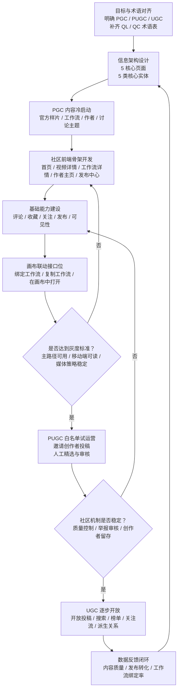
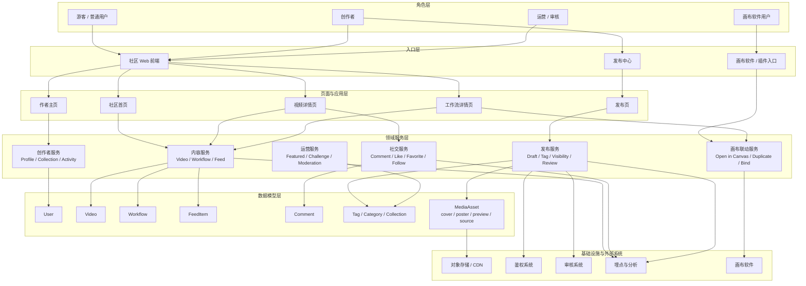

# DramaTV 社区项目开发规划

更新日期：2026-04-06

## 1. 项目判断

DramaTV 当前要做的，不再只是“补几个前端页面”，而是要搭起一个 AI 视频生成社区的第一阶段产品骨架。

这个社区需要同时承载 4 件事：

- 看结果：浏览 AI 视频作品
- 看方法：交流提示词经验、生成经验、镜头与工作流方法
- 看人：进入创作者主页，理解作者的作品和工作流体系
- 接工具：与画布软件联动，让用户从社区继续回到创作工具里

项目发展路线建议采用：

- `PGC`：平台官方、签约作者、内部运营先供给内容，解决冷启动
- `PUGC`：邀请制创作者灰度投稿，逐步形成优质内容池
- `UGC`：机制稳定后，再逐步开放普通用户投稿

## 2. 术语对齐

| 缩写 | 当前建议解释 | 在本项目中的作用 |
| --- | --- | --- |
| `PGC` | Platform Generated Content | 冷启动阶段的官方样片、官方工作流、精选作者内容 |
| `PUGC` | Professional User Generated Content | 邀请制创作者内容，兼顾质量和扩张 |
| `UGC` | User Generated Content | 面向普通用户的开放投稿 |
| `QL` | 含义待老板确认，建议作为“质量线 / 质量等级”类术语统一 | 可用于定义精选线、上首页线、审核线 |
| `QC` | 含义待老板确认，建议作为“质量控制 / 质检流程”类术语统一 | 可用于审核、精选、违规处理、内容降权 |

说明：

- `PGC / PUGC / UGC` 可以先按上面的理解推进。
- `QL / QC` 不建议现在硬猜业务定义，建议在下一次需求评审中单独整理一页术语表，以老板最终口径为准。

## 3. 开发流程图

先做社区产品骨架，再进入内容冷启动和灰度放量，不建议一开始就直接开放全面 UGC。

流程说明：

- 第一阶段先保证“作品、工作流、作者、讨论、发布”这 5 条主路径能成立。
- `PGC` 不是临时内容填充，而是冷启动阶段的主供给方式。
- `PUGC` 适合作为中间层，既能控制质量，也能逐步测试社区机制。
- `UGC` 只有在审核、质量、互动、画布联动都比较稳定后再开放。

## 4. 项目架构图

建议采用“入口层 -> 页面层 -> 领域服务层 -> 数据模型层 -> 基础设施层”的结构，既方便前端先落页面，也方便后续接后端和画布软件。

架构说明：

- 页面层先围绕 5 个核心页面展开，避免一开始铺太多边缘能力。
- 领域服务层把“内容、社交、发布、运营、画布联动”分开，有利于后续拆接口。
- 数据层必须尽快从“页面拼装假数据”升级成“统一实体模型”。
- 媒体资源不能继续只用一个视频字段，必须分 `cover / poster / preview / source`。

## 5. 分阶段开发规划

| 阶段 | 目标 | 主要交付 | 开放策略 |
| --- | --- | --- | --- |
| `M0` 术语与信息架构阶段 | 对齐项目范围和数据对象 | 术语表、页面结构、实体模型、路由规划、媒体策略 | 内部对齐 |
| `M1` PGC 冷启动阶段 | 做出社区产品骨架 | 5 核心页面、PGC 内容模板、工作流绑定能力、画布联动接口位 | 平台官方内容为主 |
| `M2` PUGC 灰度阶段 | 验证创作者投稿与运营机制 | 白名单投稿、精选机制、基础审核、关注收藏评论闭环 | 邀请制创作者 |
| `M3` UGC 成长阶段 | 形成规模化社区增长 | 开放投稿、搜索、榜单、关注流、工作流派生关系 | 逐步开放普通用户 |

## 6. 当前版本必须先做的事项

### 6.1 产品与信息架构

- 明确 `PGC -> PUGC -> UGC` 是社区增长路线，而不是“一上来全面开放”
- 建立一页统一术语表，特别是 `QL / QC`
- 把“视频作品”和“工作流”都定义为一级内容对象

### 6.2 页面与路由

- 补齐 `工作流详情页`
- 补齐 `作者主页`
- 补齐 `发布页`
- 把“发布页”做成发布中心，至少预留“发布作品”和“发布工作流”两个入口

### 6.3 数据与组件

- 统一实体模型：`User / Video / Workflow / FeedItem / Comment`
- 补充媒体模型：`MediaAsset`
- 抽基础组件：`VideoCard / WorkflowCard / CreatorHeader / CommentThread / Tag / SectionHeader / PublishFormSection`

### 6.4 画布联动

- 视频发布时支持绑定工作流
- 工作流详情页支持“复制工作流”
- 工作流详情页支持“在画布中打开”
- 视频详情页展示来源工作流

### 6.5 冷启动内容

- 先准备一批高质量 `PGC` 视频样片
- 每条精选视频尽量绑定工作流
- 每个精选工作流尽量挂 1 至 3 个案例视频
- 每周至少准备一个轻量挑战主题，作为社区运营入口

## 7. 当前阶段的验收标准

第一阶段进入可用态前，建议至少满足以下条件：

- 5 个核心页面主路径可访问
- 首页能同时分发作品、工作流、创作者和讨论入口
- 视频详情页和工作流详情页之间能建立清晰双向关系
- 作者主页能分别展示作品和工作流
- 发布链路能明确区分“发布作品”和“发布工作流”
- 所有关键交互都标记当前状态：前端占位、已接接口未联调、已可用
- 媒体资源已完成分层，不再用大视频直接充当所有场景资源

## 8. 本文配套图文件

本规划对应的 Draw.io 源文件应放在：

- `docs/archive/社区项目开发流程图-初版.drawio`
- `docs/社区项目架构图.drawio`

如果后续继续迭代，建议先更新本规划文档，再同步调整 Draw.io 图稿。
